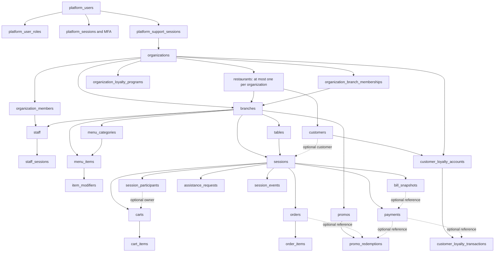

# System as built

This describes the checked-out code and the final schema obtained by reading all 39 `backend/migrations/*.up.sql` files in filename order. It is not a report of a deployed database, a test run, or a review of defects. Source citations are repository-relative `file:line`; line numbers refer to this checkout. Sections 1–8 were completed from migrations, executable code, route registrations, and test assertions before the documentation comparison in section 9. A **contradiction** identifies different statements made by code, assertions, or documentation without recommending a change.

The executable is a Go HTTP service with Gin handlers, service methods, SQL repositories, Postgres, Redis, and a WebSocket hub; a Next.js frontend keeps guest, staff, and platform state separately. The server wires these dependencies and registers the API; its process also starts the background workers. (`backend/internal/server/server.go:51`, `backend/cmd/server/main.go:94`, `frontend/store/staff.ts:17`, `frontend/store/platform.ts:28`.) Actual environment values, deployed migration history, external payment-provider configuration, and enabled rollout flags cannot be established from the source alone.

## 1. Data model

### 1.1 Entity graph and ownership

Arrows show FK relationships, not authority granted to callers; the exhaustive FK catalog below specifies direction, columns, and deletion behavior. Platform operators are a separate identity domain, not a parent row owning all tenant data. Organizations are the tenant aggregate; restaurants retain branding/settings/customer and legacy subscription ownership. Each branch independently references both a restaurant and an organization. The database does not use a composite FK to require those two references to describe the same organization. Similar independently stored scopes occur on sessions (`branch_id`, `table_id`), orders (`session_id`, `branch_id`), payments (`session_id`, `branch_id`), bill snapshots, staff sessions, and replay events. (`backend/migrations/000001_initial_schema.up.sql:20`, `backend/migrations/000017_organization_model.up.sql:1`, `backend/migrations/000018_platform_trust_domain.up.sql:1`, `backend/migrations/000021_payment_order_correctness.up.sql:1`.)

The session's optional `host_participant_id` points back into its participant collection through a deferred FK; that FK alone does not require the participant's `session_id` to match. Participant `is_host` and the session host pointer are separate stored representations. Runtime host reassignment updates both. Organization membership and branch membership are additional relations, not replacements for `staff.branch_id` or `branches.organization_id`. (`backend/migrations/000001_initial_schema.up.sql:170`, `backend/migrations/000017_organization_model.up.sql:76`, `backend/internal/repository/participant.go:54`.)

Other graph branches are global subscription plans→plan entitlements and tenant plan assignments/overrides; organization subscriptions→invoices/payments and billing profiles; feature-flag catalog→global/organization/branch overrides; theme presets→restaurant theme; branch collateral. `event_log`, `platform_audit_log`, and `audit_log` are three distinct logging tables; `session_events` is the durable realtime replay stream. The v2 `audit_log` has nullable scope identifiers without FKs and an UPDATE/DELETE rejection trigger. Bill snapshots and loyalty transactions have no equivalent immutability trigger. The FK/constraint catalog includes these tables as well. (`backend/migrations/000019_audit_log_v2.up.sql:1`, `backend/migrations/000029_organization_entitlements.up.sql:1`, `backend/migrations/000030_platform_feature_flags.up.sql:1`, `backend/migrations/000031_tenant_theme_config.up.sql:1`, `backend/migrations/000032_subscription_billing.up.sql:1`, `backend/migrations/000033_branch_collateral.up.sql:1`, `backend/migrations/000035_customer_loyalty.up.sql:1`.)

### 1.2 Ordered migration history and constraint changes

| Migration | Effect in sequence |
|---|---|
| 000001 | Initial restaurant/branch/table/staff/menu/session/participant/cart/order/assistance/payment model and eight enums; globally unique order idempotency key; shared carts not yet separately constrained. (`backend/migrations/000001_initial_schema.up.sql:1`.) |
| 000002 | Adds operational `event_log`. (`backend/migrations/000002_event_log.up.sql:1`.) |
| 000003 | Adds webhook receipts, globally unique external event ID. (`backend/migrations/000003_webhook_events.up.sql:1`.) |
| 000004 | Adds non-null active flag to staff. (`backend/migrations/000004_staff_is_active.up.sql:1`.) |
| 000005 | Adds subscription plans/tier enum and one legacy subscription per restaurant. (`backend/migrations/000005_subscriptions.up.sql:1`.) |
| 000006–000007 | Adds branch session timeout, then optional session warning timestamp. (`backend/migrations/000006_branch_session_config.up.sql:1`, `backend/migrations/000007_session_warned_at.up.sql:1`.) |
| 000008–000010 | Adds featured menu fields, metadata/allergen/dietary arrays and spice-level CHECK, then modifier group. (`backend/migrations/000008_menu_featured.up.sql:1`, `backend/migrations/000009_menu_metadata.up.sql:1`, `backend/migrations/000010_modifier_group.up.sql:1`.) |
| 000011–000012 | Adds restaurant customers with unique restaurant/phone and optional session customer; adds image/logo URLs. (`backend/migrations/000011_customers.up.sql:1`, `backend/migrations/000012_image_urls.up.sql:1`.) |
| 000013–000014 | Adds branch order prefix/date counters and optional order number; adds optional payment subtotal/tax/service fields and non-null tip. (`backend/migrations/000013_order_sequences.up.sql:1`, `backend/migrations/000014_payment_billing.up.sql:1`.) |
| 000015 | Adds branch promos, active case-insensitive code uniqueness, order redemptions, optional order promo and non-null order discount. (`backend/migrations/000015_promos.up.sql:1`.) |
| 000016 | Adds globally unique branch code, branch-local unique staff code, credential versions, durable staff sessions with unique token hash. (`backend/migrations/000016_identity_hardening.up.sql:1`.) |
| 000017 | Backfills organizations from restaurants, requires restaurant/branch organization IDs, unique restaurant organization, memberships and lifecycle checks. Adds unique `(organization_id, branch_code)` **without removing the global branch-code unique constraint**. (`backend/migrations/000017_organization_model.up.sql:1`.) |
| 000018 | Adds independent platform identities/roles/sessions/support sessions/audit; support expiry must exceed start. (`backend/migrations/000018_platform_trust_domain.up.sql:1`.) |
| 000019 | Adds typed v2 audit log and trigger rejecting UPDATE/DELETE. (`backend/migrations/000019_audit_log_v2.up.sql:1`.) |
| 000020 | Abandons duplicate active sessions, repairs table occupancy, adds unique table WHERE active and durable session events unique by session/sequence. (`backend/migrations/000020_realtime_session_hardening.up.sql:1`.) |
| 000021 | Extends payment states/methods; adds idempotency ledger and bill snapshots. Backfills order operational fields to NOT NULL and globally unique operational ID. **Drops the global order idempotency unique constraint and replaces it with a non-unique scoped index**; ledger uniqueness now supplies service replay exclusion. Adds non-null payment branch, optional snapshot/provider/staff settlement references, partial unique provider/payment reference, promo redemption counter and unique promo/order. (`backend/migrations/000021_payment_order_correctness.up.sql:1`.) |
| 000022 | Backfills session/payment business-date sequence/reference fields to NOT NULL; branch-local session/payment reference uniqueness and unique audit event reference. **Contradiction in migration instructions:** this migration attempts UPDATE of existing audit rows, while 000019's trigger rejects UPDATE; no trigger-disable statement precedes that UPDATE. This describes the SQL interaction, not whether any deployed migration had rows to update. (`backend/migrations/000022_operational_ux_cleanup.up.sql:1`, `backend/migrations/000022_operational_ux_cleanup.up.sql:109`, `backend/migrations/000019_audit_log_v2.up.sql:55`.) |
| 000023–000024 | Extends session enum with payment_pending/awaiting_reactivation/expired; adds participant revocation fields. Replaces the active-only index with unique table WHERE status is any of active, payment_pending, awaiting_reactivation, strengthening the one-live-session invariant. (`backend/migrations/000023_session_lifecycle_states.up.sql:1`, `backend/migrations/000024_session_lifecycle_invariants.up.sql:1`.) |
| 000025–000028 | Adds platform MFA/challenges, awaiting-reactivation timestamp, unique shared cart per session WHERE participant IS NULL, then optional participant phone. (`backend/migrations/000025_platform_mfa.up.sql:1`, `backend/migrations/000026_session_reactivation.up.sql:1`, `backend/migrations/000027_shared_session_cart.up.sql:1`, `backend/migrations/000028_participant_phone.up.sql:1`.) |
| 000029–000031 | Adds entitlement catalog/grants/assignments/overrides; feature-flag catalog and layered overrides; tenant themes and four presets. (`backend/migrations/000029_organization_entitlements.up.sql:1`, `backend/migrations/000030_platform_feature_flags.up.sql:1`, `backend/migrations/000031_tenant_theme_config.up.sql:1`.) |
| 000032–000034 | Adds organization subscription billing/profile/invoice/payment model; branch collateral; staff-performance entitlement/flag, both initially disabled. (`backend/migrations/000032_subscription_billing.up.sql:1`, `backend/migrations/000033_branch_collateral.up.sql:1`, `backend/migrations/000034_staff_performance_analytics.up.sql:1`.) |
| 000035 | Adds organization loyalty program, customer accounts and transactions; positive earn-rate checks, non-negative account balance and one earn transaction per payment; disabled loyalty entitlements/flag. (`backend/migrations/000035_customer_loyalty.up.sql:1`.) |
| 000036 | Adds optional redemption payment FK and partial unique promo/payment. **Weakens redemption order ownership by dropping order_id NOT NULL**; retains unique promo/order. Neither an exactly-one-parent nor at-least-one-parent CHECK is added. (`backend/migrations/000036_promo_redemption_payment.up.sql:1`.) |
| 000037–000039 | Adds non-null modifier single_select=false; adds serene preset; normalizes existing redemption phones to plus/digits, setting strings without digits to NULL. Phone formatting remains a data rewrite, not a constraint. (`backend/migrations/000037_modifier_single_select.up.sql:1`, `backend/migrations/000038_serene_theme_preset.up.sql:1`, `backend/migrations/000039_normalize_promo_redemption_phones.up.sql:1`.) |

The catalog below lists **every nullable column**, making the requested “unexpectedly nullable” cases explicit without guessing a product requirement. Particularly consequential optional links are session host/customer; cart participant (NULL denotes the shared cart); order participant/promo; payment order/snapshot/provider/reference/settling staff; webhook payment; redemption order **and** payment; loyalty transaction payment/session/staff; support branch/approver; audit scope/actor references. Optional billing components coexist with non-null payment amount/tip. `organization_entitlement_overrides.enabled`/`limit_value` and plan limits also use NULL as configuration semantics. All are documented at their defining/altering lines below; runtime requirements are distinguished in sections 3–5.

Catalog notation: omitted `ON DELETE` means PostgreSQL's default NO ACTION; PK implies NOT NULL and uniqueness even where the column declaration omits NOT NULL. UNIQUE permits multiple NULLs unless a listed partial index constrains them. JSON/array elements are not FK-constrained. Enum membership is listed separately; no other CHECKs are implied by field names, defaults, or Go validation.

### 1.3 Final constraint and nullability catalog

The following catalog applies all 39 up migrations in filename order. `PK` means primary key (and therefore non-null); every additional unique constraint/index, foreign key and check is listed. A foreign key without an explicit delete action uses PostgreSQL’s default `NO ACTION`; all foreign keys are immediate/non-deferrable except the explicitly deferred host foreign key. Nullable lists are complete; columns not listed are non-null. Defaults do not by themselves make a column non-null. Enum domains are listed separately below.

#### `restaurants`

Table definition: `backend/migrations/000001_initial_schema.up.sql:21`.

PK: `id`. Nullable: `logo_url`.

- `slug TEXT NOT NULL UNIQUE` — `backend/migrations/000001_initial_schema.up.sql:24`.
- `CONSTRAINT fk_restaurants_organization FOREIGN KEY (organization_id) REFERENCES organizations(id)` — `backend/migrations/000017_organization_model.up.sql:37`.
- `UNIQUE INDEX idx_restaurants_organization_id_unique ON restaurants(organization_id)` — `backend/migrations/000017_organization_model.up.sql:45`.

Nullable-column sources: `logo_url`: `backend/migrations/000012_image_urls.up.sql:5`.

#### `branches`

Table definition: `backend/migrations/000001_initial_schema.up.sql:36`.

PK: `id`. Nullable: none.

- `restaurant_id BIGINT NOT NULL REFERENCES restaurants(id) ON DELETE CASCADE` — `backend/migrations/000001_initial_schema.up.sql:38`.
- `status TEXT NOT NULL DEFAULT 'active' CHECK (status IN ('active', 'suspended', 'archived'))` — `backend/migrations/000017_organization_model.up.sql:18`.
- `CONSTRAINT fk_branches_organization FOREIGN KEY (organization_id) REFERENCES organizations(id)` — `backend/migrations/000017_organization_model.up.sql:42`.
- `UNIQUE INDEX idx_branches_branch_code_unique ON branches(branch_code)` — `backend/migrations/000016_identity_hardening.up.sql:11`.
- `UNIQUE INDEX idx_branches_organization_branch_code_unique ON branches(organization_id, branch_code)` — `backend/migrations/000017_organization_model.up.sql:51`.

#### `tables`

Table definition: `backend/migrations/000001_initial_schema.up.sql:51`.

PK: `id`. Nullable: none.

- `branch_id BIGINT NOT NULL REFERENCES branches(id) ON DELETE CASCADE` — `backend/migrations/000001_initial_schema.up.sql:53`.
- `qr_code_token TEXT NOT NULL UNIQUE` — `backend/migrations/000001_initial_schema.up.sql:57`.
- `UNIQUE(branch_id, identifier)` — `backend/migrations/000001_initial_schema.up.sql:60`.

#### `staff`

Table definition: `backend/migrations/000001_initial_schema.up.sql:70`.

PK: `id`. Nullable: none.

- `branch_id BIGINT NOT NULL REFERENCES branches(id) ON DELETE CASCADE` — `backend/migrations/000001_initial_schema.up.sql:72`.
- `UNIQUE INDEX idx_staff_branch_staff_code_unique ON staff(branch_id, staff_code)` — `backend/migrations/000016_identity_hardening.up.sql:25`.

#### `menu_categories`

Table definition: `backend/migrations/000001_initial_schema.up.sql:86`.

PK: `id`. Nullable: none.

- `branch_id BIGINT NOT NULL REFERENCES branches(id) ON DELETE CASCADE` — `backend/migrations/000001_initial_schema.up.sql:88`.

#### `menu_items`

Table definition: `backend/migrations/000001_initial_schema.up.sql:100`.

PK: `id`. Nullable: `image_url`.

- `category_id BIGINT NOT NULL REFERENCES menu_categories(id) ON DELETE CASCADE` — `backend/migrations/000001_initial_schema.up.sql:102`.
- `branch_id BIGINT NOT NULL REFERENCES branches(id) ON DELETE CASCADE` — `backend/migrations/000001_initial_schema.up.sql:103`.
- `price NUMERIC(10, 2) NOT NULL CHECK (price >= 0)` — `backend/migrations/000001_initial_schema.up.sql:106`.
- `spice_level SMALLINT NOT NULL DEFAULT 0 CONSTRAINT menu_items_spice_level_range CHECK (spice_level BETWEEN 0 AND 3)` — `backend/migrations/000009_menu_metadata.up.sql:4`.

Nullable-column sources: `image_url`: `backend/migrations/000012_image_urls.up.sql:2`.

#### `item_modifiers`

Table definition: `backend/migrations/000001_initial_schema.up.sql:118`.

PK: `id`. Nullable: none.

- `item_id BIGINT NOT NULL REFERENCES menu_items(id) ON DELETE CASCADE` — `backend/migrations/000001_initial_schema.up.sql:120`.

#### `sessions`

Table definition: `backend/migrations/000001_initial_schema.up.sql:136`.

PK: `id`. Nullable: `host_participant_id`, `closed_at`, `warned_at`, `customer_id`, `awaiting_reactivation_at`.

- `branch_id BIGINT NOT NULL REFERENCES branches(id)` — `backend/migrations/000001_initial_schema.up.sql:138`.
- `table_id BIGINT NOT NULL REFERENCES tables(id)` — `backend/migrations/000001_initial_schema.up.sql:139`.
- `session_token TEXT NOT NULL UNIQUE` — `backend/migrations/000001_initial_schema.up.sql:142`.
- `customer_id BIGINT REFERENCES customers(id) ON DELETE SET NULL` — `backend/migrations/000011_customers.up.sql:17`.
- `CONSTRAINT fk_sessions_host_participant FOREIGN KEY (host_participant_id) REFERENCES session_participants(id) DEFERRABLE INITIALLY DEFERRED` — `backend/migrations/000001_initial_schema.up.sql:171`.
- `UNIQUE INDEX idx_sessions_branch_session_number_unique ON sessions(branch_id, session_number)` — `backend/migrations/000022_operational_ux_cleanup.up.sql:47`.
- `UNIQUE INDEX idx_sessions_one_active_per_table ON sessions(table_id) WHERE status IN ('active', 'payment_pending', 'awaiting_reactivation')` — `backend/migrations/000024_session_lifecycle_invariants.up.sql:9`.

Nullable-column sources: `host_participant_id`: `backend/migrations/000001_initial_schema.up.sql:140`; `closed_at`: `backend/migrations/000001_initial_schema.up.sql:144`; `warned_at`: `backend/migrations/000007_session_warned_at.up.sql:1`; `customer_id`: `backend/migrations/000011_customers.up.sql:17`; `awaiting_reactivation_at`: `backend/migrations/000026_session_reactivation.up.sql:7`.

#### `session_participants`

Table definition: `backend/migrations/000001_initial_schema.up.sql:157`.

PK: `id`. Nullable: `revoked_at`, `revoked_reason`, `phone_e164`.

- `session_id UUID NOT NULL REFERENCES sessions(id) ON DELETE CASCADE` — `backend/migrations/000001_initial_schema.up.sql:159`.

Nullable-column sources: `revoked_at`: `backend/migrations/000023_session_lifecycle_states.up.sql:15`; `revoked_reason`: `backend/migrations/000023_session_lifecycle_states.up.sql:16`; `phone_e164`: `backend/migrations/000028_participant_phone.up.sql:5`.

#### `carts`

Table definition: `backend/migrations/000001_initial_schema.up.sql:184`.

PK: `id`. Nullable: `participant_id`.

- `session_id UUID NOT NULL REFERENCES sessions(id) ON DELETE CASCADE` — `backend/migrations/000001_initial_schema.up.sql:186`.
- `participant_id BIGINT REFERENCES session_participants(id) ON DELETE SET NULL` — `backend/migrations/000001_initial_schema.up.sql:187`.
- `UNIQUE(session_id, participant_id)` — `backend/migrations/000001_initial_schema.up.sql:188`.
- `UNIQUE INDEX carts_session_shared_uniq ON carts(session_id) WHERE participant_id IS NULL` — `backend/migrations/000027_shared_session_cart.up.sql:8`.

Nullable-column sources: `participant_id`: `backend/migrations/000001_initial_schema.up.sql:187`.

#### `cart_items`

Table definition: `backend/migrations/000001_initial_schema.up.sql:200`.

PK: `id`. Nullable: none.

- `cart_id BIGINT NOT NULL REFERENCES carts(id) ON DELETE CASCADE` — `backend/migrations/000001_initial_schema.up.sql:202`.
- `menu_item_id BIGINT NOT NULL REFERENCES menu_items(id)` — `backend/migrations/000001_initial_schema.up.sql:203`.
- `quantity SMALLINT NOT NULL DEFAULT 1 CHECK (quantity > 0)` — `backend/migrations/000001_initial_schema.up.sql:204`.

#### `orders`

Table definition: `backend/migrations/000001_initial_schema.up.sql:218`.

PK: `id`. Nullable: `placed_by_participant_id`, `order_number`, `promo_id`.

- `session_id UUID NOT NULL REFERENCES sessions(id)` — `backend/migrations/000001_initial_schema.up.sql:220`.
- `branch_id BIGINT NOT NULL REFERENCES branches(id)` — `backend/migrations/000001_initial_schema.up.sql:221`.
- `placed_by_participant_id BIGINT REFERENCES session_participants(id) ON DELETE SET NULL` — `backend/migrations/000001_initial_schema.up.sql:222`.
- `promo_id BIGINT REFERENCES promos(id)` — `backend/migrations/000015_promos.up.sql:36`.
- `UNIQUE INDEX idx_orders_operational_id ON orders(order_operational_id)` — `backend/migrations/000021_payment_order_correctness.up.sql:46`.

Nullable-column sources: `placed_by_participant_id`: `backend/migrations/000001_initial_schema.up.sql:222`; `order_number`: `backend/migrations/000013_order_sequences.up.sql:2`; `promo_id`: `backend/migrations/000015_promos.up.sql:36`.

#### `order_items`

Table definition: `backend/migrations/000001_initial_schema.up.sql:242`.

PK: `id`. Nullable: none.

- `order_id UUID NOT NULL REFERENCES orders(id) ON DELETE CASCADE` — `backend/migrations/000001_initial_schema.up.sql:244`.
- `menu_item_id BIGINT NOT NULL REFERENCES menu_items(id)` — `backend/migrations/000001_initial_schema.up.sql:245`.
- `quantity SMALLINT NOT NULL DEFAULT 1 CHECK (quantity > 0)` — `backend/migrations/000001_initial_schema.up.sql:246`.

#### `assistance_requests`

Table definition: `backend/migrations/000001_initial_schema.up.sql:258`.

PK: `id`. Nullable: `participant_id`, `resolved_at`.

- `session_id UUID NOT NULL REFERENCES sessions(id)` — `backend/migrations/000001_initial_schema.up.sql:260`.
- `table_id BIGINT NOT NULL REFERENCES tables(id)` — `backend/migrations/000001_initial_schema.up.sql:261`.
- `participant_id BIGINT REFERENCES session_participants(id) ON DELETE SET NULL` — `backend/migrations/000001_initial_schema.up.sql:262`.

Nullable-column sources: `participant_id`: `backend/migrations/000001_initial_schema.up.sql:262`; `resolved_at`: `backend/migrations/000001_initial_schema.up.sql:266`.

#### `payments`

Table definition: `backend/migrations/000001_initial_schema.up.sql:280`.

PK: `id`. Nullable: `order_id`, `completed_at`, `subtotal`, `tax_amount`, `service_charge`, `bill_snapshot_id`, `provider`, `provider_payment_ref`, `provider_order_ref`, `settled_by_staff_id`, `settled_at`.

- `session_id UUID NOT NULL REFERENCES sessions(id)` — `backend/migrations/000001_initial_schema.up.sql:282`.
- `order_id UUID REFERENCES orders(id) ON DELETE SET NULL` — `backend/migrations/000001_initial_schema.up.sql:283`.
- `amount NUMERIC(12, 2) NOT NULL CHECK (amount > 0)` — `backend/migrations/000001_initial_schema.up.sql:284`.
- `bill_snapshot_id BIGINT REFERENCES bill_snapshots(id)` — `backend/migrations/000021_payment_order_correctness.up.sql:67`.
- `branch_id BIGINT REFERENCES branches(id) NOT NULL` — `backend/migrations/000021_payment_order_correctness.up.sql:68`; `backend/migrations/000021_payment_order_correctness.up.sql:81`.
- `settled_by_staff_id BIGINT REFERENCES staff(id)` — `backend/migrations/000021_payment_order_correctness.up.sql:73`.
- `UNIQUE INDEX idx_payments_provider_ref ON payments(provider, provider_payment_ref) WHERE provider_payment_ref IS NOT NULL` — `backend/migrations/000021_payment_order_correctness.up.sql:83`.
- `UNIQUE INDEX idx_payments_branch_payment_reference_unique ON payments(branch_id, payment_reference)` — `backend/migrations/000022_operational_ux_cleanup.up.sql:95`.

Nullable-column sources: `order_id`: `backend/migrations/000001_initial_schema.up.sql:283`; `completed_at`: `backend/migrations/000001_initial_schema.up.sql:284`; `subtotal`: `backend/migrations/000014_payment_billing.up.sql:2`; `tax_amount`: `backend/migrations/000014_payment_billing.up.sql:3`; `service_charge`: `backend/migrations/000014_payment_billing.up.sql:4`; `bill_snapshot_id`: `backend/migrations/000021_payment_order_correctness.up.sql:67`; `provider`: `backend/migrations/000021_payment_order_correctness.up.sql:70`; `provider_payment_ref`: `backend/migrations/000021_payment_order_correctness.up.sql:71`; `provider_order_ref`: `backend/migrations/000021_payment_order_correctness.up.sql:72`; `settled_by_staff_id`: `backend/migrations/000021_payment_order_correctness.up.sql:73`; `settled_at`: `backend/migrations/000021_payment_order_correctness.up.sql:74`.

#### `event_log`

Table definition: `backend/migrations/000002_event_log.up.sql:8`.

PK: `id`. Nullable: `session_id`, `branch_id`, `actor_id`.

- `session_id UUID REFERENCES sessions(id) ON DELETE SET NULL` — `backend/migrations/000002_event_log.up.sql:10`.
- `branch_id BIGINT REFERENCES branches(id) ON DELETE SET NULL` — `backend/migrations/000002_event_log.up.sql:11`.

Nullable-column sources: `session_id`: `backend/migrations/000002_event_log.up.sql:10`; `branch_id`: `backend/migrations/000002_event_log.up.sql:11`; `actor_id`: `backend/migrations/000002_event_log.up.sql:17`.

#### `payment_webhook_events`

Table definition: `backend/migrations/000003_webhook_events.up.sql:10`.

PK: `id`. Nullable: `processed_at`, `payment_id`, `error_message`, `raw_payload`.

- `external_event_id TEXT NOT NULL UNIQUE` — `backend/migrations/000003_webhook_events.up.sql:13`.
- `payment_id BIGINT REFERENCES payments(id) ON DELETE SET NULL` — `backend/migrations/000003_webhook_events.up.sql:22`.

Nullable-column sources: `processed_at`: `backend/migrations/000003_webhook_events.up.sql:21`; `payment_id`: `backend/migrations/000003_webhook_events.up.sql:22`; `error_message`: `backend/migrations/000003_webhook_events.up.sql:24`; `raw_payload`: `backend/migrations/000021_payment_order_correctness.up.sql:86`.

#### `subscription_plans`

Table definition: `backend/migrations/000005_subscriptions.up.sql:10`.

PK: `id`. Nullable: none.

- `tier plan_tier NOT NULL UNIQUE` — `backend/migrations/000005_subscriptions.up.sql:13`.

#### `restaurant_subscriptions`

Table definition: `backend/migrations/000005_subscriptions.up.sql:25`.

PK: `id`. Nullable: `trial_ends_at`, `current_period_end`.

- `restaurant_id BIGINT NOT NULL REFERENCES restaurants(id) ON DELETE CASCADE` — `backend/migrations/000005_subscriptions.up.sql:27`.
- `plan_id BIGINT NOT NULL REFERENCES subscription_plans(id)` — `backend/migrations/000005_subscriptions.up.sql:28`.
- `UNIQUE(restaurant_id)` — `backend/migrations/000005_subscriptions.up.sql:35`.

Nullable-column sources: `trial_ends_at`: `backend/migrations/000005_subscriptions.up.sql:30`; `current_period_end`: `backend/migrations/000005_subscriptions.up.sql:32`.

#### `customers`

Table definition: `backend/migrations/000011_customers.up.sql:1`.

PK: `id`. Nullable: `opted_in_at`.

- `restaurant_id BIGINT NOT NULL REFERENCES restaurants(id) ON DELETE CASCADE` — `backend/migrations/000011_customers.up.sql:3`.
- `UNIQUE(restaurant_id, phone_e164)` — `backend/migrations/000011_customers.up.sql:11`.

Nullable-column sources: `opted_in_at`: `backend/migrations/000011_customers.up.sql:7`.

#### `order_sequences`

Table definition: `backend/migrations/000013_order_sequences.up.sql:4`.

PK: `branch_id, date`. Nullable: none.

- `branch_id BIGINT NOT NULL REFERENCES branches(id)` — `backend/migrations/000013_order_sequences.up.sql:5`.
- `PRIMARY KEY (branch_id, date)` — `backend/migrations/000013_order_sequences.up.sql:8`.

#### `promos`

Table definition: `backend/migrations/000015_promos.up.sql:3`.

PK: `id`. Nullable: `max_uses`, `time_window_start`, `time_window_end`, `description`, `created_by`.

- `branch_id BIGINT NOT NULL REFERENCES branches(id)` — `backend/migrations/000015_promos.up.sql:5`.
- `created_by BIGINT REFERENCES staff(id)` — `backend/migrations/000015_promos.up.sql:18`.
- `UNIQUE INDEX idx_promos_branch_code ON promos(branch_id, LOWER(code)) WHERE is_active` — `backend/migrations/000015_promos.up.sql:22`.

Nullable-column sources: `max_uses`: `backend/migrations/000015_promos.up.sql:10`; `time_window_start`: `backend/migrations/000015_promos.up.sql:14`; `time_window_end`: `backend/migrations/000015_promos.up.sql:15`; `description`: `backend/migrations/000015_promos.up.sql:17`; `created_by`: `backend/migrations/000015_promos.up.sql:18`.

#### `promo_redemptions`

Table definition: `backend/migrations/000015_promos.up.sql:24`.

PK: `id`. Nullable: `order_id`, `phone_e164`, `payment_id`.

- `promo_id BIGINT NOT NULL REFERENCES promos(id)` — `backend/migrations/000015_promos.up.sql:26`.
- `order_id UUID REFERENCES orders(id)` — `backend/migrations/000015_promos.up.sql:27`; `backend/migrations/000036_promo_redemption_payment.up.sql:12`.
- `payment_id BIGINT REFERENCES payments(id)` — `backend/migrations/000036_promo_redemption_payment.up.sql:7`.
- `UNIQUE INDEX idx_redemptions_promo_order ON promo_redemptions(promo_id, order_id)` — `backend/migrations/000021_payment_order_correctness.up.sql:101`.
- `UNIQUE INDEX idx_redemptions_promo_payment ON promo_redemptions(promo_id, payment_id) WHERE payment_id IS NOT NULL` — `backend/migrations/000036_promo_redemption_payment.up.sql:16`.

Nullable-column sources: `order_id`: `backend/migrations/000015_promos.up.sql:27`; `backend/migrations/000036_promo_redemption_payment.up.sql:12`; `phone_e164`: `backend/migrations/000015_promos.up.sql:28`; `payment_id`: `backend/migrations/000036_promo_redemption_payment.up.sql:7`.

#### `staff_sessions`

Table definition: `backend/migrations/000016_identity_hardening.up.sql:30`.

PK: `id`. Nullable: `revoked_at`.

- `staff_id BIGINT NOT NULL REFERENCES staff(id) ON DELETE CASCADE` — `backend/migrations/000016_identity_hardening.up.sql:32`.
- `branch_id BIGINT NOT NULL REFERENCES branches(id) ON DELETE CASCADE` — `backend/migrations/000016_identity_hardening.up.sql:33`.
- `token_hash TEXT NOT NULL UNIQUE` — `backend/migrations/000016_identity_hardening.up.sql:34`.

Nullable-column sources: `revoked_at`: `backend/migrations/000016_identity_hardening.up.sql:41`.

#### `organizations`

Table definition: `backend/migrations/000017_organization_model.up.sql:1`.

PK: `id`. Nullable: none.

- `code TEXT NOT NULL UNIQUE` — `backend/migrations/000017_organization_model.up.sql:3`.
- `status TEXT NOT NULL DEFAULT 'active' CHECK (status IN ('active', 'suspended', 'archived'))` — `backend/migrations/000017_organization_model.up.sql:6`.

#### `organization_members`

Table definition: `backend/migrations/000017_organization_model.up.sql:54`.

PK: `id`. Nullable: `invited_by_staff_id`.

- `organization_id BIGINT NOT NULL REFERENCES organizations(id) ON DELETE CASCADE` — `backend/migrations/000017_organization_model.up.sql:56`.
- `staff_id BIGINT NOT NULL REFERENCES staff(id) ON DELETE CASCADE` — `backend/migrations/000017_organization_model.up.sql:57`.
- `role TEXT NOT NULL CHECK (role IN ('owner', 'admin'))` — `backend/migrations/000017_organization_model.up.sql:58`.
- `status TEXT NOT NULL DEFAULT 'active' CHECK (status IN ('active', 'invited', 'removed'))` — `backend/migrations/000017_organization_model.up.sql:59`.
- `invited_by_staff_id BIGINT REFERENCES staff(id) ON DELETE SET NULL` — `backend/migrations/000017_organization_model.up.sql:60`.
- `UNIQUE (organization_id, staff_id)` — `backend/migrations/000017_organization_model.up.sql:63`.

Nullable-column sources: `invited_by_staff_id`: `backend/migrations/000017_organization_model.up.sql:60`.

#### `organization_branch_memberships`

Table definition: `backend/migrations/000017_organization_model.up.sql:81`.

PK: `id`. Nullable: none.

- `organization_id BIGINT NOT NULL REFERENCES organizations(id) ON DELETE CASCADE` — `backend/migrations/000017_organization_model.up.sql:83`.
- `branch_id BIGINT NOT NULL REFERENCES branches(id) ON DELETE CASCADE` — `backend/migrations/000017_organization_model.up.sql:84`.
- `UNIQUE (organization_id, branch_id)` — `backend/migrations/000017_organization_model.up.sql:86`.

#### `platform_users`

Table definition: `backend/migrations/000018_platform_trust_domain.up.sql:1`.

PK: `id`. Nullable: none.

- `email TEXT NOT NULL UNIQUE` — `backend/migrations/000018_platform_trust_domain.up.sql:3`.
- `status TEXT NOT NULL DEFAULT 'active' CHECK (status IN ('active', 'suspended', 'disabled'))` — `backend/migrations/000018_platform_trust_domain.up.sql:6`.

#### `platform_user_roles`

Table definition: `backend/migrations/000018_platform_trust_domain.up.sql:12`.

PK: `platform_user_id, role`. Nullable: none.

- `platform_user_id BIGINT NOT NULL REFERENCES platform_users(id) ON DELETE CASCADE` — `backend/migrations/000018_platform_trust_domain.up.sql:13`.
- `role TEXT NOT NULL CHECK (role IN ('super_admin', 'support_admin', 'billing_admin', 'read_only_auditor'))` — `backend/migrations/000018_platform_trust_domain.up.sql:14`.
- `PRIMARY KEY (platform_user_id, role)` — `backend/migrations/000018_platform_trust_domain.up.sql:16`.

#### `platform_sessions`

Table definition: `backend/migrations/000018_platform_trust_domain.up.sql:19`.

PK: `id`. Nullable: `revoked_at`.

- `platform_user_id BIGINT NOT NULL REFERENCES platform_users(id) ON DELETE CASCADE` — `backend/migrations/000018_platform_trust_domain.up.sql:21`.
- `token_hash TEXT NOT NULL UNIQUE` — `backend/migrations/000018_platform_trust_domain.up.sql:22`.

Nullable-column sources: `revoked_at`: `backend/migrations/000018_platform_trust_domain.up.sql:27`.

#### `platform_support_sessions`

Table definition: `backend/migrations/000018_platform_trust_domain.up.sql:34`.

PK: `id`. Nullable: `branch_id`, `approved_by_platform_user_id`.

- `platform_user_id BIGINT NOT NULL REFERENCES platform_users(id) ON DELETE CASCADE` — `backend/migrations/000018_platform_trust_domain.up.sql:36`.
- `organization_id BIGINT NOT NULL REFERENCES organizations(id) ON DELETE CASCADE` — `backend/migrations/000018_platform_trust_domain.up.sql:37`.
- `branch_id BIGINT REFERENCES branches(id) ON DELETE CASCADE` — `backend/migrations/000018_platform_trust_domain.up.sql:38`.
- `approved_by_platform_user_id BIGINT REFERENCES platform_users(id) ON DELETE SET NULL` — `backend/migrations/000018_platform_trust_domain.up.sql:40`.
- `CHECK (expires_at > starts_at)` — `backend/migrations/000018_platform_trust_domain.up.sql:44`.

Nullable-column sources: `branch_id`: `backend/migrations/000018_platform_trust_domain.up.sql:38`; `approved_by_platform_user_id`: `backend/migrations/000018_platform_trust_domain.up.sql:40`.

#### `platform_audit_log`

Table definition: `backend/migrations/000018_platform_trust_domain.up.sql:50`.

PK: `id`. Nullable: `platform_user_id`, `organization_id`, `branch_id`, `support_session_id`.

- `platform_user_id BIGINT REFERENCES platform_users(id) ON DELETE SET NULL` — `backend/migrations/000018_platform_trust_domain.up.sql:52`.
- `organization_id BIGINT REFERENCES organizations(id) ON DELETE SET NULL` — `backend/migrations/000018_platform_trust_domain.up.sql:56`.
- `branch_id BIGINT REFERENCES branches(id) ON DELETE SET NULL` — `backend/migrations/000018_platform_trust_domain.up.sql:57`.
- `support_session_id BIGINT REFERENCES platform_support_sessions(id) ON DELETE SET NULL` — `backend/migrations/000018_platform_trust_domain.up.sql:58`.

Nullable-column sources: `platform_user_id`: `backend/migrations/000018_platform_trust_domain.up.sql:52`; `organization_id`: `backend/migrations/000018_platform_trust_domain.up.sql:56`; `branch_id`: `backend/migrations/000018_platform_trust_domain.up.sql:57`; `support_session_id`: `backend/migrations/000018_platform_trust_domain.up.sql:58`.

#### `audit_log`

Table definition: `backend/migrations/000019_audit_log_v2.up.sql:41`.

PK: `id`. Nullable: `organization_id`, `branch_id`, `restaurant_id`, `session_id`, `table_id`, `before_json`, `after_json`, `row_hash`, `previous_hash`.

- `UNIQUE INDEX idx_audit_log_event_reference ON audit_log(event_reference)` — `backend/migrations/000022_operational_ux_cleanup.up.sql:112`.

Nullable-column sources: `organization_id`: `backend/migrations/000019_audit_log_v2.up.sql:43`; `branch_id`: `backend/migrations/000019_audit_log_v2.up.sql:44`; `restaurant_id`: `backend/migrations/000019_audit_log_v2.up.sql:45`; `session_id`: `backend/migrations/000019_audit_log_v2.up.sql:46`; `table_id`: `backend/migrations/000019_audit_log_v2.up.sql:47`; `before_json`: `backend/migrations/000019_audit_log_v2.up.sql:62`; `after_json`: `backend/migrations/000019_audit_log_v2.up.sql:63`; `row_hash`: `backend/migrations/000019_audit_log_v2.up.sql:67`; `previous_hash`: `backend/migrations/000019_audit_log_v2.up.sql:68`.

#### `session_events`

Table definition: `backend/migrations/000020_realtime_session_hardening.up.sql:41`.

PK: `id`. Nullable: none.

- `organization_id BIGINT NOT NULL REFERENCES organizations(id)` — `backend/migrations/000020_realtime_session_hardening.up.sql:44`.
- `branch_id BIGINT NOT NULL REFERENCES branches(id)` — `backend/migrations/000020_realtime_session_hardening.up.sql:45`.
- `session_id UUID NOT NULL REFERENCES sessions(id) ON DELETE CASCADE` — `backend/migrations/000020_realtime_session_hardening.up.sql:46`.
- `UNIQUE(session_id, sequence)` — `backend/migrations/000020_realtime_session_hardening.up.sql:50`.

#### `idempotency_keys`

Table definition: `backend/migrations/000021_payment_order_correctness.up.sql:10`.

PK: `id`. Nullable: `response_resource_type`, `response_resource_id`.

- `UNIQUE(scope_type, scope_id, actor_type, actor_id, key)` — `backend/migrations/000021_payment_order_correctness.up.sql:23`.

Nullable-column sources: `response_resource_type`: `backend/migrations/000021_payment_order_correctness.up.sql:18`; `response_resource_id`: `backend/migrations/000021_payment_order_correctness.up.sql:19`.

#### `bill_snapshots`

Table definition: `backend/migrations/000021_payment_order_correctness.up.sql:48`.

PK: `id`. Nullable: none.

- `session_id UUID NOT NULL REFERENCES sessions(id)` — `backend/migrations/000021_payment_order_correctness.up.sql:50`.
- `branch_id BIGINT NOT NULL REFERENCES branches(id)` — `backend/migrations/000021_payment_order_correctness.up.sql:51`.

#### `session_sequences`

Table definition: `backend/migrations/000022_operational_ux_cleanup.up.sql:35`.

PK: `branch_id, date`. Nullable: none.

- `branch_id BIGINT NOT NULL REFERENCES branches(id)` — `backend/migrations/000022_operational_ux_cleanup.up.sql:36`.
- `PRIMARY KEY (branch_id, date)` — `backend/migrations/000022_operational_ux_cleanup.up.sql:39`.

#### `payment_sequences`

Table definition: `backend/migrations/000022_operational_ux_cleanup.up.sql:83`.

PK: `branch_id, date`. Nullable: none.

- `branch_id BIGINT NOT NULL REFERENCES branches(id)` — `backend/migrations/000022_operational_ux_cleanup.up.sql:84`.
- `PRIMARY KEY (branch_id, date)` — `backend/migrations/000022_operational_ux_cleanup.up.sql:87`.

#### `platform_user_mfa`

Table definition: `backend/migrations/000025_platform_mfa.up.sql:10`.

PK: `platform_user_id`. Nullable: `enrolled_at`, `last_used_at`.

- `platform_user_id BIGINT PRIMARY KEY REFERENCES platform_users(id) ON DELETE CASCADE` — `backend/migrations/000025_platform_mfa.up.sql:11`.
- `status TEXT NOT NULL DEFAULT 'pending' CHECK (status IN ('pending', 'active', 'disabled'))` — `backend/migrations/000025_platform_mfa.up.sql:13`.

Nullable-column sources: `enrolled_at`: `backend/migrations/000025_platform_mfa.up.sql:15`; `last_used_at`: `backend/migrations/000025_platform_mfa.up.sql:16`.

#### `platform_mfa_challenges`

Table definition: `backend/migrations/000025_platform_mfa.up.sql:25`.

PK: `id`. Nullable: `consumed_at`, `ip`, `user_agent`.

- `platform_user_id BIGINT NOT NULL REFERENCES platform_users(id) ON DELETE CASCADE` — `backend/migrations/000025_platform_mfa.up.sql:27`.
- `challenge_hash TEXT NOT NULL UNIQUE` — `backend/migrations/000025_platform_mfa.up.sql:28`.

Nullable-column sources: `consumed_at`: `backend/migrations/000025_platform_mfa.up.sql:31`; `ip`: `backend/migrations/000025_platform_mfa.up.sql:32`; `user_agent`: `backend/migrations/000025_platform_mfa.up.sql:33`.

#### `entitlements`

Table definition: `backend/migrations/000029_organization_entitlements.up.sql:5`.

PK: `key`. Nullable: none.

- `kind TEXT NOT NULL CHECK (kind IN ('capability', 'limit'))` — `backend/migrations/000029_organization_entitlements.up.sql:7`.

#### `plan_entitlements`

Table definition: `backend/migrations/000029_organization_entitlements.up.sql:14`.

PK: `plan_id, entitlement_key`. Nullable: `limit_value`.

- `plan_id BIGINT NOT NULL REFERENCES subscription_plans(id) ON DELETE CASCADE` — `backend/migrations/000029_organization_entitlements.up.sql:15`.
- `entitlement_key TEXT NOT NULL REFERENCES entitlements(key) ON DELETE CASCADE` — `backend/migrations/000029_organization_entitlements.up.sql:16`.
- `PRIMARY KEY (plan_id, entitlement_key)` — `backend/migrations/000029_organization_entitlements.up.sql:21`.

Nullable-column sources: `limit_value`: `backend/migrations/000029_organization_entitlements.up.sql:18`.

#### `organization_plan_assignments`

Table definition: `backend/migrations/000029_organization_entitlements.up.sql:26`.

PK: `organization_id`. Nullable: `assigned_by_platform_user_id`.

- `organization_id BIGINT PRIMARY KEY REFERENCES organizations(id) ON DELETE CASCADE` — `backend/migrations/000029_organization_entitlements.up.sql:27`.
- `plan_id BIGINT NOT NULL REFERENCES subscription_plans(id)` — `backend/migrations/000029_organization_entitlements.up.sql:28`.
- `status TEXT NOT NULL DEFAULT 'active' CHECK (status IN ('trial', 'active', 'suspended', 'cancelled'))` — `backend/migrations/000029_organization_entitlements.up.sql:29`.
- `assigned_by_platform_user_id BIGINT REFERENCES platform_users(id) ON DELETE SET NULL` — `backend/migrations/000029_organization_entitlements.up.sql:31`.

Nullable-column sources: `assigned_by_platform_user_id`: `backend/migrations/000029_organization_entitlements.up.sql:31`.

#### `organization_entitlement_overrides`

Table definition: `backend/migrations/000029_organization_entitlements.up.sql:38`.

PK: `organization_id, entitlement_key`. Nullable: `enabled`, `limit_value`, `created_by_platform_user_id`.

- `organization_id BIGINT NOT NULL REFERENCES organizations(id) ON DELETE CASCADE` — `backend/migrations/000029_organization_entitlements.up.sql:39`.
- `entitlement_key TEXT NOT NULL REFERENCES entitlements(key) ON DELETE CASCADE` — `backend/migrations/000029_organization_entitlements.up.sql:40`.
- `created_by_platform_user_id BIGINT REFERENCES platform_users(id) ON DELETE SET NULL` — `backend/migrations/000029_organization_entitlements.up.sql:44`.
- `PRIMARY KEY (organization_id, entitlement_key)` — `backend/migrations/000029_organization_entitlements.up.sql:47`.

Nullable-column sources: `enabled`: `backend/migrations/000029_organization_entitlements.up.sql:41`; `limit_value`: `backend/migrations/000029_organization_entitlements.up.sql:42`; `created_by_platform_user_id`: `backend/migrations/000029_organization_entitlements.up.sql:44`.

#### `platform_feature_flags`

Table definition: `backend/migrations/000030_platform_feature_flags.up.sql:6`.

PK: `key`. Nullable: none.

No additional foreign key, unique or check constraints.

#### `platform_flag_global_overrides`

Table definition: `backend/migrations/000030_platform_feature_flags.up.sql:16`.

PK: `flag_key`. Nullable: `updated_by_platform_user_id`.

- `flag_key TEXT PRIMARY KEY REFERENCES platform_feature_flags(key) ON DELETE CASCADE` — `backend/migrations/000030_platform_feature_flags.up.sql:17`.
- `updated_by_platform_user_id BIGINT REFERENCES platform_users(id) ON DELETE SET NULL` — `backend/migrations/000030_platform_feature_flags.up.sql:19`.

Nullable-column sources: `updated_by_platform_user_id`: `backend/migrations/000030_platform_feature_flags.up.sql:19`.

#### `platform_flag_organization_overrides`

Table definition: `backend/migrations/000030_platform_feature_flags.up.sql:25`.

PK: `organization_id, flag_key`. Nullable: `updated_by_platform_user_id`.

- `organization_id BIGINT NOT NULL REFERENCES organizations(id) ON DELETE CASCADE` — `backend/migrations/000030_platform_feature_flags.up.sql:26`.
- `flag_key TEXT NOT NULL REFERENCES platform_feature_flags(key) ON DELETE CASCADE` — `backend/migrations/000030_platform_feature_flags.up.sql:27`.
- `updated_by_platform_user_id BIGINT REFERENCES platform_users(id) ON DELETE SET NULL` — `backend/migrations/000030_platform_feature_flags.up.sql:30`.
- `PRIMARY KEY (organization_id, flag_key)` — `backend/migrations/000030_platform_feature_flags.up.sql:33`.

Nullable-column sources: `updated_by_platform_user_id`: `backend/migrations/000030_platform_feature_flags.up.sql:30`.

#### `platform_flag_branch_overrides`

Table definition: `backend/migrations/000030_platform_feature_flags.up.sql:37`.

PK: `branch_id, flag_key`. Nullable: `updated_by_platform_user_id`.

- `branch_id BIGINT NOT NULL REFERENCES branches(id) ON DELETE CASCADE` — `backend/migrations/000030_platform_feature_flags.up.sql:38`.
- `flag_key TEXT NOT NULL REFERENCES platform_feature_flags(key) ON DELETE CASCADE` — `backend/migrations/000030_platform_feature_flags.up.sql:39`.
- `updated_by_platform_user_id BIGINT REFERENCES platform_users(id) ON DELETE SET NULL` — `backend/migrations/000030_platform_feature_flags.up.sql:42`.
- `PRIMARY KEY (branch_id, flag_key)` — `backend/migrations/000030_platform_feature_flags.up.sql:45`.

Nullable-column sources: `updated_by_platform_user_id`: `backend/migrations/000030_platform_feature_flags.up.sql:42`.

#### `theme_presets`

Table definition: `backend/migrations/000031_tenant_theme_config.up.sql:7`.

PK: `key`. Nullable: none.

No additional foreign key, unique or check constraints.

#### `tenant_themes`

Table definition: `backend/migrations/000031_tenant_theme_config.up.sql:15`.

PK: `restaurant_id`. Nullable: `updated_by_platform_user_id`.

- `restaurant_id BIGINT PRIMARY KEY REFERENCES restaurants(id) ON DELETE CASCADE` — `backend/migrations/000031_tenant_theme_config.up.sql:16`.
- `preset TEXT NOT NULL REFERENCES theme_presets(key)` — `backend/migrations/000031_tenant_theme_config.up.sql:17`.
- `updated_by_platform_user_id BIGINT REFERENCES platform_users(id) ON DELETE SET NULL` — `backend/migrations/000031_tenant_theme_config.up.sql:19`.

Nullable-column sources: `updated_by_platform_user_id`: `backend/migrations/000031_tenant_theme_config.up.sql:19`.

#### `organization_subscriptions`

Table definition: `backend/migrations/000032_subscription_billing.up.sql:14`.

PK: `id`. Nullable: `started_at`, `trial_ends_at`, `expires_at`, `renewed_at`, `cancelled_at`, `suspended_at`.

- `organization_id BIGINT NOT NULL UNIQUE REFERENCES organizations(id) ON DELETE CASCADE` — `backend/migrations/000032_subscription_billing.up.sql:16`.
- `plan_id BIGINT NOT NULL REFERENCES subscription_plans(id)` — `backend/migrations/000032_subscription_billing.up.sql:17`.
- `status TEXT NOT NULL DEFAULT 'trial' CHECK (status IN ('trial', 'active', 'suspended', 'cancelled', 'expired', 'past_due'))` — `backend/migrations/000032_subscription_billing.up.sql:18`.
- `provider_type TEXT NOT NULL DEFAULT 'manual' CHECK (provider_type IN ('manual', 'razorpay', 'stripe'))` — `backend/migrations/000032_subscription_billing.up.sql:20`.

Nullable-column sources: `started_at`: `backend/migrations/000032_subscription_billing.up.sql:24`; `trial_ends_at`: `backend/migrations/000032_subscription_billing.up.sql:25`; `expires_at`: `backend/migrations/000032_subscription_billing.up.sql:26`; `renewed_at`: `backend/migrations/000032_subscription_billing.up.sql:27`; `cancelled_at`: `backend/migrations/000032_subscription_billing.up.sql:28`; `suspended_at`: `backend/migrations/000032_subscription_billing.up.sql:29`.

#### `organization_billing_profiles`

Table definition: `backend/migrations/000032_subscription_billing.up.sql:39`.

PK: `organization_id`. Nullable: none.

- `organization_id BIGINT PRIMARY KEY REFERENCES organizations(id) ON DELETE CASCADE` — `backend/migrations/000032_subscription_billing.up.sql:40`.

#### `subscription_invoices`

Table definition: `backend/migrations/000032_subscription_billing.up.sql:56`.

PK: `id`. Nullable: `subscription_id`, `issue_date`, `due_date`, `paid_at`, `created_by_platform_user_id`.

- `organization_id BIGINT NOT NULL REFERENCES organizations(id) ON DELETE CASCADE` — `backend/migrations/000032_subscription_billing.up.sql:58`.
- `subscription_id BIGINT REFERENCES organization_subscriptions(id) ON DELETE SET NULL` — `backend/migrations/000032_subscription_billing.up.sql:59`.
- `invoice_number TEXT NOT NULL UNIQUE` — `backend/migrations/000032_subscription_billing.up.sql:60`.
- `status TEXT NOT NULL DEFAULT 'draft' CHECK (status IN ('draft', 'issued', 'paid', 'cancelled'))` — `backend/migrations/000032_subscription_billing.up.sql:61`.
- `created_by_platform_user_id BIGINT REFERENCES platform_users(id) ON DELETE SET NULL` — `backend/migrations/000032_subscription_billing.up.sql:70`.

Nullable-column sources: `subscription_id`: `backend/migrations/000032_subscription_billing.up.sql:59`; `issue_date`: `backend/migrations/000032_subscription_billing.up.sql:65`; `due_date`: `backend/migrations/000032_subscription_billing.up.sql:66`; `paid_at`: `backend/migrations/000032_subscription_billing.up.sql:67`; `created_by_platform_user_id`: `backend/migrations/000032_subscription_billing.up.sql:70`.

#### `subscription_payments`

Table definition: `backend/migrations/000032_subscription_billing.up.sql:80`.

PK: `id`. Nullable: `subscription_id`, `invoice_id`, `recorded_by_platform_user_id`.

- `organization_id BIGINT NOT NULL REFERENCES organizations(id) ON DELETE CASCADE` — `backend/migrations/000032_subscription_billing.up.sql:82`.
- `subscription_id BIGINT REFERENCES organization_subscriptions(id) ON DELETE SET NULL` — `backend/migrations/000032_subscription_billing.up.sql:83`.
- `invoice_id BIGINT REFERENCES subscription_invoices(id) ON DELETE SET NULL` — `backend/migrations/000032_subscription_billing.up.sql:84`.
- `provider_type TEXT NOT NULL DEFAULT 'manual' CHECK (provider_type IN ('manual', 'razorpay', 'stripe'))` — `backend/migrations/000032_subscription_billing.up.sql:85`.
- `method TEXT NOT NULL CHECK (method IN ('upi', 'bank_transfer', 'cash', 'cheque', 'other'))` — `backend/migrations/000032_subscription_billing.up.sql:87`.
- `recorded_by_platform_user_id BIGINT REFERENCES platform_users(id) ON DELETE SET NULL` — `backend/migrations/000032_subscription_billing.up.sql:95`.

Nullable-column sources: `subscription_id`: `backend/migrations/000032_subscription_billing.up.sql:83`; `invoice_id`: `backend/migrations/000032_subscription_billing.up.sql:84`; `recorded_by_platform_user_id`: `backend/migrations/000032_subscription_billing.up.sql:95`.

#### `branch_collateral`

Table definition: `backend/migrations/000033_branch_collateral.up.sql:7`.

PK: `branch_id`. Nullable: `updated_by_platform_user_id`.

- `branch_id BIGINT PRIMARY KEY REFERENCES branches(id) ON DELETE CASCADE` — `backend/migrations/000033_branch_collateral.up.sql:8`.
- `updated_by_platform_user_id BIGINT REFERENCES platform_users(id) ON DELETE SET NULL` — `backend/migrations/000033_branch_collateral.up.sql:10`.

Nullable-column sources: `updated_by_platform_user_id`: `backend/migrations/000033_branch_collateral.up.sql:10`.

#### `organization_loyalty_programs`

Table definition: `backend/migrations/000035_customer_loyalty.up.sql:10`.

PK: `organization_id`. Nullable: `updated_by_staff_id`.

- `organization_id BIGINT PRIMARY KEY REFERENCES organizations(id) ON DELETE CASCADE` — `backend/migrations/000035_customer_loyalty.up.sql:11`.
- `earn_rate_points BIGINT NOT NULL DEFAULT 1 CHECK (earn_rate_points > 0)` — `backend/migrations/000035_customer_loyalty.up.sql:13`.
- `earn_rate_amount NUMERIC(12,2) NOT NULL DEFAULT 100.00 CHECK (earn_rate_amount > 0)` — `backend/migrations/000035_customer_loyalty.up.sql:14`.
- `updated_by_staff_id BIGINT REFERENCES staff(id) ON DELETE SET NULL` — `backend/migrations/000035_customer_loyalty.up.sql:15`.

Nullable-column sources: `updated_by_staff_id`: `backend/migrations/000035_customer_loyalty.up.sql:15`.

#### `customer_loyalty_accounts`

Table definition: `backend/migrations/000035_customer_loyalty.up.sql:20`.

PK: `id`. Nullable: none.

- `customer_id BIGINT NOT NULL REFERENCES customers(id) ON DELETE CASCADE` — `backend/migrations/000035_customer_loyalty.up.sql:22`.
- `organization_id BIGINT NOT NULL REFERENCES organizations(id) ON DELETE CASCADE` — `backend/migrations/000035_customer_loyalty.up.sql:23`.
- `points_balance BIGINT NOT NULL DEFAULT 0 CHECK (points_balance >= 0)` — `backend/migrations/000035_customer_loyalty.up.sql:24`.
- `UNIQUE (customer_id, organization_id)` — `backend/migrations/000035_customer_loyalty.up.sql:31`.

#### `customer_loyalty_transactions`

Table definition: `backend/migrations/000035_customer_loyalty.up.sql:38`.

PK: `id`. Nullable: `amount`, `payment_id`, `session_id`, `performed_by_staff_id`.

- `account_id BIGINT NOT NULL REFERENCES customer_loyalty_accounts(id) ON DELETE CASCADE` — `backend/migrations/000035_customer_loyalty.up.sql:40`.
- `type TEXT NOT NULL CHECK (type IN ('earn', 'redeem', 'adjustment'))` — `backend/migrations/000035_customer_loyalty.up.sql:41`.
- `payment_id BIGINT REFERENCES payments(id) ON DELETE SET NULL` — `backend/migrations/000035_customer_loyalty.up.sql:44`.
- `session_id UUID REFERENCES sessions(id) ON DELETE SET NULL` — `backend/migrations/000035_customer_loyalty.up.sql:45`.
- `performed_by_actor_type TEXT NOT NULL DEFAULT 'system' CHECK (performed_by_actor_type IN ('system', 'staff'))` — `backend/migrations/000035_customer_loyalty.up.sql:46`.
- `performed_by_staff_id BIGINT REFERENCES staff(id) ON DELETE SET NULL` — `backend/migrations/000035_customer_loyalty.up.sql:48`.
- `UNIQUE INDEX idx_loyalty_txn_earn_payment ON customer_loyalty_transactions(payment_id) WHERE type = 'earn' AND payment_id IS NOT NULL` — `backend/migrations/000035_customer_loyalty.up.sql:56`.

Nullable-column sources: `amount`: `backend/migrations/000035_customer_loyalty.up.sql:43`; `payment_id`: `backend/migrations/000035_customer_loyalty.up.sql:44`; `session_id`: `backend/migrations/000035_customer_loyalty.up.sql:45`; `performed_by_staff_id`: `backend/migrations/000035_customer_loyalty.up.sql:48`.

### 1.4 Enum domains after all migrations

- `table_status`: `available`, `occupied`, `reserved`. `backend/migrations/000001_initial_schema.up.sql:6`.
- `staff_role`: `owner`, `manager`, `waiter`, `kitchen`. `backend/migrations/000001_initial_schema.up.sql:7`.
- `session_status`: `active`, `closed`, `abandoned`, `payment_pending`, `awaiting_reactivation`, `expired`. `backend/migrations/000001_initial_schema.up.sql:8`; `backend/migrations/000023_session_lifecycle_states.up.sql:10`; `backend/migrations/000023_session_lifecycle_states.up.sql:11`; `backend/migrations/000023_session_lifecycle_states.up.sql:12`.
- `order_status`: `pending`, `confirmed`, `preparing`, `ready`, `served`, `cancelled`. `backend/migrations/000001_initial_schema.up.sql:9`.
- `assistance_type`: `waiter`, `bill`, `other`. `backend/migrations/000001_initial_schema.up.sql:12`.
- `assistance_status`: `pending`, `acknowledged`, `resolved`. `backend/migrations/000001_initial_schema.up.sql:13`.
- `payment_method`: `cash`, `card`, `digital`, `card_manual`, `upi`. `backend/migrations/000001_initial_schema.up.sql:14`; `backend/migrations/000021_payment_order_correctness.up.sql:7`; `backend/migrations/000021_payment_order_correctness.up.sql:8`.
- `payment_status`: `pending`, `completed`, `failed`, `refunded`, `requested`, `provider_pending`, `requires_staff_confirmation`, `cancelled`, `partially_refunded`. `backend/migrations/000001_initial_schema.up.sql:15`; `backend/migrations/000021_payment_order_correctness.up.sql:1`; `backend/migrations/000021_payment_order_correctness.up.sql:2`; `backend/migrations/000021_payment_order_correctness.up.sql:3`; `backend/migrations/000021_payment_order_correctness.up.sql:4`; `backend/migrations/000021_payment_order_correctness.up.sql:5`.
- `plan_tier`: `free`, `standard`, `premium`. `backend/migrations/000005_subscriptions.up.sql:8`.
- `promo_type`: `flat_amount`, `percentage`. `backend/migrations/000015_promos.up.sql:1`.
- `audit_actor_type`: `platform_user`, `organization_user`, `staff`, `guest`, `system`, `webhook`. `backend/migrations/000019_audit_log_v2.up.sql:10`.
- `audit_risk_level`: `low`, `medium`, `high`, `critical`. `backend/migrations/000019_audit_log_v2.up.sql:19`.
- `audit_result_type`: `success`, `failure`, `denied`. `backend/migrations/000019_audit_log_v2.up.sql:26`.
- `audit_source_type`: `web`, `mobile`, `pwa`, `api`, `webhook`, `system`. `backend/migrations/000019_audit_log_v2.up.sql:32`.

## 2. API surface

These are all **177 explicit route registrations**, with no inferred `/api` prefix. Each row cites its registration and implementation. A request can be rejected by earlier middleware or resource/state checks even when its identity class is eligible. Unauthenticated means no guest/staff/platform credential is required; webhook authentication is a separate HMAC requirement.

Middleware abbreviations, in execution order:

- **C**: recovery → optional OpenTelemetry (health/readyz/metrics excluded from tracing) → request ID → audit request context → logger → metrics → security headers (optional HSTS) → CORS → 1 MiB body limit → hostname tenant resolution. (`backend/internal/server/server.go:58`.)
- **G**: C → general per-IP Redis fixed-window limit, default 60/minute; Redis errors permit the request. (`backend/internal/server/server.go:183`, `backend/internal/middleware/ratelimit.go:19`, `backend/internal/config/config.go:157`.)
- **A**: C → sensitive `auth` per-IP limit, default 10/minute; Redis errors return 503. This is the auth group, not G. (`backend/internal/server/server.go:265`.)
- **S**: G → StaffAuth; **P**: G → PlatformAuth. (`backend/internal/server/server.go:273`, `backend/internal/server/server.go:371`.)
- **B**: append BranchTenantGuard to G or S; only branch public/staff groups have this middleware. It compares the URL branch with resolved hostname tenant when one exists. (`backend/internal/server/server.go:247`, `backend/internal/server/server.go:382`.)
- **IP(surface,n)** appends RateLimitSensitive; **SID(surface,n)** appends RateLimitByKey using URL session ID. Both use per-minute windows; sensitive Redis failure returns 503, SID failure permits the request. Limits execute before handlers/authentication done inside handlers. (`backend/internal/middleware/ratelimit.go:36`, `backend/internal/middleware/ratelimit.go:44`.)

Role notation: **all staff** = owner/manager/waiter/kitchen; **OM** = owner/manager; **OMW** adds waiter. **policy(...)** denotes a central-policy role restriction enforced only when `AUTHZ_CENTRAL_POLICY_ENFORCE=true` (default false); central tenant-scope denials are always enforced. Unmarked role restrictions are unconditional handler/service checks. All staff resources still require their stated tenant relationship. Platform abbreviations: **SA** super_admin, **SUP** support_admin, **BILL** billing_admin, **AUD** read_only_auditor; **ALL-P** is all four. SA is accepted by every platform role check. (`backend/internal/handlers/authz.go:47`, `backend/internal/authz/policy.go:119`, `backend/internal/services/platform.go:256`, `backend/internal/config/config.go:243`.)

Guest checks are inside handlers, not a Gin group middleware. **guest** means signed credential + participant/session/version/revocation checks by default; when `AUTH_GUEST_CREDENTIALS_REQUIRED=false`, ordinary guest handlers permit their legacy participant-header/body path, including anonymous read paths. WebSocket ticket issuance always requires a signed credential. Host qualification means the database/current-host authority, not merely the token role. See §3. (`backend/internal/handlers/guest_auth.go:34`, `backend/internal/handlers/session.go:238`.)

### 2.1 Guest (17 registrations)

| Method | Full path | Middleware chain | Eligible identity / resource condition | Source |
|---|---|---|---|---|
| GET | `/sessions/:id` | G | guest, matching session | `backend/internal/server/server.go:188`; `backend/internal/handlers/session.go:81` |
| DELETE | `/sessions/:id` | G | guest, current host | `backend/internal/server/server.go:189`; `backend/internal/handlers/session.go:100` |
| POST | `/sessions/:id/reactivate` | G | guest, matching session | `backend/internal/server/server.go:191`; `backend/internal/handlers/session.go:184` |
| POST | `/sessions/:id/host` | G → SID(host_transfer_session,6) | guest, current host; active target participant | `backend/internal/server/server.go:194`; `backend/internal/handlers/session.go:209` |
| POST | `/sessions/:id/ws-ticket` | G → IP(ws_ticket,60) → SID(ws_ticket_session,12) | signed guest, active session | `backend/internal/server/server.go:198`; `backend/internal/handlers/session.go:238` |
| GET | `/sessions/:id/cart` | G | guest, matching session | `backend/internal/server/server.go:205`; `backend/internal/handlers/cart.go:30` |
| POST | `/sessions/:id/cart/items` | G | guest, matching session | `backend/internal/server/server.go:206`; `backend/internal/handlers/cart.go:64` |
| DELETE | `/sessions/:id/cart/items/:item_id` | G | guest, matching session | `backend/internal/server/server.go:207`; `backend/internal/handlers/cart.go:119` |
| POST | `/sessions/:id/orders` | G → SID(order_place_session,12) | guest, host authority | `backend/internal/server/server.go:212`; `backend/internal/handlers/order.go:43` |
| GET | `/sessions/:id/orders` | G | guest, matching session | `backend/internal/server/server.go:216`; `backend/internal/handlers/order.go:126` |
| POST | `/sessions/:id/assist` | G → SID(assist_session,6) | guest; bill request needs host authority | `backend/internal/server/server.go:220`; `backend/internal/handlers/assistance.go:42` |
| POST | `/sessions/:id/payments` | G → IP(payment_init,30) → SID(payment_init_session,6) | guest, host authority | `backend/internal/server/server.go:228`; `backend/internal/handlers/payment.go:75` |
| GET | `/sessions/:id/bill` | G | guest, matching session | `backend/internal/server/server.go:233`; `backend/internal/handlers/billing.go:72` |
| POST | `/sessions/:id/customer` | G | guest, matching session | `backend/internal/server/server.go:240`; `backend/internal/handlers/customer.go:39` |
| POST | `/sessions/:id/promos/validate` | G | guest, matching session | `backend/internal/server/server.go:243`; `backend/internal/handlers/promo.go:39` |
| GET | `/sessions/:id/snapshot` | G | guest, matching session | `backend/internal/server/server.go:254`; `backend/internal/handlers/snapshot.go:31` |
| GET | `/ws` | C | single-use guest WS ticket; legacy guest mode only when configured | `backend/internal/server/server.go:469`; `backend/internal/handlers/ws.go:33` |

### 2.2 Staff (69 registrations)

| Method | Full path | Middleware chain | Eligible identity / resource condition | Source |
|---|---|---|---|---|
| POST | `/staff/logout` | S | all staff, own cookie | `backend/internal/server/server.go:374`; `backend/internal/handlers/staff.go:127` |
| PATCH | `/orders/:id/status` | S | all staff; served: policy(OMW) | `backend/internal/server/server.go:375`; `backend/internal/handlers/order.go:148` |
| PATCH | `/payments/:id/settle` | S | policy(OMW), payment branch | `backend/internal/server/server.go:376`; `backend/internal/handlers/payment.go:255` |
| PATCH | `/assist/:id/ack` | S | all staff, same branch | `backend/internal/server/server.go:377`; `backend/internal/handlers/assistance.go:86` |
| PATCH | `/assist/:id/resolve` | S | all staff, same branch | `backend/internal/server/server.go:378`; `backend/internal/handlers/assistance.go:130` |
| GET | `/branches/:id/orders/active` | S → B | all staff, same branch | `backend/internal/server/server.go:383`; `backend/internal/handlers/order.go:209` |
| GET | `/branches/:id/sessions/active` | S → B | all staff, same branch | `backend/internal/server/server.go:384`; `backend/internal/handlers/session.go:295` |
| GET | `/branches/:id/assist/active` | S → B | all staff, same branch | `backend/internal/server/server.go:385`; `backend/internal/handlers/assistance.go:174` |
| GET | `/branches/:id/payments` | S → B | all staff, same branch | `backend/internal/server/server.go:386`; `backend/internal/handlers/payment.go:318` |
| GET | `/branches/:id/menu/full` | S → B | all staff, same branch | `backend/internal/server/server.go:387`; `backend/internal/handlers/menu_admin.go:389` |
| POST | `/branches/:id/menu/categories` | S → B | OM, same branch | `backend/internal/server/server.go:388`; `backend/internal/handlers/menu_admin.go:33` |
| POST | `/branches/:id/menu/items` | S → B | OM, same branch | `backend/internal/server/server.go:389`; `backend/internal/handlers/menu_admin.go:83` |
| POST | `/branches/:id/staff` | S → B | owner, own branch | `backend/internal/server/server.go:390`; `backend/internal/handlers/staff.go:158` |
| GET | `/branches/:id/staff` | S → B | OM, own branch | `backend/internal/server/server.go:391`; `backend/internal/handlers/staff.go:281` |
| GET | `/branches/:id/events/recent` | S → B | all staff, same branch | `backend/internal/server/server.go:392`; `backend/internal/handlers/event_log.go:56` |
| GET | `/branches/:id/analytics/top-items` | S → B | all staff, same branch | `backend/internal/server/server.go:393`; `backend/internal/handlers/analytics.go:45` |
| GET | `/branches/:id/analytics/busy-hours` | S → B | all staff, same branch | `backend/internal/server/server.go:394`; `backend/internal/handlers/analytics.go:77` |
| GET | `/branches/:id/analytics/order-volume` | S → B | all staff, same branch | `backend/internal/server/server.go:395`; `backend/internal/handlers/analytics.go:108` |
| GET | `/branches/:id/analytics/staff/waiters` | S → B | OM, same branch + feature gate | `backend/internal/server/server.go:396`; `backend/internal/handlers/staff_analytics.go:69` |
| GET | `/branches/:id/analytics/staff/kitchen` | S → B | OM, same branch + feature gate | `backend/internal/server/server.go:397`; `backend/internal/handlers/staff_analytics.go:87` |
| GET | `/branches/:id/analytics/staff/summary` | S → B | OM, same branch + feature gate | `backend/internal/server/server.go:398`; `backend/internal/handlers/staff_analytics.go:105` |
| GET | `/branches/:id/analytics/loyalty` | S → B | OM, same branch + feature gate | `backend/internal/server/server.go:399`; `backend/internal/handlers/loyalty.go:221` |
| GET | `/branches/:id/loyalty/program` | S → B | OM, same branch + feature gate | `backend/internal/server/server.go:400`; `backend/internal/handlers/loyalty.go:78` |
| PUT | `/branches/:id/loyalty/program` | S → B | OM, same branch + feature gate | `backend/internal/server/server.go:401`; `backend/internal/handlers/loyalty.go:98` |
| GET | `/branches/:id/loyalty/customers` | S → B | OMW, same branch + feature gate | `backend/internal/server/server.go:402`; `backend/internal/handlers/loyalty.go:117` |
| GET | `/branches/:id/loyalty/accounts/:account_id/transactions` | S → B | OMW, account organization + feature gate | `backend/internal/server/server.go:403`; `backend/internal/handlers/loyalty.go:136` |
| POST | `/branches/:id/loyalty/accounts/:account_id/redeem` | S → B | OMW, account organization + redeem gate | `backend/internal/server/server.go:404`; `backend/internal/handlers/loyalty.go:163` |
| POST | `/branches/:id/loyalty/accounts/:account_id/adjust` | S → B | OM, account organization + adjustment gate | `backend/internal/server/server.go:405`; `backend/internal/handlers/loyalty.go:197` |
| GET | `/branches/:id/tables` | S → B | all staff, same branch | `backend/internal/server/server.go:406`; `backend/internal/handlers/tables.go:47` |
| POST | `/branches/:id/tables` | S → B | OM, same branch | `backend/internal/server/server.go:407`; `backend/internal/handlers/tables.go:80` |
| GET | `/branches/:id/collateral` | S → B | all staff, same branch | `backend/internal/server/server.go:408`; `backend/internal/handlers/branches.go:288` |
| PUT | `/branches/:id/collateral` | S → B | OM, same branch | `backend/internal/server/server.go:409`; `backend/internal/handlers/branches.go:309` |
| GET | `/branches/:id` | S → B | all staff, same branch | `backend/internal/server/server.go:410`; `backend/internal/handlers/branches.go:48` |
| PATCH | `/branches/:id` | S → B | OM, same branch | `backend/internal/server/server.go:411`; `backend/internal/handlers/branches.go:119` |
| GET | `/branches/:id/customers` | S → B | all staff, same branch | `backend/internal/server/server.go:412`; `backend/internal/handlers/customer.go:78` |
| GET | `/branches/:id/audit` | S → B | policy(OM), same branch | `backend/internal/server/server.go:414`; `backend/internal/handlers/audit_log.go:30` |
| GET | `/orgs/:org_id` | S | active org membership owner/admin; organizations flag; policy(OM) | `backend/internal/server/server.go:418`; `backend/internal/handlers/organization.go:39` |
| PATCH | `/orgs/:org_id` | S | active org membership owner; organizations flag; policy(OM) | `backend/internal/server/server.go:419`; `backend/internal/handlers/organization.go:48` |
| GET | `/orgs/:org_id/branches` | S | active org membership owner/admin; organizations flag; policy(OM) | `backend/internal/server/server.go:420`; `backend/internal/handlers/organization.go:93` |
| GET | `/orgs/:org_id/analytics/top-items` | S | active org membership owner/admin; organizations flag; policy(OM) | `backend/internal/server/server.go:421`; `backend/internal/handlers/organization.go:106` |
| GET | `/orgs/:org_id/analytics/busy-hours` | S | active org membership owner/admin; organizations flag; policy(OM) | `backend/internal/server/server.go:422`; `backend/internal/handlers/organization.go:128` |
| GET | `/orgs/:org_id/analytics/order-volume` | S | active org membership owner/admin; organizations flag; policy(OM) | `backend/internal/server/server.go:423`; `backend/internal/handlers/organization.go:150` |
| GET | `/orgs/:org_id/audit` | S | active org membership owner/admin | `backend/internal/server/server.go:424`; `backend/internal/handlers/audit_log.go:85` |
| GET | `/branches/:id/promos` | S → B | all staff, same branch | `backend/internal/server/server.go:427`; `backend/internal/handlers/promo.go:101` |
| POST | `/branches/:id/promos` | S → B | policy(OM), same branch | `backend/internal/server/server.go:428`; `backend/internal/handlers/promo.go:204` |
| DELETE | `/branches/:id/promos/:promo_id` | S → B | policy(OM), same branch | `backend/internal/server/server.go:429`; `backend/internal/handlers/promo.go:297` |
| PATCH | `/branches/:id/promos/:promo_id` | S → B | policy(OM), same branch | `backend/internal/server/server.go:430`; `backend/internal/handlers/promo.go:370` |
| POST | `/branches/:id/promos/:promo_id/activate` | S → B | policy(OM), same branch | `backend/internal/server/server.go:431`; `backend/internal/handlers/promo.go:346` |
| PATCH | `/menu/items/:id` | S | OM, same branch | `backend/internal/server/server.go:434`; `backend/internal/handlers/menu_admin.go:164` |
| DELETE | `/menu/items/:id` | S | OM, same branch | `backend/internal/server/server.go:435`; `backend/internal/handlers/menu_admin.go:411` |
| PATCH | `/menu/items/:id/availability` | S | OM, same branch | `backend/internal/server/server.go:436`; `backend/internal/handlers/menu_admin.go:268` |
| PATCH | `/menu/items/:id/featured` | S | OM, same branch | `backend/internal/server/server.go:437`; `backend/internal/handlers/menu_admin.go:323` |
| POST | `/menu/items/:id/modifiers` | S | OM, same branch | `backend/internal/server/server.go:438`; `backend/internal/handlers/menu_admin.go:593` |
| DELETE | `/menu/categories/:id` | S | OM, same branch | `backend/internal/server/server.go:439`; `backend/internal/handlers/menu_admin.go:462` |
| PATCH | `/menu/categories/:id` | S | OM, same branch | `backend/internal/server/server.go:440`; `backend/internal/handlers/menu_admin.go:520` |
| PATCH | `/menu/modifiers/:id` | S | OM, same branch | `backend/internal/server/server.go:441`; `backend/internal/handlers/menu_admin.go:650` |
| DELETE | `/menu/modifiers/:id` | S | OM, same branch | `backend/internal/server/server.go:442`; `backend/internal/handlers/menu_admin.go:700` |
| POST | `/upload/menu-item-image` | S | all staff, same branch | `backend/internal/server/server.go:445`; `backend/internal/handlers/upload.go:44` |
| POST | `/upload/restaurant-logo` | S | all staff, same branch | `backend/internal/server/server.go:446`; `backend/internal/handlers/upload.go:103` |
| PATCH | `/tables/:id/qr-refresh` | S | OM, same branch | `backend/internal/server/server.go:449`; `backend/internal/handlers/tables.go:237` |
| PATCH | `/tables/:id` | S | OM, same branch | `backend/internal/server/server.go:450`; `backend/internal/handlers/tables.go:136` |
| DELETE | `/tables/:id` | S | OM, same branch | `backend/internal/server/server.go:451`; `backend/internal/handlers/tables.go:185` |
| PATCH | `/staff/:id/pin` | S | self or owner in same branch, old PIN required | `backend/internal/server/server.go:454`; `backend/internal/handlers/staff.go:215` |
| POST | `/staff/:id/pin/reset` | S | OM; manager cannot reset owner/manager | `backend/internal/server/server.go:455`; `backend/internal/handlers/staff.go:323` |
| PATCH | `/staff/:id/deactivate` | S | owner, same branch | `backend/internal/server/server.go:456`; `backend/internal/handlers/staff.go:392` |
| GET | `/sessions/:id/events` | S | all staff, same branch | `backend/internal/server/server.go:459`; `backend/internal/handlers/event_log.go:23` |
| GET | `/restaurants/:id/subscription` | S | all staff, own restaurant | `backend/internal/server/server.go:462`; `backend/internal/handlers/subscription.go:37` |
| GET | `/customers/:id/history` | S | all staff, own restaurant/org | `backend/internal/server/server.go:465`; `backend/internal/handlers/customer.go:113` |
| DELETE | `/customers/:id` | S | OM, own restaurant | `backend/internal/server/server.go:466`; `backend/internal/handlers/customer.go:163` |

### 2.3 Platform (76 registrations)

| Method | Full path | Middleware chain | Eligible identity / resource condition | Source |
|---|---|---|---|---|
| POST | `/platform/auth/logout` | P | any authenticated platform user, own session/MFA | `backend/internal/server/server.go:275`; `backend/internal/handlers/platform.go:198` |
| POST | `/platform/mfa/enroll` | P | any authenticated platform user, own session/MFA | `backend/internal/server/server.go:276`; `backend/internal/handlers/platform.go:120` |
| POST | `/platform/mfa/confirm` | P | any authenticated platform user, own session/MFA | `backend/internal/server/server.go:277`; `backend/internal/handlers/platform.go:146` |
| POST | `/platform/mfa/disable` | P | any authenticated platform user, own session/MFA | `backend/internal/server/server.go:278`; `backend/internal/handlers/platform.go:175` |
| GET | `/platform/users` | P | SA, AUD | `backend/internal/server/server.go:279`; `backend/internal/handlers/platform.go:217` |
| GET | `/platform/users/:id` | P | SA, AUD | `backend/internal/server/server.go:280`; `backend/internal/handlers/platform.go:240` |
| GET | `/platform/organizations` | P | ALL-P | `backend/internal/server/server.go:281`; `backend/internal/handlers/platform.go:263` |
| POST | `/platform/organizations` | P | SA | `backend/internal/server/server.go:282`; `backend/internal/handlers/platform.go:291` |
| GET | `/platform/organizations/:org_id` | P | ALL-P | `backend/internal/server/server.go:283`; `backend/internal/handlers/platform.go:348` |
| PATCH | `/platform/organizations/:org_id` | P | SA | `backend/internal/server/server.go:284`; `backend/internal/handlers/platform.go:366` |
| GET | `/platform/organizations/:org_id/branches` | P | ALL-P | `backend/internal/server/server.go:285`; `backend/internal/handlers/platform.go:557` |
| POST | `/platform/organizations/:org_id/branches` | P | SA | `backend/internal/server/server.go:286`; `backend/internal/handlers/platform.go:434` |
| GET | `/platform/branches/:branch_id` | P | ALL-P | `backend/internal/server/server.go:287`; `backend/internal/handlers/platform.go:575` |
| PATCH | `/platform/branches/:branch_id` | P | SA | `backend/internal/server/server.go:288`; `backend/internal/handlers/platform.go:610` |
| GET | `/platform/branches/:branch_id/tables` | P | ALL-P | `backend/internal/server/server.go:289`; `backend/internal/handlers/platform_collateral.go:20` |
| POST | `/platform/branches/:branch_id/tables` | P | SA | `backend/internal/server/server.go:290`; `backend/internal/handlers/platform_lifecycle.go:106` |
| GET | `/platform/branches/:branch_id/collateral` | P | ALL-P | `backend/internal/server/server.go:291`; `backend/internal/handlers/platform_collateral.go:45` |
| PUT | `/platform/branches/:branch_id/collateral` | P | SA | `backend/internal/server/server.go:292`; `backend/internal/handlers/platform_collateral.go:70` |
| GET | `/platform/support/search` | P | SA, SUP, AUD | `backend/internal/server/server.go:293`; `backend/internal/handlers/platform.go:687` |
| POST | `/platform/support/sessions` | P | SA, SUP | `backend/internal/server/server.go:294`; `backend/internal/handlers/platform.go:720` |
| GET | `/platform/support/sessions` | P | SA, SUP, AUD | `backend/internal/server/server.go:295`; `backend/internal/handlers/platform.go:800` |
| GET | `/platform/support/sessions/:id` | P | SA, SUP, AUD | `backend/internal/server/server.go:296`; `backend/internal/handlers/platform.go:818` |
| GET | `/platform/audit` | P | SA, AUD | `backend/internal/server/server.go:297`; `backend/internal/handlers/platform.go:859` |
| GET | `/platform/entitlements` | P | ALL-P | `backend/internal/server/server.go:300`; `backend/internal/handlers/platform_entitlements.go:66` |
| GET | `/platform/plans` | P | ALL-P | `backend/internal/server/server.go:301`; `backend/internal/handlers/platform_entitlements.go:86` |
| POST | `/platform/plans` | P | SA | `backend/internal/server/server.go:302`; `backend/internal/handlers/platform_entitlements.go:111` |
| PATCH | `/platform/plans/:plan_id` | P | SA, BILL | `backend/internal/server/server.go:303`; `backend/internal/handlers/platform_entitlements.go:154` |
| PUT | `/platform/plans/:plan_id/entitlements` | P | SA | `backend/internal/server/server.go:304`; `backend/internal/handlers/platform_entitlements.go:202` |
| GET | `/platform/organizations/:org_id/entitlements` | P | ALL-P | `backend/internal/server/server.go:305`; `backend/internal/handlers/platform_entitlements.go:262` |
| PUT | `/platform/organizations/:org_id/plan` | P | SA, BILL | `backend/internal/server/server.go:306`; `backend/internal/handlers/platform_entitlements.go:286` |
| PUT | `/platform/organizations/:org_id/entitlements/:key` | P | SA | `backend/internal/server/server.go:307`; `backend/internal/handlers/platform_entitlements.go:333` |
| GET | `/platform/organizations/:org_id/subscription` | P | ALL-P | `backend/internal/server/server.go:311`; `backend/internal/handlers/platform_billing.go:87` |
| POST | `/platform/organizations/:org_id/subscription/activate` | P | SA, BILL | `backend/internal/server/server.go:312`; `backend/internal/handlers/platform_billing.go:108` |
| POST | `/platform/organizations/:org_id/subscription/suspend` | P | SA, BILL | `backend/internal/server/server.go:313`; `backend/internal/handlers/platform_billing.go:131` |
| POST | `/platform/organizations/:org_id/subscription/renew` | P | SA, BILL | `backend/internal/server/server.go:314`; `backend/internal/handlers/platform_billing.go:146` |
| POST | `/platform/organizations/:org_id/subscription/cancel` | P | SA, BILL | `backend/internal/server/server.go:315`; `backend/internal/handlers/platform_billing.go:166` |
| POST | `/platform/organizations/:org_id/subscription/extend-trial` | P | SA, BILL | `backend/internal/server/server.go:316`; `backend/internal/handlers/platform_billing.go:186` |
| POST | `/platform/organizations/:org_id/subscription/plan` | P | SA, BILL | `backend/internal/server/server.go:317`; `backend/internal/handlers/platform_billing.go:209` |
| GET | `/platform/organizations/:org_id/billing-profile` | P | ALL-P | `backend/internal/server/server.go:318`; `backend/internal/handlers/platform_billing.go:234` |
| PUT | `/platform/organizations/:org_id/billing-profile` | P | SA, BILL | `backend/internal/server/server.go:319`; `backend/internal/handlers/platform_billing.go:250` |
| GET | `/platform/organizations/:org_id/payments` | P | ALL-P | `backend/internal/server/server.go:320`; `backend/internal/handlers/platform_billing.go:282` |
| POST | `/platform/organizations/:org_id/payments` | P | SA, BILL | `backend/internal/server/server.go:321`; `backend/internal/handlers/platform_billing.go:302` |
| GET | `/platform/organizations/:org_id/invoices` | P | ALL-P | `backend/internal/server/server.go:322`; `backend/internal/handlers/platform_billing.go:336` |
| POST | `/platform/organizations/:org_id/invoices` | P | SA, BILL | `backend/internal/server/server.go:323`; `backend/internal/handlers/platform_billing.go:356` |
| GET | `/platform/organizations/:org_id/invoices/:invoice_id` | P | ALL-P | `backend/internal/server/server.go:324`; `backend/internal/handlers/platform_billing.go:381` |
| POST | `/platform/organizations/:org_id/invoices/:invoice_id/issue` | P | SA, BILL | `backend/internal/server/server.go:325`; `backend/internal/handlers/platform_billing.go:405` |
| POST | `/platform/organizations/:org_id/invoices/:invoice_id/mark-paid` | P | SA, BILL | `backend/internal/server/server.go:326`; `backend/internal/handlers/platform_billing.go:409` |
| POST | `/platform/organizations/:org_id/invoices/:invoice_id/cancel` | P | SA, BILL | `backend/internal/server/server.go:327`; `backend/internal/handlers/platform_billing.go:413` |
| POST | `/platform/organizations/:org_id/suspend` | P | SA | `backend/internal/server/server.go:330`; `backend/internal/handlers/platform_lifecycle.go:24` |
| POST | `/platform/organizations/:org_id/activate` | P | SA | `backend/internal/server/server.go:331`; `backend/internal/handlers/platform_lifecycle.go:30` |
| POST | `/platform/branches/:branch_id/suspend` | P | SA | `backend/internal/server/server.go:332`; `backend/internal/handlers/platform_lifecycle.go:58` |
| POST | `/platform/branches/:branch_id/activate` | P | SA | `backend/internal/server/server.go:333`; `backend/internal/handlers/platform_lifecycle.go:64` |
| GET | `/platform/flags` | P | ALL-P | `backend/internal/server/server.go:336`; `backend/internal/handlers/platform_flags.go:40` |
| POST | `/platform/flags` | P | SA | `backend/internal/server/server.go:337`; `backend/internal/handlers/platform_flags.go:78` |
| PATCH | `/platform/flags/:key` | P | SA | `backend/internal/server/server.go:338`; `backend/internal/handlers/platform_flags.go:108` |
| PUT | `/platform/flags/:key/global` | P | SA | `backend/internal/server/server.go:339`; `backend/internal/handlers/platform_flags.go:144` |
| DELETE | `/platform/flags/:key/global` | P | SA | `backend/internal/server/server.go:340`; `backend/internal/handlers/platform_flags.go:170` |
| PUT | `/platform/organizations/:org_id/flags/:key` | P | SA | `backend/internal/server/server.go:341`; `backend/internal/handlers/platform_flags.go:186` |
| DELETE | `/platform/organizations/:org_id/flags/:key` | P | SA | `backend/internal/server/server.go:342`; `backend/internal/handlers/platform_flags.go:220` |
| GET | `/platform/organizations/:org_id/flags` | P | ALL-P | `backend/internal/server/server.go:343`; `backend/internal/handlers/platform_flags.go:295` |
| PUT | `/platform/branches/:branch_id/flags/:key` | P | SA | `backend/internal/server/server.go:344`; `backend/internal/handlers/platform_flags.go:240` |
| DELETE | `/platform/branches/:branch_id/flags/:key` | P | SA | `backend/internal/server/server.go:345`; `backend/internal/handlers/platform_flags.go:275` |
| GET | `/platform/branches/:branch_id/flags` | P | ALL-P | `backend/internal/server/server.go:346`; `backend/internal/handlers/platform_flags.go:318` |
| GET | `/platform/observability/subscriptions` | P | ALL-P | `backend/internal/server/server.go:349`; `backend/internal/handlers/platform_observability.go:16` |
| GET | `/platform/observability/entitlements` | P | ALL-P | `backend/internal/server/server.go:350`; `backend/internal/handlers/platform_observability.go:32` |
| GET | `/platform/observability/flags` | P | ALL-P | `backend/internal/server/server.go:351`; `backend/internal/handlers/platform_observability.go:48` |
| GET | `/platform/analytics/usage` | P | ALL-P | `backend/internal/server/server.go:354`; `backend/internal/handlers/platform_analytics.go:52` |
| GET | `/platform/analytics/revenue` | P | ALL-P | `backend/internal/server/server.go:355`; `backend/internal/handlers/platform_analytics.go:72` |
| GET | `/platform/analytics/health` | P | ALL-P | `backend/internal/server/server.go:356`; `backend/internal/handlers/platform_analytics.go:92` |
| GET | `/platform/analytics/staff-performance` | P | ALL-P | `backend/internal/server/server.go:357`; `backend/internal/handlers/platform_analytics.go:115` |
| GET | `/platform/theme/presets` | P | ALL-P | `backend/internal/server/server.go:360`; `backend/internal/handlers/platform_theme.go:26` |
| GET | `/platform/organizations/:org_id/theme` | P | ALL-P | `backend/internal/server/server.go:361`; `backend/internal/handlers/platform_theme.go:46` |
| PUT | `/platform/organizations/:org_id/theme` | P | SA | `backend/internal/server/server.go:362`; `backend/internal/handlers/platform_theme.go:71` |
| GET | `/platform/sessions/:id` | P | SA, SUP, AUD | `backend/internal/server/server.go:365`; `backend/internal/handlers/platform_support.go:22` |
| GET | `/platform/orders/:id` | P | SA, SUP, AUD | `backend/internal/server/server.go:366`; `backend/internal/handlers/platform_support.go:48` |
| GET | `/platform/payments/:id` | P | SA, SUP, AUD | `backend/internal/server/server.go:367`; `backend/internal/handlers/platform_support.go:73` |

### 2.4 Unauthenticated (15 registrations)

| Method | Full path | Middleware chain | Eligible identity / resource condition | Source |
|---|---|---|---|---|
| GET | `/health` | C | no identity credential | `backend/internal/server/server.go:178`; `backend/internal/handlers/health.go:22` |
| GET | `/readyz` | C | no identity credential | `backend/internal/server/server.go:179`; `backend/internal/handlers/health.go:28` |
| GET | `/metrics` | C | no identity credential | `backend/internal/server/server.go:180` |
| POST | `/sessions` | G | no identity credential | `backend/internal/server/server.go:187`; `backend/internal/handlers/session.go:43` |
| POST | `/sessions/:id/join` | G | no identity credential | `backend/internal/server/server.go:190`; `backend/internal/handlers/session.go:144` |
| POST | `/webhooks/payments/:provider` | G → IP(webhook,200) | provider HMAC + timestamp | `backend/internal/server/server.go:234`; `backend/internal/handlers/payment.go:199` |
| GET | `/branches/:id/menu` | G → B | no identity credential | `backend/internal/server/server.go:248`; `backend/internal/handlers/menu.go:19` |
| GET | `/branches/:id/feature-flags` | G → B | no identity credential | `backend/internal/server/server.go:249`; `backend/internal/handlers/platform_flags.go:359` |
| GET | `/branches/:id/theme` | G → B | no identity credential | `backend/internal/server/server.go:250`; `backend/internal/handlers/platform_theme.go:122` |
| GET | `/tables/by-qr/:token` | G | no identity credential | `backend/internal/server/server.go:251`; `backend/internal/handlers/menu.go:34` |
| GET | `/tenants/by-slug/:slug` | G | no identity credential | `backend/internal/server/server.go:257`; `backend/internal/handlers/tenant.go:25` |
| GET | `/plans` | G | no identity credential | `backend/internal/server/server.go:260`; `backend/internal/handlers/subscription.go:26` |
| POST | `/staff/auth` | A | branch/staff code and PIN; yields staff identity | `backend/internal/server/server.go:267`; `backend/internal/handlers/staff.go:51` |
| POST | `/platform/auth` | A | email/password; yields platform session or MFA challenge | `backend/internal/server/server.go:268`; `backend/internal/handlers/platform.go:53` |
| POST | `/platform/auth/mfa` | A | challenge token + MFA proof | `backend/internal/server/server.go:269`; `backend/internal/handlers/platform.go:97` |

There is no registered guest-token refresh, participant-revocation, guest-cap management, staff/platform force-close, payment-cancel, or refund-creation endpoint. The only registered session DELETE is the guest host close. `/tables/resolve` and `/tables/:id/active-session` are also absent; QR resolution is `/tables/by-qr/:token`. This distinction matters to the e2e intentions in §8. (`backend/internal/server/server.go:178` through the final registration at `backend/internal/server/server.go:469`.)

## 3. Identity and authorization

### 3.1 Three identity credentials

| Identity | Issuance and representation | Validation | Refresh / revocation |
|---|---|---|---|
| Guest participant | Public session create creates the initial host; public join creates a new participant. Both issue a signed JSON claims payload encoded as `base64url(payload).base64url(HMAC-SHA256)`: **two segments, not a three-segment JWT**. Claims include participant/sub, session, branch, table, organization, role, credential version, issued/expiry times, JTI and audience `qr-dining-guest`; default TTL 12h. | Cryptographic validator checks signature, audience and expiration. Handler helper then compares URL session and any supplied participant ID, reads the participant and checks session, credential version, and revocation. It does not separately compare all org/branch/table/role claims on ordinary guest requests. | No refresh endpoint or refresh token. Rejoining issues a new participant's token. Session close/abandon revokes participants and increments their versions. Existing sockets are not periodically reauthenticated. Sources: `backend/internal/auth/guest.go:26`, `backend/internal/auth/guest.go:50`, `backend/internal/auth/guest.go:82`, `backend/internal/handlers/guest_auth.go:34`, `backend/internal/handlers/session.go:355`, `backend/internal/services/session.go:161`, `backend/internal/repository/worker.go:55`. |
| Branch staff | POST staff auth uses normalized uppercase branch/staff codes and a 4–8-character PIN validated with bcrypt. Optional legacy branch/PIN login accepts only exactly one matching active staff member. Creates random UUID bearer token; Postgres stores SHA-256 hash, staff/branch, token and PIN versions, device, fixed 8h expiry. Redis stores the session under `staff:token:<raw token>` and a per-staff token set. Issuance requires active staff, branch and organization. | StaffAuth takes Bearer first, then optional `qrd_staff_session` cookie. Validation requires Redis session, current active staff and matching token/PIN versions. With durable-session enforcement enabled, also requires an unrevoked/unexpired DB session with matching identity/versions. Touching last_seen does not extend expiry. Current branch/org status is not rechecked here; the returned role comes from cached session data. | No refresh endpoint. Rotate/reset PIN increments PIN and token versions, revokes durable sessions and invalidates cached tokens; deactivation clears active and increments token version, then revokes sessions. **Contradiction:** logout's invalidation comment versus its implementation: the registered staff logout only clears the cookie, while PIN/deactivation paths perform server-side revocation. Sources: `backend/internal/services/staff.go:27`, `backend/internal/services/staff.go:90`, `backend/internal/services/staff.go:115`, `backend/internal/services/staff.go:179`, `backend/internal/services/staff.go:234`, `backend/internal/services/staff.go:303`, `backend/internal/services/staff.go:366`, `backend/internal/handlers/staff.go:127`, `backend/internal/middleware/staff_auth.go:22`, `backend/sql/queries/staff.sql:25`. |
| Platform operator | POST platform auth uses normalized email/password, bcrypt, active platform user and nonempty roles; random UUID bearer with SHA-256 hash in platform_sessions, separate Redis `platform:token:` namespace, fixed 8h expiry. MFA may interpose a challenge (below). | PlatformAuth accepts Bearer; validation requires cached session, active current platform user, nonempty current roles and active matching durable session. It touches last_seen; the returned role list is the cached list. Staff/guest credentials are not platform sessions. | No refresh endpoint. Platform logout revokes the durable session and deletes its cache entry. The role helper accepts SA at all role gates. Sources: `backend/internal/services/platform.go:23`, `backend/internal/services/platform.go:82`, `backend/internal/services/platform.go:117`, `backend/internal/services/platform.go:208`, `backend/internal/services/platform.go:249`, `backend/internal/middleware/platform_auth.go:15`. |

Guest credentials are held in tab `sessionStorage`; a `localStorage` per-session recovery slot preserves the first participant's credentials and permits updates for that same participant. Recovery copies them back into sessionStorage; it does not renew their validity. Staff and platform Zustand stores persist in **sessionStorage**, under `staff-auth` and `platform-auth`. Optional staff cookie issuance is disabled by default; when enabled it is HttpOnly, SameSite=Lax, path `/`, 8h, secure in release/HSTS mode. (`frontend/lib/guest-session.ts:17`, `frontend/lib/guest-session.ts:46`, `frontend/store/staff.ts:39`, `frontend/store/platform.ts:66`, `backend/internal/handlers/staff.go:135`, `backend/internal/config/config.go:222`.)

Platform MFA enrollment generates a TOTP secret, encrypts it with AES-GCM, and saves a pending Postgres enrollment. Confirmation verifies a code, activates the enrollment, and returns ten recovery codes whose bcrypt hashes are stored. Login with an active enrollment first creates an ordinary session via Authenticate, attempts to revoke it, then returns a five-minute opaque challenge whose hash is stored in Postgres. Challenge completion verifies a TOTP or recovery code, consumes the challenge and issues a session; recovery verification removes the matching hash. Disable verifies a proof and disables the enrollment. **Contradictions:** `platform_users.mfa_required` has a helper but is not used by this login/enrollment decision; lack of active enrollment returns the ordinary session even when that field is true. Migration commentary mentions Redis challenge storage, while the executed service uses `platform_mfa_challenges` in Postgres. (`backend/internal/services/platform.go:117`, `backend/internal/services/platform_mfa.go:66`, `backend/internal/services/platform_mfa.go:94`, `backend/internal/services/platform_mfa.go:126`, `backend/internal/services/platform_mfa.go:136`, `backend/internal/services/platform_mfa.go:149`, `backend/internal/services/platform_mfa.go:174`, `backend/internal/services/platform_mfa.go:264`, `backend/migrations/000025_platform_mfa.up.sql:1`, `backend/internal/crypto/totp.go:1`.)

Staff lockout uses ten failed attempts with a five-minute counter TTL and two-minute lock; platform uses five attempts/five-minute counter/30-minute lock. Redis counter and lock records are separate operations; failed attempts refresh the counter TTL. Auth endpoints also share the sensitive IP limiter. These lockouts are separate from token expiry/revocation. (`backend/internal/services/staff.go:27`, `backend/internal/services/platform.go:23`, `backend/internal/redis/lockout.go:1`, `backend/internal/server/server.go:265`.)

### 3.2 Tenant resolution and actual enforcement points

Hostname middleware only resolves a single-label tenant subdomain when BASE_DOMAIN is configured. Empty base domain, base host, unmatched host or unsupported host shape proceeds without tenant context. A resolved restaurant supplies tenant/organization context; organization resolution depends on the organizations flag. BranchTenantGuard only runs on the two `/branches/:id` groups; with no tenant context it is a no-op. With context it compares the branch's organization, or legacy restaurant, against the hostname. There is no migration defining PostgreSQL row-level security; SQL access is through the application pool and predicates below. (`backend/internal/middleware/tenant.go:37`, `backend/internal/middleware/branch_guard.go:19`, `backend/internal/server/server.go:247`, `backend/internal/server/server.go:382`; complete migration catalog §1.)

Central staff authorization constructs an actor from the staff session and its branch organization, checks nonzero matching scope first, then the action's allowed roles. Scope denial is always an HTTP denial. A role-only denial is logged but allowed when central enforcement is false (the default); separate direct role checks still apply. Consequently the pure policy tests express a narrower role matrix than some default HTTP paths. `STRICT_BRANCH_SCOPED_MUTATIONS` controls compatibility handling of supplied branch IDs, while resource-derived scope and direct same-branch checks still apply. (`backend/internal/authz/policy.go:48`, `backend/internal/handlers/authz.go:47`, `backend/internal/handlers/authz.go:116`, `backend/internal/config/config.go:243`, `backend/internal/config/config.go:248`.)

| Resource | Actual enforcement point |
|---|---|
| Table/QR and session creation/join | QR token resolves a table and current nonterminal session. Create accepts table ID and derives branch; neither create nor join requires an existing identity. Table/session row locks and the partial unique index enforce one live session. Join creates another participant; there is no participant-cap or fingerprint-uniqueness check. (`backend/internal/handlers/session.go:43`, `backend/internal/handlers/session.go:144`, `backend/internal/services/session.go:47`, `backend/internal/services/session.go:452`, `backend/internal/services/menu.go:73`.) |
| Guest session reads, snapshot, cart, orders, billing/customer/promo requests | Each handler invokes guest helper for the URL session; DB participant linkage/version/revocation is the binding. Legacy mode changes this requirement as described above. Session responses remove the stored session token. (`backend/internal/handlers/guest_auth.go:15`, `backend/internal/handlers/guest_auth.go:34` and the handler citations in §2.) |
| Host-only actions | Close/transfer use the current session host. Order, payment and bill-assistance use SessionService host authority: current host succeeds; another active participant may be promoted when the recorded host is absent from presence. Presence errors and a nil presence dependency follow different branches; errors ultimately allow the absence decision, while nil returns “not absent.” Snapshot may repair a missing/revoked host or choose a present participant. ReassignHost writes both representations. (`backend/internal/services/session.go:161`, `backend/internal/services/session.go:232`, `backend/internal/services/session.go:266`, `backend/internal/services/session.go:295`, `backend/internal/services/session.go:344`, `backend/internal/repository/participant.go:1`.) |
| Cart items | Service resolves the shared cart for the session; removal compares item.cart_id and deletes within that cart. Add resolves item availability and modifier ownership. It does not compare menu item's branch with session branch; **contrast:** order placement performs that comparison. (`backend/internal/services/cart.go:44`, `backend/internal/services/cart.go:65`, `backend/internal/services/cart.go:127`, `backend/internal/services/order.go:185`.) |
| Orders/order items | HTTP rejects nonzero client branch/placed-by fields and derives them from session/guest. Service checks participant membership, branch, exact active state and host authority; each item must belong to branch and be available. Status change loads order, authorizes derived branch, validates transition, then updates WHERE id/branch/expected status. This status-update path does not require session active. (`backend/internal/handlers/order.go:35`, `backend/internal/handlers/order.go:121`, `backend/internal/services/order.go:65`, `backend/internal/services/order.go:344`, `backend/sql/queries/orders.sql:1`.) |
| Assistance | Request loads session and host authority for bill type; the supplied table_id is inserted without comparison to the session's table, and Request has no session-terminal check. Staff mutation derives branch through session and uses a branch-scoped update after service-level state validation. (`backend/internal/handlers/assistance.go:1`, `backend/internal/services/assistance.go:28`, `backend/sql/queries/assistance.sql:1`.) |
| Payments/snapshots/webhook receipts | Initiation derives branch/bill from URL session and host authority. Staff settlement loads payment scope, central-authorizes and independently compares staff branch in service; CAS uses expected status and snapshot freshness checks source order IDs. Webhook HMAC is followed by provider/reference lookup and amount/currency/session/branch comparison. (`backend/internal/handlers/payment.go:62`, `backend/internal/services/payment.go:111`, `backend/internal/services/payment.go:503`, `backend/internal/services/payment.go:370`.) |
| Menu/categories/modifiers | Branch-path creation uses staff branch. Item/category/modifier paths load resource scope then authorize and call requireActorBranch. Every menu mutation service requires owner/manager; admin menu read admits any same-branch staff. New item insertion accepts category_id and branch_id as separate FKs. (`backend/internal/handlers/menu_admin.go:33`, `backend/internal/handlers/menu_admin.go:164`, `backend/internal/handlers/menu_admin.go:389`, `backend/internal/services/menu.go:160`, `backend/internal/services/menu.go:285`.) |
| Tables, settings, collateral, images | Table changes require OM and target branch; QR refresh changes QR token. Branch settings and collateral writes hard-check OM and same branch. Image presigning derives scope from item or staff branch→restaurant; it admits same-branch staff, accepts JPEG/PNG/WebP up to 5 MiB, and produces a five-minute upload URL when storage is configured. (`backend/internal/handlers/tables.go:1`, `backend/internal/handlers/branches.go:119`, `backend/internal/handlers/upload.go:1`.) |
| Customers | Link requires guest session, normalizes phone, checks restaurant customer_memory_enabled, upserts within restaurant and links session. Staff search derives restaurant from own branch; history uses scoped SQL; delete hard-checks OM and restaurant. Participant phone alone does not link a customer. (`backend/internal/handlers/customer.go:1`, `backend/internal/services/customer.go:30`, `backend/internal/services/customer.go:45`, `backend/internal/services/customer.go:99`.) |
| Promos | Validation derives branch from guest session but accepts caller order_total for this preview; payment subsequently recomputes the bill. Staff list/mutations use central scope/role rules and explicit promo→branch comparison on existing promos. (`backend/internal/handlers/promo.go:39`, `backend/internal/handlers/promo.go:101`, `backend/internal/handlers/promo.go:204`, `backend/internal/handlers/promo.go:441`.) |
| Organization staff operations | OrganizationHandler requires organizations flag, active organization and active staff membership; reads allow member owner/admin, update requires member owner. Branch-local staff identity alone is insufficient. Organization audit separately requires active owner/admin membership, without the OrganizationHandler flag/status branch. (`backend/internal/handlers/organization.go:172`, `backend/internal/handlers/audit_log.go:85`.) |
| Analytics, loyalty, subscriptions, logs | Branch analytics directly matches staff branch; legacy analytics availability is checked when hostname restaurant exists. Staff-performance analytics hard-checks OM plus entitlement AND product flag. Loyalty hard-checks same branch, excludes kitchen, uses OM for program/adjust/analytics, and scopes accounts to branch organization. Branch events and session timeline use direct branch predicates; branch audit adds central policy, org audit uses membership. Legacy subscription read requires staff branch's restaurant. (`backend/internal/handlers/analytics.go:45`, `backend/internal/handlers/staff_analytics.go:42`, `backend/internal/handlers/loyalty.go:32`, `backend/internal/handlers/event_log.go:23`, `backend/internal/handlers/subscription.go:37`.) |
| Platform organization/branch/support/config/billing | Platform middleware then unconditional handler role gates in §2. Platform reads may span organizations; resource IDs are not constrained to a staff tenant. Support sessions are recorded reason/time/scope records, not an impersonation credential or prerequisite enforced by operational support reads. Support creation validates org and optional branch match, refuses >24h and also >4h without implementing an approval continuation. Billing service separately checks invoice belongs to requested org. (`backend/internal/handlers/platform.go:720`, `backend/internal/handlers/platform.go:883`, `backend/internal/handlers/platform_support.go:22`, `backend/internal/handlers/platform_billing.go:445`, `backend/internal/services/billing.go:371`.) |

Entitlements resolve organization override → organization plan assignment → restaurant-subscription bridge → free default. Capabilities default false; limit NULL maps to unlimited (-1), whereas NULL override means inherit. Feature flags resolve branch → organization → global → catalog default. Staff analytics and loyalty combine entitlement AND flag; cached gate decisions have 60s TTL and platform changes invalidate `featgate:*`. Custom theme tokens require `custom.theme`; preset-only changes do not. **Contradiction:** EntitlementService's “resolve-only/no operational path enforces” comment differs from these consumers. Billing lifecycle synchronizes organization plan-assignment data; resolver and raw subscription status are distinct representations. (`backend/internal/services/entitlement.go:46`, `backend/internal/services/entitlement.go:89`, `backend/internal/services/entitlement.go:129`, `backend/internal/services/flag.go:40`, `backend/internal/services/feature_gate.go:42`, `backend/internal/services/feature_gate.go:113`, `backend/internal/services/theme.go:1`, `backend/internal/services/billing.go:1`.)

## 4. State machines

The enum/domain transition graph and the actual writers are listed separately: a domain-allowed transition does not establish that an HTTP route or worker performs it. The order and payment services invoke their validators; session lifecycle SQL performs its own state predicates. (`backend/internal/domain/statemachine.go:73`, `backend/internal/services/order.go:344`, `backend/internal/services/payment.go:370`, `backend/sql/queries/sessions.sql:1`.)

### 4.1 Session

States: **active, payment_pending, awaiting_reactivation, closed, abandoned, expired**. Domain rules allow each of the first three to transition to either other nonterminal state or any terminal state. closed/abandoned/expired have no outgoing edges. Only payment_pending is “cart frozen”; terminal rejection is a separate check. (`backend/internal/domain/statemachine.go:82`, `backend/migrations/000023_session_lifecycle_states.up.sql:1`.)

| Actual transition | Trigger and writer | Related mutations |
|---|---|---|
| none → active | SessionService.CreateSession, public create | Allocate branch-local visit/reference; insert session and host; set table occupied in a transaction. (`backend/internal/services/session.go:47`.) |
| active → payment_pending | PaymentService.InitiatePayment | Conditionally update session status in the payment/snapshot/idempotency transaction. Already pending can accept another initiation. (`backend/internal/services/payment.go:194`.) |
| payment_pending → active | PaymentService release after failed/cancelled processing when no nonterminal payment remains | Payment state classified by payment helper; current webhook parser produces failed but not cancelled. (`backend/internal/services/payment.go:472`, `backend/internal/services/payment.go:451`.) |
| active → awaiting_reactivation | Reactivation worker sees empty Redis presence after session creation grace and no known nonterminal payment | Set awaiting timestamp; leave table occupied; log pause and emit SESSION_EXPIRING_SOON. (`backend/internal/worker/worker.go:322`.) |
| awaiting_reactivation → active | SessionService.Reactivate, called explicitly, by public join, or by snapshot read | Clear awaiting marker; maintain table occupation. No independent elapsed-window check in service; DB state decides eligibility. Already active is no-op success. Publishes SESSION_CREATED. (`backend/internal/services/session.go:496`, `backend/internal/services/session.go:452`, `backend/internal/services/session.go:550`.) |
| any nonterminal → closed | SessionService.CloseSession invoked by guest host or PaymentService auto-close | Atomically close, set table available, revoke participants and bump versions; clear presence and publish SESSION_CLOSED after commit. Service terminal replay is a no-op after host check. (`backend/internal/services/session.go:161`, `backend/internal/services/payment.go:657`.) |
| active → abandoned | Stale cleaner calls repository abandonment for sessions older than branch timeout | Transaction locks session/table, closes and releases table, revokes/bump participants. Selection is based on created_at. (`backend/internal/worker/worker.go:1`, `backend/internal/repository/worker.go:55`, `backend/sql/queries/workers.sql:3`.) |
| awaiting_reactivation → abandoned | Reactivation window elapsed; worker verifies no nonterminal payment | Same abandonment transaction and SESSION_CLOSED event. (`backend/internal/worker/worker.go:322`.) |
| duplicate active → abandoned | Migration 000020 cleanup; periodic reconciliation repository also contains duplicate repair | Prefer host-bearing/newest survivor. Reconciler's duplicate SQL does not perform participant revocation. (`backend/migrations/000020_realtime_session_hardening.up.sql:1`, `backend/internal/repository/worker.go:108`.) |
| any → expired | **No production writer found.** Enum/domain validator allow it; tests may seed it directly. | A possible state in storage/domain, not a demonstrated runtime transition. (`backend/internal/domain/statemachine.go:82`; writers above.) |

**Multiple components reach active** (creation/reactivation and payment release), **closed** (host close and payment completion through the same closer), and **abandoned** (age cleaner, reactivation worker, reconciler and migration cleanup). No terminal→active production transition is implemented. Snapshot permits a service-level 60-minute terminal read window based on closed_at, but ordinary strict HTTP guest validation first rejects credentials revoked by close; those are different layers of behavior. Similarly, service close idempotence does not guarantee a second HTTP close succeeds with the revoked original token. (`backend/internal/services/session.go:161`, `backend/internal/services/session.go:541`, `backend/internal/handlers/guest_auth.go:89`.)

### 4.2 Order

| From | Allowed next states | Actual writer |
|---|---|---|
| none | pending | PlaceOrder transaction. |
| pending | confirmed, cancelled | Staff UpdateOrderStatus. |
| confirmed | preparing, cancelled | Staff UpdateOrderStatus. |
| preparing | ready, cancelled | Staff UpdateOrderStatus. |
| ready | served | Staff UpdateOrderStatus. |
| served, cancelled | none | Terminal; validator rejects further transitions. |

All order status transitions are performed by OrderService, through branch-scoped compare-and-set SQL; stale expected states fail. There is no worker or webhook that advances an order. Marking served is subject to the configurable central OMW role rule; kitchen has the other operational transitions in the policy. Order placement requires session active; existing-order status change does not. (`backend/internal/domain/statemachine.go:73`, `backend/internal/services/order.go:217`, `backend/internal/services/order.go:344`, `backend/sql/queries/orders.sql:1`, `backend/internal/authz/policy.go:119`.)

### 4.3 Payment

| Domain state | All allowed next states |
|---|---|
| pending | completed, failed, provider_pending, requires_staff_confirmation |
| requested | provider_pending, requires_staff_confirmation, cancelled, failed |
| provider_pending | completed, failed, cancelled |
| requires_staff_confirmation | completed, failed, cancelled |
| completed | refunded, partially_refunded |
| partially_refunded | refunded |
| failed | pending, requested |
| cancelled, refunded | none |

This is the domain graph, including legacy pending and newer requested states. (`backend/internal/domain/statemachine.go:115`.) Actual creation enters requires_staff_confirmation for cash and card/card_manual (card normalized to card_manual), provider_pending for digital, and either state for UPI depending on PAYMENT_STAFF_SETTLEMENT_REQUIRED (default false). No external provider SDK call creates an intent in this path. The service accepts provider/ref; HTTP exposes provider references but no provider field, so provider-pending HTTP initiation uses generic and generates `pay_<UUID>` if no reference was supplied. (`backend/internal/services/payment.go:111`, `backend/internal/config/config.go:247`.)

Staff settlement accepts only requires_staff_confirmation and writes completed with staff/time after freshness validation. Verified webhook types `payment.captured`, `payment.success`, `charge.succeeded` request completed; `payment.failed`/`charge.failed` request failed; `refund.created`/`payment.refunded` request refunded. They still pass the domain transition validator and expected-status update. The webhook's supplied status does not choose the state. No registered production action was found writing requested, partially_refunded, retrying failed→pending/requested, or initiating cancellation/refund; the parser itself does not generate cancelled. **Completed has two independent writers: staff settlement and webhook processing.** (`backend/internal/services/payment.go:370`, `backend/internal/services/payment.go:503`, `backend/internal/handlers/payment.go:199`.)

“Terminal payment” has a second meaning in freeze/escalation logic: completed, failed, cancelled, refunded, partially_refunded count as terminal there, even though domain completed/failed/partially_refunded have outgoing transitions. Record both definitions when interpreting pending-payment queries. (`backend/internal/services/payment.go:472`, `backend/internal/domain/statemachine.go:115`.)

Assistance, which is also stateful, starts pending and allows pending→acknowledged/resolved and acknowledged→resolved; resolved has no outgoing edge. Request writes pending, staff handlers perform transitions, and resolved sets resolved_at. (`backend/internal/domain/statemachine.go:109`, `backend/internal/services/assistance.go:28`.)

## 5. Money path: shared cart to settlement

### 5.1 Cart, pricing and order snapshots

GET cart obtains/creates one session-wide cart with participant_id NULL; participant identity authorizes access, not cart partitioning. Adding an item snapshots selected modifier ID/name/price_delta as JSON; cart reads join the current menu base price. Removal is scoped to shared cart. Add/remove reject payment_pending and terminal sessions, but allow awaiting_reactivation; order placement only accepts active. Single-select conflicts are checked by cart addition (different options from a group containing a single_select modifier); duplicate same IDs are not that conflict, and no required-group completion check is performed. (`backend/sql/queries/carts.sql:7`, `backend/sql/queries/carts.sql:38`, `backend/internal/services/cart.go:65`, `backend/internal/services/cart.go:149`.)

Frontend cart submission constructs an order from local cart items, modifier IDs/notes and a generated idempotency key; server PlaceOrder uses those request items rather than reading the persisted shared cart as its source. It fetches current menu/modifier rows, checks availability and branch, computes `(base + sum(selected modifier deltas)) × quantity`, sums totals with float64 and formats two decimals for Postgres NUMERIC. Order item `unit_price` stores base price, and modifier JSON stores deltas. Order placement's modifier ownership check does not implement the cart's single-select check. After commit the service publishes/logs the order and best-effort clears shared cart, emitting CART_UPDATED. (`frontend/hooks/useOrders.ts:1`, `backend/internal/handlers/order.go:35`, `backend/internal/services/order.go:146`, `backend/internal/services/order.go:185`, `backend/internal/services/order.go:217`, `backend/internal/services/order.go:299`, `backend/internal/services/order.go:449`.)

Database money is decimal NUMERIC (mostly 12,2; plan/menu/modifier declarations vary as in §1); it is not uniformly represented as integer minor units. Go calculations largely convert pgtype.Numeric to float64, round or format back to two decimals. Frontend uses JS numbers. Loyalty earning is the exception using exact rational arithmetic. Stored order totals and recomputed bill totals are distinct fields/calculations. (`backend/migrations/000001_initial_schema.up.sql:1`, `backend/internal/services/order.go:185`, `backend/internal/handlers/billing.go:92`, `backend/internal/services/loyalty.go:1`.)

### 5.2 Bill and payment initiation

ComputeBill selects all noncancelled session orders and their snapshotted item base/modifier prices. It rounds each line to cents, sums subtotal, adds tax and service charge computed separately from subtotal using restaurant settings' fractional rates, suppresses added tax when include_tax_in_price=true, subtracts stored order discounts, and rounds total. Tip is zero, currency INR. Bill display can use current menu names while prices come from order snapshots. GET bill computes a live result; payment initiation copies this result into bill_snapshots with source order IDs. The schema has no bill-snapshot UPDATE/DELETE trigger. (`backend/internal/handlers/billing.go:92`, `backend/migrations/000021_payment_order_correctness.up.sql:52`.)

The guest payment handler requires positive amount, method and idempotency key; it recomputes the whole bill, optionally validates/applies a promo, then rejects requested amount greater than computed total by more than 0.01. **Contradiction with a partial-payment interpretation of `amount`: smaller requested amounts pass that comparison, but the requested amount is not forwarded as a payment allocation; PaymentService persists the full computed Bill.Total.** Optional order_id is a reference, not a filtered order-only bill. Frontend sends the displayed full discounted bill total, uses a fresh key per attempted initiation, limits payment request controls to host authority, and waits for server completed status or PAYMENT_COMPLETED before displaying completion. (`backend/internal/handlers/payment.go:62`, `backend/internal/handlers/payment.go:104`, `backend/internal/services/payment.go:194`, `frontend/app/(guest)/session/[id]/payment/page.tsx:80`, `frontend/app/(guest)/session/[id]/payment/page.tsx:175`.)

Payment transaction reads session state, conditionally changes active to payment_pending, allocates a branch-local payment reference/date/sequence, inserts a bill snapshot and payment with full snapshot total, records any promo redemption, and completes idempotency result. It freezes the session via payment_pending. Manual methods wait for staff; provider methods wait for webhook. No collection of card details or bank/provider settlement call is implemented by this initiation service. (`backend/internal/services/payment.go:111`, `backend/internal/services/payment.go:194`, `backend/internal/services/operational_ids.go:1`.)

### 5.3 Promotions and loyalty

Promo preview accepts branch-scoped code, caller total and optional phone. Active code lookup is case-insensitive; dates, minimum total, optional daily branch-timezone window, global redeemed counter/max uses, and uses-per-phone are checked. Flat discount is capped at passed total; percent is rounded to cents. Phone cap comparison strips nondigits and prefixes `+`; payment stores the normalized phone. Daily SQL uses start≤local time≤end, not an overnight-window expression. Staff creation defaults uses_per_phone to 1, accepts explicit 0, and clamps negatives to 0. (`backend/internal/services/promo.go:42`, `backend/sql/queries/promos.sql:1`, `backend/internal/handlers/promo.go:204`.)

Current order creation leaves promo_id NULL and discount_amount zero. Payment handler folds the selected promo into the bill; the transaction revalidates under a promo row lock, inserts redemption linked to payment and increments redeemed_count. This locked validation uses `Bill.Total + Bill.DiscountAmount`; its returned discount is not used to recalculate the already-folded snapshot. Unique promo/payment and payment idempotency prevent a replay redemption. Failed/cancelled/refunded payments have no redemption reversal in the implemented path. **Contradiction:** order-service promo-related comments remain, but execution applies promos at payment. (`backend/internal/services/order.go:182`, `backend/internal/services/payment.go:194`, `backend/migrations/000036_promo_redemption_payment.up.sql:1`.)

Both staff and webhook completion synchronously invoke loyalty after the payment write. Accrual requires loyalty.enabled entitlement AND loyalty flag, active organization program, and a customer explicitly linked to the session. Points=`floor(payment amount × earn_rate_points / earn_rate_amount)` using big.Rat; nonpositive/invalid inputs yield zero. A transaction credits balance/lifetime/spend, inserts an earn ledger row and counts one visit per session rather than per payment. Unique earn/payment rolls back a duplicate whole transaction. A loyalty error is logged/metriced after payment completion and does not undo payment; no retry worker is registered. Anonymous sessions and zero-point accrual are no-ops. (`backend/internal/services/loyalty.go:1`, `backend/internal/services/loyalty.go:112`, `backend/internal/services/payment.go:503`, `backend/migrations/000035_customer_loyalty.up.sql:1`.)

Staff redeem needs its entitlement and uses conditional balance deduction plus a negative ledger row in one transaction; manual signed adjustment needs another entitlement and a reason. Deductions beyond balance fail rather than clamp to zero, despite a “floors at zero” comment. Redemption/adjustment do not alter dining bills or payments and no points-to-money conversion is connected to checkout. No refund reversal of earned points is implemented. (`backend/internal/services/loyalty.go:379`, `backend/internal/services/loyalty.go:426`, `backend/internal/handlers/loyalty.go:163`.)

### 5.4 Idempotency, webhook and closing the bill

| Operation | Mechanism and boundary |
|---|---|
| Order/payment initiation | `idempotency_keys` unique `(scope_type,scope_id,actor_type,actor_id,key)`; both use session/participant scope without an operation discriminator. SHA-256 of canonical request JSON distinguishes identical replay from conflict. Order hashes include ordered items with sorted modifier IDs; payment hashes include total/currency/method/provider refs/promo code/source IDs, not every billing breakdown/phone/requested amount. Reservation is outside business transaction; completion with resource reference is inside it. Completed identical replay loads original resource; differing hash conflicts; unfinished/failed records are not reset by retry. `expires_at` is stored but lookup does not filter it and no cleanup worker is registered. Order state/host validation precedes replay. (`backend/internal/services/order.go:65`, `backend/internal/services/order.go:311`, `backend/internal/services/payment.go:111`, `backend/internal/services/payment.go:318`, `backend/sql/queries/idempotency.sql:1`.) |
| Webhook delivery | HMAC-SHA256 lowercase hex of `timestamp + "." + exact raw body`, provider-specific configured secret, absolute timestamp tolerance default 5m. Missing/invalid proof is rejected before receipt processing. The provider event ID is mandatory and globally unique in payment_webhook_events, independent of provider. Duplicate insert returns success and increments replay metric. (`backend/internal/handlers/payment.go:199`, `backend/internal/handlers/payment.go:370`, `backend/migrations/000003_webhook_events.up.sql:1`.) |
| Webhook state mutation | Receipt with raw/parsed body and signature/timestamp headers is inserted first, separately from payment mutation. Find payment by provider/payment_ref; require matching amount to cents, currency, session UUID, branch ID; map event type→target state; validate transition; CAS expected status. Processing failures are stored on receipt and generally acknowledged successfully; replay of that external ID is suppressed even when its original processing recorded an error. Unknown event types are acknowledged without a state mutation. There is no registered receipt retry worker. (`backend/internal/services/payment.go:370`, `backend/internal/repository/payment.go:1`.) |
| Staff settlement | Only requires_staff_confirmation; branch equality; compare current noncancelled order-ID set to snapshot source IDs; expected-status update. A second settlement encounters the new state rather than creating another completion. (`backend/internal/services/payment.go:503`.) |
| Loyalty earn | Partial unique payment_id WHERE type='earn'; account and ledger transaction roll back together on duplicate. (`backend/migrations/000035_customer_loyalty.up.sql:1`, `backend/internal/services/loyalty.go:112`.) |
| Session close | Conditional nonterminal update, table release/revocation in same transaction; repeat service call does not repeat close effects. HTTP credentials may already be revoked. (`backend/internal/services/session.go:161`.) |

After a payment reaches completed, auto-close takes the latest completed payment with a snapshot, compares current noncancelled source order IDs with that snapshot, sums all completed payments for the session and closes if paid sum reaches snapshot total within 0.001. It does not require all other payment attempts to become terminal first. Freshness is an order-ID-set comparison, not a recalculation of historical item prices/settings. Failed/cancelled terminal processing can unfreeze if no nonterminal payments remain. Completion publishes to clients; failure-release itself has no corresponding publisher call; a refund status update has no corresponding loyalty reversal. (`backend/internal/services/payment.go:451`, `backend/internal/services/payment.go:657`.)

Organization subscription billing is a separate money model: platform billing operators manually activate/suspend/renew/cancel/extend trial/change plan, record payments and create/issue/mark-paid/cancel invoices. These use organization_subscriptions/subscription_payments/subscription_invoices, not dining payments/webhooks. Invoice numbers come from a global sequence; invoice lookup enforces organization; marking paid and recording a payment are separate operations. Lifecycle changes synchronize organization subscription and plan-assignment representations; no registered recurring provider billing worker exists. (`backend/internal/services/billing.go:1`, `backend/internal/services/billing.go:325`, `backend/internal/services/billing.go:336`, `backend/internal/services/billing.go:389`, `backend/internal/handlers/platform_billing.go:1`.)

## 6. Realtime and reconciliation

### 6.1 Ticket and connection lifecycle

POST ws-ticket always validates a signed guest token, matching session, active session and matching participant credential version. It issues 32 random bytes encoded URL-safe with a 30s lifetime in Redis `ws_ticket:<ticket>`; claims copy organization, branch, session, participant, version and JTI. Issuance's participant check does not inspect revoked_at; socket redemption does. The WebSocket endpoint consumes with atomic GETDEL before scope checks and upgrade, so a failed upgrade also consumes the ticket. It rechecks active session, actual branch/organization, participant/session/version and revocation. Legacy session/participant query or guest Bearer access is only considered when WS_TICKET_AUTH_REQUIRED=false, with guest strictness depending on both flags. (`backend/internal/handlers/session.go:238`, `backend/internal/redis/ws_ticket.go:1`, `backend/internal/handlers/ws.go:33`, `backend/internal/handlers/ws.go:94`.)

Hub rooms map session UUID→connection UUID→client, supporting multiple sockets per participant. A hub goroutine owns membership/broadcast; register/unregister buffers are 32, hub broadcast 512, each client's outgoing channel 256. Redis subscription forwards matching channels to the hub. Full consumer queues evict that connection; full hub broadcast drops dispatch. Reader and writer run per connection; reads cap frames at 4096 bytes, control ping interval is 54s with 60s read deadline and 10s write timeout. Inbound token bucket starts at 20 and refills 5/s; malformed/rate-excess frames accumulate 100 strikes before forced close. Application PING refreshes presence and produces unsequenced PONG. Origin comparison uses the configured exact allowlist (empty accepts any). No per-table participant/device cap is enforced by the hub. (`backend/internal/websocket/hub.go:1`, `backend/internal/websocket/client.go:1`.)

### 6.2 Durable and transient state

| Location | Contents / lifetime |
|---|---|
| Postgres | Sessions/participants including last_seen and revocation; cart/order/payment state; bill snapshots; durable session_events with event UUID, organization/branch/session, per-session sequence, payload and timestamp; operational/audit logs; durable staff/platform sessions and MFA challenges. (`backend/internal/repository/session.go:197`, migrations §1.) |
| Redis | One-use WS tickets; staff/platform raw-token session cache and staff token index; pubsub envelopes; scoped/legacy presence hashes; last-seen DB-sync throttle; menu and feature-gate cache; auth/IP/session rate/lockout counters; worker locks and payment-escalation dedupe markers. These are separate namespaces, not a second cart/order/payment database. (`backend/internal/redis/ws_ticket.go:1`, `backend/internal/redis/presence.go:1`, `backend/internal/services/staff.go:223`, `backend/internal/services/menu.go:56`, `backend/internal/services/feature_gate.go:48`, `backend/internal/worker/worker.go:543`.) |
| Process/frontend memory | Hub membership, connection send queues/rate buckets, frontend reconnect counter and lastSequence, Zustand entity collections. Credential stores are separately persisted as described in §3. (`backend/internal/websocket/hub.go:1`, `frontend/lib/ws/connection.ts:1`, `frontend/lib/ws/reconciliation.ts:8`.) |

Publisher appends session event first, then publishes envelope; append failure logs and prevents live publish without rolling back the already-committed business mutation. Append has its own transaction: advisory lock per session, MAX(sequence)+1, insert; UNIQUE(session_id,sequence) backs it. Thus this is durable replay plus pubsub, not a business-transaction outbox. Scoped channel is `org:<org>:branch:<branch>:session:<uuid>:events`; legacy `session:<uuid>:events` remains subscribed. There is no replay-event retention/purge worker. (`backend/internal/events/events.go:48`, `backend/internal/repository/session.go:197`, `backend/internal/redis/pubsub.go:1`.)

Presence hash fields are participant IDs with RFC3339 timestamps; **the whole hash**, not each field, expires after 90s and any heartbeat refreshes that TTL. Reads return parseable entries without age-filtering individual timestamps. Disconnect removes the local client but does not call the Redis participant-removal method. ParticipantService refreshes Redis every heartbeat and throttles durable last_seen updates to once per two minutes using SETNX. Close clears scoped and legacy presence. The nominal presence-expiry worker itself only logs. (`backend/internal/redis/presence.go:1`, `backend/internal/services/participant.go:45`, `backend/internal/websocket/hub.go:1`, `backend/internal/worker/worker.go:171`.)

### 6.3 Reconnect, snapshots and frontend authority

Frontend opens with a freshly fetched ticket, sends application PING every 30s and reconnects using 1,2,4,8,16,30-second capped delays with a ten-attempt limit. It keeps lastSequence only in memory. On reconnect it fetches a snapshot **before** getting a new ticket; first connection's snapshot instead comes independently from SessionProvider. A terminal snapshot dispatches close/disconnect; awaiting_reactivation pauses/retries; other states proceed toward ticket issuance. **Contradiction:** ticket issuance only accepts active, while payment_pending remains a nonterminal session and the reconnect path proceeds toward ticket issuance for it. (`frontend/lib/ws/connection.ts:1`, `frontend/lib/ws/connection.ts:116`, `frontend/providers/SessionProvider.tsx:29`, `backend/internal/handlers/session.go:265`.)

Backend snapshot reads session, attempts awaiting→active, then loads participants/orders/assistance/table and optional replay concurrently. After those reads it may repair the host, then sets snapshot_at; these operations are not one transaction. Replay reads at most 500 events with sequence > last_sequence. `snapshot_authoritative` is true when requested last sequence is zero or the first returned event skips past last+1; this is the implemented test, not a general count/gap oracle. Snapshot has no complete cart/payment state or explicit current maximum sequence; client reconciliation separately fetches cart. (`backend/internal/services/session.go:550`, `backend/internal/services/session.go:619`, `backend/internal/repository/session.go:246`, `frontend/lib/ws/reconciliation.ts:8`.)

For an authoritative snapshot, client replaces stores, skips replay and advances lastSequence from supplied missed events; otherwise it handles replay events then reconciles snapshot state. Envelope handling tracks max sequence but does **not** reject duplicate/older events or check event-ID uniqueness; individual stores may deduplicate entities (for example order ID), which is a different behavior from envelope dedupe. **Event-name contradiction:** backend reactivation emits SESSION_CREATED, while useWebSocket listens for SESSION_REACTIVATED to clear reactivation state. The frontend handles PAYMENT_COMPLETED and refetches cart on CART_UPDATED; it has no PAYMENT_INITIATED handler in that hook. Existing WebSockets are not automatically removed from the hub merely because a domain session-close envelope was published; the client hook handles SESSION_CLOSED. (`frontend/lib/ws/connection.ts:175`, `frontend/hooks/useWebSocket.ts:24`, `frontend/hooks/useWebSocket.ts:32`, `frontend/hooks/useWebSocket.ts:44`, `frontend/hooks/useWebSocket.ts:100`, `backend/internal/services/session.go:496`, `backend/internal/websocket/hub.go:1`.)

## 7. Background work

All six workers are started by the server process; listed schedules are configuration defaults, not observations of a deployment. Work is driven by tickers, with per-run timeout, panic recovery and Redis SETNX regional lock `worker:<region>:<name>:lock`; region defaults `default`. Locks are TTL-based and released with DELETE, without an ownership token in release. Redis lock error or lock already held skips work. (`backend/cmd/server/main.go:94`, `backend/internal/worker/worker.go:527`, `backend/internal/worker/worker.go:543`, `backend/internal/config/config.go:228`.)

| Worker | Default schedule / lock / execution timeout | Reads, writes and outputs |
|---|---|---|
| Stale-session cleaner | 5m / 4m30s / 30s | Select active sessions by created_at older than per-branch timeout (default 120m); atomically abandon session, release table, revoke/version-bump participants; clear presence, publish close, log/audit. The selection is session age, not last activity, and excludes payment_pending/awaiting. (`backend/internal/worker/worker.go:1`, `backend/sql/queries/workers.sql:3`, `backend/internal/repository/worker.go:55`.) |
| Expiry warning | 5m (hard-coded wiring) / 4m / 30s | Select active, unwarned sessions expiring within 15m of branch age timeout; publish SESSION_EXPIRING_SOON then set warned_at. (`backend/cmd/server/main.go:98`, `backend/internal/worker/worker.go:1`, `backend/sql/queries/sessions.sql:107`.) |
| Presence expiry | 60s / 50s / 30s | Logging hook only; Redis TTL performs hash expiry. No scan or participant mutation in the worker body. (`backend/internal/worker/worker.go:171`.) |
| Reactivation | Presence interval, default 60s / 4m / 45s | Phase 1: active sessions older than creation grace (60s), no presence, no known pending payment → awaiting_reactivation, timestamp, expiry event and log. Payment-query error does not take the successful-has-payment skip branch here. Phase 2: awaiting timestamp older than 5m, no nonterminal payment → abandon/revoke/release/close event. Phase-2 payment-query errors skip that session. (`backend/cmd/server/main.go:101`, `backend/internal/worker/worker.go:322`, `backend/internal/config/config.go:232`.) |
| Session/table reconciliation | 5m / 4m / 30s | Transaction frees occupied tables without a nonterminal session, occupies available tables with one, and abandons duplicate active sessions. Emits reconciliation logs/audits. **Contradiction between repository result and worker interpretation:** `table_occupied` actions include an active session ID; the worker publishes SESSION_CLOSED and clears presence for every action carrying a session ID, including this table repair, even though that action leaves the session active. (`backend/internal/repository/worker.go:108`, `backend/internal/worker/worker.go:447`.) |
| Pending-payment escalation | 60s / 50s / 30s | Examine payment_pending sessions with old nonterminal payments; warning after 5m, critical after 15m. Redis marker per level/session suppresses repeat alerts for twice critical threshold (default 30m); marker failure permits alert. Emits PAYMENT_SETTLEMENT_STALLED, operational/audit logs and metrics. Does not settle/cancel payment, unfreeze/close session, or retry provider delivery. (`backend/internal/worker/worker.go:1`, `backend/internal/config/config.go:234`.) |

The process also samples database-pool metrics every 30 seconds. There is no registered periodic token refresh, webhook retry, idempotency expiration cleanup, session-event cleanup, loyalty retry/refund adjustment, or subscription charge job. (`backend/cmd/server/main.go:94`, `backend/cmd/server/main.go:104`.)

## 8. Test inventory and intended behavior

This inventories **152 top-level Go Test functions** and **129 Playwright test declarations in 106 e2e spec files**, including five screenshot-only declarations. Table-driven cases are described within their parent Go test. These are source-level assertions, not reported pass/fail results; no test suite was run for this descriptive task. “Intention” below means what the assertion actually asks the system to guarantee. Where a title/comment asks for more than the assertions, both are identified.

### 8.1 Execution context and interpretation

Some Go integration files require the `integration` build tag; others are untagged and use runtime database skips. Database helpers skip without TEST_DATABASE_URL and run the actual migrations when configured. Redis integration helpers similarly skip without TEST_REDIS_URL. Most service tests call services/repositories directly with a no-op publisher, bypassing router middleware and live WebSockets. The seven Phase0 guardrail tests are explicit skipped-by-default/unconditional-failure scaffolds, not behavioral implementations. Promo-window testing additionally skips test windows crossing midnight. (`backend/internal/testutil/db.go:17`, `backend/internal/services/integration_test_helpers_test.go:17`, `backend/internal/events/events.go:42`, `backend/internal/redis/ws_ticket_integration_test.go:58`, `backend/internal/services/phase0_guardrail_integration_test.go:10`, `backend/internal/services/promo_window_integration_test.go:32`.)

Playwright points at externally running API/app URLs (default localhost8080/3000); it runs all specs under desktop, mobile and tablet projects, fully parallel, with CI retries and four CI workers. Many specs use Node fetch only, even when their title mentions tabs, devices, or reconnecting UI. Shared seed creates an organization, branch, table and **owner**, logs that owner in and creates menu data. E2E_ADMIN_TOKEN is an externally supplied opaque credential, default string e2e-admin-secret; server code does not declare that string a privileged credential. Helper joinSessionAsGuest calls unregistered /tables/resolve and /tables/:id/active-session; forceCloseSession instead uses the registered guest DELETE with guest token. These fixture/helper contracts cannot establish deployment credentials or capability by themselves. (`e2e/playwright.config.ts:6`, `e2e/helpers/api.ts:5`, `e2e/helpers/api.ts:33`, `e2e/helpers/api.ts:100`, `e2e/helpers/api.ts:160`.)

### 8.2 Go assertions and intentions

#### `backend/internal/audit/redaction_test.go` (unit)

| Test / source | Assertions | Intended behavior / limits |
|---|---|---|
| `TestRedact_SensitiveKeys` — `backend/internal/audit/redaction_test.go:8` | PIN/hash/password/token/card/CVV/CVC/expiry exact keys become [REDACTED]. | Known secret/payment fields are masked. |
| `TestRedact_SecretContains` — `backend/internal/audit/redaction_test.go:24` | api_secret and bcrypt_hash masked. | Secret/hash-derived field names are masked. |
| `TestRedact_NestedSensitiveKey` — `backend/internal/audit/redaction_test.go:39` | Nested password masked and name retained. | Redaction recurses through objects. |
| `TestRedact_NonSensitiveKey` — `backend/internal/audit/redaction_test.go:64` | Name/email unchanged. | Nonsecret fields remain readable. |
| `TestRedact_NilInput` — `backend/internal/audit/redaction_test.go:80` | Nil before/after remain nil. | Missing audit payload is preserved. |
| `TestRedact_BothBeforeAndAfter` — `backend/internal/audit/redaction_test.go:87` | Before and after PIN masked; their distinct roles preserved. | Both sides of change are redacted independently. |
| `TestRedact_ArrayOfObjects` — `backend/internal/audit/redaction_test.go:114` | Array object token/card/CVV masked; status/amount preserved. | Redaction recurses through object arrays. |
| `TestRedact_PhaseAExpandedKeys` — `backend/internal/audit/redaction_test.go:147` | Signature variants,CSRF/refresh/access tokens,client/private/API keys,OTP/MFA/recovery/PAN fields masked. | Expanded credentials and provider proofs are redacted. |
| `TestRedact_PhaseASubstrings` — `backend/internal/audit/redaction_test.go:178` | Derived signature/PIN-hash/MFA/2FA names masked; benign field preserved. | Substring matching covers derived names. |
| `TestRedact_NestedArrays` — `backend/internal/audit/redaction_test.go:203` | Nested arrays' password/api_secret masked; safe name/scalar preserved. | Arbitrarily nested collections retain nonsecret structure. |

#### `backend/internal/auth/guest_test.go` (unit)

| Test / source | Assertions | Intended behavior / limits |
|---|---|---|
| `TestGuestTokenRoundTrip` — `backend/internal/auth/guest_test.go:11` | Issue/validate preserves session and participant claims. | Issued guest credentials round-trip to the issuing identity. |
| `TestGuestTokenRejectsExpired` — `backend/internal/auth/guest_test.go:37` | Past-expiry credential returns ErrGuestTokenExpired. | Expiration is enforced by token validation. |
| `TestGuestTokenRejectsTampering` — `backend/internal/auth/guest_test.go:59` | Altered signed token returns invalid/malformed. | Payload/signature changes are not accepted. |

#### `backend/internal/authz/policy_test.go` (unit)

| Test / source | Assertions | Intended behavior / limits |
|---|---|---|
| `TestAuthorizeSameBranchOperationalRoles` — `backend/internal/authz/policy_test.go:10` | All four operational staff roles may update same-branch order status. | Routine operational access is shared across staff roles. |
| `TestAuthorizeMarkServedExcludesKitchen` — `backend/internal/authz/policy_test.go:21` | OMW may mark served; kitchen denied. | Serving is a floor-staff responsibility. |
| `TestAuthorizePaymentSettlementAllowsWaiter` — `backend/internal/authz/policy_test.go:34` | OMW may settle; kitchen denied. | Floor staff can confirm payment. |
| `TestAuthorizeDeniesCrossBranch` — `backend/internal/authz/policy_test.go:47` | Cross-branch action denied. | Branch scope bounds staff authority. |
| `TestAuthorizeDeniesCrossBranchOrderStatusUpdate` — `backend/internal/authz/policy_test.go:55` | Cross-branch order update denied. | Order status belongs to the order branch. |
| `TestAuthorizeDeniesCrossBranchPaymentSettlement` — `backend/internal/authz/policy_test.go:64` | Cross-branch settlement denied. | Payment confirmation belongs to the payment branch. |
| `TestAuthorizeMenuRoles` — `backend/internal/authz/policy_test.go:73` | OM allowed menu action; waiter/kitchen denied. | Menu administration is managerial. |
| `TestAuthorizeCustomerScope` — `backend/internal/authz/policy_test.go:88` | Waiter may read own-org customer history, may not delete; foreign owner denied history. | Customer reads and deletion have different role requirements, both tenant-scoped. |
| `TestAuthorizeStaffDeactivationRequiresOwnerAndTargetBranch` — `backend/internal/authz/policy_test.go:102` | Manager deactivation denied; foreign owner denied; own-branch owner allowed. | Only the local owner deactivates staff. |
| `TestAuthorizeAuditReadBranchRequiresManagerOrOwner` — `backend/internal/authz/policy_test.go:116` | OM may read branch audit; waiter/kitchen and foreign owner denied. | Audit access is managerial and branch-bound in pure policy. |
| `TestAuthorizeStaffCreateRequiresOwnerAndSameBranch` — `backend/internal/authz/policy_test.go:140` | Only same-branch owner may create staff. | Staffing authority is local to owner. |
| `TestAuthorizeBranchUpdateSettingsRolesAndBranch` — `backend/internal/authz/policy_test.go:156` | OM may change own branch settings; waiter/kitchen and foreign owner denied. | Settings policy requires local management. |
| `TestAuthorizeOrganizationScopeAndRoles` — `backend/internal/authz/policy_test.go:174` | Owner/manager may read/update matching org; foreign owner and waiter/kitchen update denied. | Org policy uses org scope plus management role (handler membership is an additional rule). |
| `TestScopeViolationIsSetOnlyForTenantScopeDenials` — `backend/internal/authz/policy_test.go:202` | Cross-branch/org denials set ScopeViolation; role-only denial does not; allowed result has no violation. | Scope denials can be enforced separately from rollout of role rules. |
| `TestScopeViolationFailsClosedOnZeroScope` — `backend/internal/authz/policy_test.go:237` | Zero actor/resource branch/org values deny with ScopeViolation. | Missing scope does not count as a scope match. |

#### `backend/internal/config/config_test.go` (unit)

| Test / source | Assertions | Intended behavior / limits |
|---|---|---|
| `TestRelease_RejectsDevGuestSecret` — `backend/internal/config/config_test.go:26` | Release rejects development guest secret. | Production configuration must explicitly supply a suitable guest secret. |
| `TestRelease_RejectsShortGuestSecret` — `backend/internal/config/config_test.go:35` | Release rejects too-short guest secret. | Guest secret length is validated. |
| `TestRelease_RejectsEmptyCORS` — `backend/internal/config/config_test.go:44` | Release rejects empty CORS allowlist. | Release boot requires configured origins. |
| `TestRelease_RejectsShortMFAKey` — `backend/internal/config/config_test.go:53` | Release rejects too-short MFA key. | Configured MFA encryption key must satisfy length rules. |
| `TestRelease_RejectsShortWebhookSecret` — `backend/internal/config/config_test.go:62` | Release rejects too-short webhook secret. | Configured provider secrets must satisfy length rules. |
| `TestRelease_AcceptsSecureConfig` — `backend/internal/config/config_test.go:71` | Secure release loads, keeps supplied secret, defaults guest TTL 12h and guest/staff-code/staff-DB/WS enforcement on. | Secure release defaults enable credential gates. |
| `TestRelease_AllowsExplicitTimeBoundAuthRollback` — `backend/internal/config/config_test.go:92` | Explicit false auth flags remain false and release still loads. | Operators can explicitly select compatibility mode. |
| `TestDebug_AllowsDevDefaults` — `backend/internal/config/config_test.go:111` | Debug loads development defaults. | Development has less restrictive boot requirements. |
| `TestRelease_DotenvCannotOverrideInjectedEnvironment` — `backend/internal/config/config_test.go:120` | Stray .env cannot replace injected DB URL or disable guest enforcement in release. | Process environment is authoritative for release configuration. |

#### `backend/internal/crypto/totp_test.go` (unit)

| Test / source | Assertions | Intended behavior / limits |
|---|---|---|
| `TestGenerateAndVerifyTOTP` — `backend/internal/crypto/totp_test.go:10` | Secret generation succeeds and length ≥16; a matching zero code is only logged, not rejected by assertion. | Generate a usable-length secret; this test does not establish wrong-code rejection. |
| `TestVerifyTOTP_TolerantToFormatting` — `backend/internal/crypto/totp_test.go:27` | Finds a current valid code and accepts the same digits separated by space or dash. | Human-entered MFA formatting is tolerated. |
| `TestEncryptDecryptSecret` — `backend/internal/crypto/totp_test.go:57` | Ciphertext differs from plaintext and decrypts to original. | MFA secrets are encrypted reversibly with the configured key. |
| `TestDecryptSecret_WrongKeyFails` — `backend/internal/crypto/totp_test.go:76` | Wrong key decryption errors. | A different key cannot decrypt enrollment data. |

#### `backend/internal/domain/statemachine_test.go` (unit)

| Test / source | Assertions | Intended behavior / limits |
|---|---|---|
| `TestValidateOrderTransition` — `backend/internal/domain/statemachine_test.go:9` | Allows pending→confirmed/cancelled, confirmed→preparing/cancelled, preparing→ready, ready→served; rejects pending→served, served→pending/cancelled, cancelled→confirmed. | Order fulfillment advances through named stages; terminal orders stay terminal. Preparing→cancelled exists in code but is not among these cases. |
| `TestValidateSessionTransition` — `backend/internal/domain/statemachine_test.go:36` | Allows active→closed/abandoned/payment_pending/awaiting/expired, pending→active/closed, awaiting→active/abandoned; rejects terminal→active and listed terminal-to-terminal changes. | Session pauses can resume; terminal sessions cannot. |
| `TestIsSessionTerminal` — `backend/internal/domain/statemachine_test.go:69` | closed/abandoned/expired true, other three false. | Terminality is an explicit set. |
| `TestIsSessionCartFrozen` — `backend/internal/domain/statemachine_test.go:84` | Only payment_pending is cart-frozen, including false for terminal states. | Payment freezing and terminal rejection are separate predicates. |
| `TestValidateAssistanceTransition` — `backend/internal/domain/statemachine_test.go:101` | Allows pending→acknowledged/resolved and acknowledged→resolved; rejects resolved→pending/acknowledged and acknowledged→pending. | Assistance can resolve directly but cannot reopen. |
| `TestValidatePaymentTransition` — `backend/internal/domain/statemachine_test.go:124` | Tests pending→completed/failed, completed→refunded, failed→pending; rejects refunded→pending and completed→pending/failed. | Legacy payment success/failure/refund rules; newer requested/provider/staff/partial states receive no cases here. |

#### `backend/internal/handlers/authz_scope_integration_test.go` (integration)

| Test / source | Assertions | Intended behavior / limits |
|---|---|---|
| `TestCrossTenantWritesAreDeniedRegardlessOfEnforcementFlag` — `backend/internal/handlers/authz_scope_integration_test.go:279` | Ten item-scoped cases (item update/availability/featured/delete,category update/delete,modifier add/update/delete,session events) return403 for sibling branch and foreign org with central flag off AND on. | Tenant scope applies independently of central role rollout. |
| `TestSameBranchOperationsStillSucceed` — `backend/internal/handlers/authz_scope_integration_test.go:308` | Own-branch item/category update200,availability204,session events200 and nonempty for both flag values. | Tenant guards preserve authorized local operations. |
| `TestCrossTenantWritesLeaveResourcesUntouched` — `backend/internal/handlers/authz_scope_integration_test.go:353` | Foreign/sibling item name,available,featured remain identical after attempted update/toggle/delete. | Denial happens before those writes, not after them. |

#### `backend/internal/handlers/guest_auth_test.go` (unit)

| Test / source | Assertions | Intended behavior / limits |
|---|---|---|
| `TestGuestParticipantID_PresentInvalidTokenRejected` — `backend/internal/handlers/guest_auth_test.go:19` | Present malformed guest Bearer rejected401 in both strict and compatibility modes before repository use. | Supplying an invalid credential cannot fall back to anonymous identity. |
| `TestGuestParticipantID_NoTokenNonStrictPreserved` — `backend/internal/handlers/guest_auth_test.go:43` | Absent Bearer with required=false passes. | Explicit legacy/anonymous compatibility remains. |

#### `backend/internal/handlers/payment_webhook_test.go` (unit)

| Test / source | Assertions | Intended behavior / limits |
|---|---|---|
| `TestVerifyGenericWebhook` — `backend/internal/handlers/payment_webhook_test.go:14` | Correct raw-body HMAC with current timestamp validates; bad signature errors. | Webhooks require matching signed bytes. No stale/future timestamp cases in this unit test. |

#### `backend/internal/handlers/platform_audit_test.go` (unit)

| Test / source | Assertions | Intended behavior / limits |
|---|---|---|
| `TestAuditV2PlatformFilters` — `backend/internal/handlers/platform_audit_test.go:16` | Valid query yields org10,branch20,platform_user,success,web typed filters. | Platform audit filters preserve scope/type fields. |
| `TestAuditV2PlatformResponseUsesRawJSON` — `backend/internal/handlers/platform_audit_test.go:44` | Before serializes as JSON object with redacted PIN,org ID numeric10. | Audit JSON is structured rather than encoded bytes/text. |
| `TestPlatformAuditReadEventUsesAuditV2Fields` — `backend/internal/handlers/platform_audit_test.go:81` | Audit read event has audit-log resource,read action,platform actor42/email,success,low risk. | Reading audit itself has a defined v2 audit identity. |

#### `backend/internal/handlers/session_ws_ticket_test.go` (unit)

| Test / source | Assertions | Intended behavior / limits |
|---|---|---|
| `TestIssueWSTicketRejectsSessionMismatch` — `backend/internal/handlers/session_ws_ticket_test.go:15` | Token session differs from URL→403. | Ticket issuer binds URL to guest session. |

#### `backend/internal/handlers/ws_test.go` (unit)

| Test / source | Assertions | Intended behavior / limits |
|---|---|---|
| `TestWSUpgradeRequiresTicketWhenFlagEnabled` — `backend/internal/handlers/ws_test.go:12` | Missing ticket with required flag→401. | Strict socket upgrade requires ticket. |

#### `backend/internal/handlers/ws_ticket_integration_test.go` (integration)

| Test / source | Assertions | Intended behavior / limits |
|---|---|---|
| `TestWSUpgradeWithTicketRejectsCredentialVersionMismatch` — `backend/internal/handlers/ws_ticket_integration_test.go:20` | Ticket version1 vs stored participant version2→403 at upgrade. | Revocation/version changes take effect when redeeming a previously issued ticket. |

#### `backend/internal/redis/ws_ticket_integration_test.go` (integration)

| Test / source | Assertions | Intended behavior / limits |
|---|---|---|
| `TestWSTicketStoreConsumeOnce` — `backend/internal/redis/ws_ticket_integration_test.go:16` | First consume succeeds, second errors. | Ticket consumption is one-shot. |
| `TestWSTicketStoreExpiredTicketRejected` — `backend/internal/redis/ws_ticket_integration_test.go:33` | 30ms wait exceeds shortened test TTL and consume errors. | Redis ticket expiration is enforced. |

#### `backend/internal/repository/audit_log_integration_test.go` (integration; no build tag)

| Test / source | Assertions | Intended behavior / limits |
|---|---|---|
| `TestAuditLog_Insert` — `backend/internal/repository/audit_log_integration_test.go:42` | One inserted branch log with expected action/actor. | Audit writer persists searchable actor/action. |
| `TestAuditLog_Immutable` — `backend/internal/repository/audit_log_integration_test.go:78` | SQL UPDATE errors containing immutable. | DB protects v2 rows from update; DELETE trigger is not exercised here. |
| `TestAuditLog_OrgIsolation` — `backend/internal/repository/audit_log_integration_test.go:103` | Org100 and200 queries each return their one actor10/20 row. | Audit query scoping isolates organizations. |
| `TestAuditLog_OrganizationSourceFilter` — `backend/internal/repository/audit_log_integration_test.go:154` | Organization source filter yields only one web row. | Source filtering works within org. |
| `TestAuditLog_PlatformFiltersV2Rows` — `backend/internal/repository/audit_log_integration_test.go:195` | Platform v2 filters yield one platform_user/web/success row. | Platform audit supports typed filter combinations. |
| `TestAuditLog_RedactionInWriter` — `backend/internal/repository/audit_log_integration_test.go:247` | Stored before JSON masks PIN and preserves role. | Redaction happens before persistence. |

#### `backend/internal/repository/lifecycle_integration_test.go` (integration; no build tag)

| Test / source | Assertions | Intended behavior / limits |
|---|---|---|
| `TestOrganizationAndBranchStatusLifecycle` — `backend/internal/repository/lifecycle_integration_test.go:12` | Org defaults active; suspend→active round-trip for org and branch. | Lifecycle status is persisted independently for each scope. |

#### `backend/internal/repository/organization_integration_test.go` (integration; no build tag)

| Test / source | Assertions | Intended behavior / limits |
|---|---|---|
| `TestOrganizationCompatibilityQueries` — `backend/internal/repository/organization_integration_test.go:12` | Restaurant-by-slug carries correct org; branch resolves same org; org branch list exactly fixture branch. | Legacy restaurant and new org queries agree on ownership. |
| `TestOrganizationMembershipForStaff` — `backend/internal/repository/organization_integration_test.go:45` | Seeded active staff membership resolves owner role. | Staff membership is an explicit organization relation. |

#### `backend/internal/repository/platform_integration_test.go` (integration; no build tag)

| Test / source | Assertions | Intended behavior / limits |
|---|---|---|
| `TestPlatformProvisioningRepositories` — `backend/internal/repository/platform_integration_test.go:17` | Platform user/role persists SA; org/restaurant/branch/membership writes succeed; support session has expected org/branch; filtered audit returns exactly one linked support row. | Platform support records preserve scope and audit linkage. This does not test platform login middleware. |

#### `backend/internal/repository/session_hardening_integration_test.go` (integration)

| Test / source | Assertions | Intended behavior / limits |
|---|---|---|
| `TestAppendSessionEvent_MonotonicUnderConcurrency` — `backend/internal/repository/session_hardening_integration_test.go:17` | Concurrent event append yields requested count, contiguous sequences1..N. | Durable replay ordering is serialized per session. |
| `TestReconcileSessionTablesRepairsMismatches` — `backend/internal/repository/session_hardening_integration_test.go:62` | Reconciliation returns ≥2 actions, orphan occupied→available, available with active→occupied, session stays active. | Table occupancy repairs do not close the live visit. |
| `TestAbandonStaleSessionDoesNotFreeNewActiveSessionTable` — `backend/internal/repository/session_hardening_integration_test.go:101` | Abandoning old already-closed visit reports false and leaves replacement visit's table occupied. | Delayed cleanup does not release a newer visit's table. |
| `TestReconcileSessionTablesAbandonsDuplicateActiveSessions` — `backend/internal/repository/session_hardening_integration_test.go:129` | Drops unique index, seeds duplicate active, reconciliation reports duplicate_abandoned and retains newer active. | Repository can repair duplicate historical state. This exercises data outside the final index invariant. |

#### `backend/internal/services/assistance_integration_test.go` (integration)

| Test / source | Assertions | Intended behavior / limits |
|---|---|---|
| `TestAssistanceLifecycle` — `backend/internal/services/assistance_integration_test.go:15` | Request pending, acknowledge acknowledged, resolve resolved with resolved_at. | Staff can complete the assistance lifecycle. |
| `TestAssistance_InvalidTransition` — `backend/internal/services/assistance_integration_test.go:61` | Direct pending→resolved succeeds; resolving then acknowledging returns ErrInvalidAssistanceTransition. | Direct resolution is allowed and resolved is final. |

#### `backend/internal/services/billing_integration_test.go` (integration; no build tag)

| Test / source | Assertions | Intended behavior / limits |
|---|---|---|
| `TestBillingLifecycle` — `backend/internal/services/billing_integration_test.go:17` | Activate creates active with dates and standard org assignment; suspend timestamp; resume clears suspension; renew sets renewed_at; plan change resolves premium; cancel records reason/time and subsequent suspend rejected; billing profile round-trip; draft→issued→paid timestamps, paid reissue rejected, second unique invoice can cancel; manual UPI payment/provider manual, crypto method rejected; new org trial creation; foreign invoice reads/payments rejected; listings2 vs0. | Platform billing lifecycle, resolver synchronization, manual records, invoice identity and org isolation work together. |

#### `backend/internal/services/billing_test.go` (unit)

| Test / source | Assertions | Intended behavior / limits |
|---|---|---|
| `TestValidSubscriptionTransition` — `backend/internal/services/billing_test.go:5` | Table cases allow activate from trial/suspended/cancelled/expired; suspend active/trial/past_due only; renew active/expired but not trial/cancelled; cancel active/trial/suspended not cancelled; extend_trial only trial; change_plan active/trial; unknown action false. | Subscription actions have their own lifecycle distinct from dining payment. |
| `TestMappedAssignmentStatus` — `backend/internal/services/billing_test.go:49` | trial→trial,active/past_due→active,suspended→suspended,cancelled/expired→cancelled assignment statuses. | Billing statuses intentionally collapse into entitlement assignment statuses. |
| `TestValidInvoiceTransition` — `backend/internal/services/billing_test.go:65` | Issue draft only; mark_paid draft/issued; cancel draft/issued; paid/cancelled cannot be paid/cancelled again. | Invoice lifecycle permits manual direct payment from draft and finalizes paid/cancelled. |
| `TestFormatInvoiceNumber` — `backend/internal/services/billing_test.go:90` | 42→INV-2026-000042;1234567 retains all digits. | Invoice numbering pads without truncating large sequences. |
| `TestParseNumeric` — `backend/internal/services/billing_test.go:99` | 1499.00 parses; not-a-number errors. | Billing accepts decimal strings. |

#### `backend/internal/services/cart_integration_test.go` (integration)

| Test / source | Assertions | Intended behavior / limits |
|---|---|---|
| `TestCart_AddAndRemoveItem` — `backend/internal/services/cart_integration_test.go:17` | Add gives nonzero item ID and one cart row; remove leaves zero items. | Shared cart supports persistent add/remove. |
| `TestCart_ModifierSnapshot` — `backend/internal/services/cart_integration_test.go:70` | Selected modifier JSON has one element with price_delta. | Cart keeps a modifier price snapshot. |
| `TestCart_SingleSelectModifierConflict` — `backend/internal/services/cart_integration_test.go:115` | Two different single-select group choices yield ErrModifierConflict; one succeeds. | Single-select groups admit one option. |

#### `backend/internal/services/collateral_test.go` (unit)

| Test / source | Assertions | Intended behavior / limits |
|---|---|---|
| `TestDecodeCollateralStrict_RejectsUnknownKeys` — `backend/internal/services/collateral_test.go:12` | Unknown customCss property rejected as invalid config. | Collateral schema is closed to arbitrary keys. |
| `TestDecodeCollateralStrict_EmptyYieldsDefaults` — `backend/internal/services/collateral_test.go:19` | Empty input yields default format, logo/footer true. | Omitted configuration has defaults. |
| `TestDecodeCollateralStrict_DefaultsPreservedForAbsentFields` — `backend/internal/services/collateral_test.go:29` | Absent showLogo remains true; explicit showWifi true retained. | Partial settings inherit field defaults. |
| `TestValidateCollateral_BadFormat` — `backend/internal/services/collateral_test.go:43` | billboard format rejected. | Formats come from an allowlist. |
| `TestValidateCollateral_OversizedText` — `backend/internal/services/collateral_test.go:51` | Welcome text beyond configured limit rejected. | Text limits are enforced. |
| `TestValidateCollateral_AllFormatsAllowed` — `backend/internal/services/collateral_test.go:59` | Every published allowed format validates. | Catalog and validator agree. |
| `TestNormalizeCollateral_TrimsWhitespace` — `backend/internal/services/collateral_test.go:69` | Welcome message and Wi-Fi name trimmed. | Stored collateral text is normalized. |

#### `backend/internal/services/enforcement_observability_integration_test.go` (integration; no build tag)

| Test / source | Assertions | Intended behavior / limits |
|---|---|---|
| `TestEnforcementObservability` — `backend/internal/services/enforcement_observability_integration_test.go:15` | One table against limit0 reported actual1/limit0;3 subscriptions with expected trial-ending/expired alerts; global override flag in-use and no-override flag orphaned. | Reports expose configured limits, lifecycle timing and override use. |

#### `backend/internal/services/enforcement_observability_test.go` (unit)

| Test / source | Assertions | Intended behavior / limits |
|---|---|---|
| `TestClassifySubscription` — `backend/internal/services/enforcement_observability_test.go:8` | Suspended/past_due/expired classified; cancelled silent; healthy active/trial and no-expiry active silent; elapsed active→expired,soon trial→trial_ending,elapsed trial→trial_expired. | Observability classifies subscription attention conditions without mutating lifecycle. |

#### `backend/internal/services/entitlement_integration_test.go` (integration; no build tag)

| Test / source | Assertions | Intended behavior / limits |
|---|---|---|
| `TestEntitlementResolution` — `backend/internal/services/entitlement_integration_test.go:22` | Legacy standard bridge agrees with legacy analytics and limits3/-1; premium assignment takes precedence; missing/NULL limits unlimited; override disables multi_branch and sets branch limit2 while advanced remains; capability lookup true. | Migration compatibility and new organization grants have defined precedence. |

#### `backend/internal/services/entitlement_test.go` (unit)

| Test / source | Assertions | Intended behavior / limits |
|---|---|---|
| `TestMergeEntitlements` — `backend/internal/services/entitlement_test.go:8` | Empty base gives false capabilities/unlimited limits; plan grants apply; overrides can enable/disable or replace limits; nil override inherits; nil plan limit unlimited; noncatalog keys excluded. | Entitlements are layered configuration with explicit NULL semantics. |
| `TestLimitFromInt` — `backend/internal/services/entitlement_test.go:94` | -1→nil,5→pointer5,0→pointer0. | Unlimited and zero capacity are different. |

#### `backend/internal/services/feature_gate_test.go` (unit)

| Test / source | Assertions | Intended behavior / limits |
|---|---|---|
| `TestGateDecision` — `backend/internal/services/feature_gate_test.go:5` | Truth table returns true only when capability and flag are both true. | Feature rollout requires both entitlement and product enablement. |
| `TestPickFlagState` — `backend/internal/services/feature_gate_test.go:26` | Known loyalty state retained; missing key disabled with default source. | Unknown features default off. |

#### `backend/internal/services/flag_integration_test.go` (integration; no build tag)

| Test / source | Assertions | Intended behavior / limits |
|---|---|---|
| `TestFeatureFlagResolution` — `backend/internal/services/flag_integration_test.go:14` | Branch resolution reports correct value/source for default/global/org/branch including branch false over org true; org resolution ignores branch override. | Flag layers remain scope-specific. |

#### `backend/internal/services/flag_test.go` (unit)

| Test / source | Assertions | Intended behavior / limits |
|---|---|---|
| `TestResolveFlag` — `backend/internal/services/flag_test.go:5` | Checks value and source for default true/false, global>default, org>global, branch>org and explicit false override. | Most-specific explicit flag value wins, including false. |
| `TestPtrFromMap` — `backend/internal/services/flag_test.go:38` | Map true/false produce corresponding pointers; absent key nil. | Missing override is distinct from disabled. |

#### `backend/internal/services/loyalty_integration_test.go` (integration; no build tag)

| Test / source | Assertions | Intended behavior / limits |
|---|---|---|
| `TestLoyaltyEarnRedeemAdjust` — `backend/internal/services/loyalty_integration_test.go:60` | Gate-off/missing/inactive program creates no account; active250 earns2 and visit1; same-payment replay keeps one earn; same-session second payment adds points not visit; new session yields balance7/visits2; lookup reflects7; redeem gated,2 spent→5, overdraw rejected; two concurrent4 redemptions yield one success/one refusal and balance1; gated +5 adjustment→6; -100 rejected; analytics issued7/redeemed6/accounts1/active1/loyaltySessions2/top customer correct. | Loyalty earning is once per payment, visits once per session, balances never overdraw, and management reports reflect ledger activity. “Floors” comment means rejection in assertions, not clamping. |
| `TestLoyaltySkipsAnonymousSessions` — `backend/internal/services/loyalty_integration_test.go:270` | Completed payment on unlinked customer session produces zero loyalty transactions. | Anonymous diners do not accrue points. |

#### `backend/internal/services/loyalty_points_test.go` (unit)

| Test / source | Assertions | Intended behavior / limits |
|---|---|---|
| `TestComputeEarnPoints` — `backend/internal/services/loyalty_points_test.go:18` | 250/100→2,300→3,299.99→2,99.99→0,0→0;125 at2/50→5;100/33.33→3;999999.99/100→9999; zero/negative rate points→0. | Earn floor is exact at decimal boundaries and supports multi-point/fractional rates. |
| `TestComputeEarnPointsInvalidNumerics` — `backend/internal/services/loyalty_points_test.go:47` | Invalid amount or invalid rate NUMERIC returns0. | Invalid numeric inputs accrue nothing. |

#### `backend/internal/services/operational_ids_test.go` (unit)

| Test / source | Assertions | Intended behavior / limits |
|---|---|---|
| `TestOperationalReferencesUseBranchLocalBusinessDate` — `backend/internal/services/operational_ids_test.go:10` | UTC instant becomes Kolkata date2026-05-22; references BLR-INDIRANAGAR-S-20260522-018 and ...-PAY-20260522-0031. | Human references use branch-local business dates and padded sequence. |
| `TestOperationalReferencesFallbackToUTCForInvalidTimezone` — `backend/internal/services/operational_ids_test.go:30` | Invalid timezone uses UTC and date2026-05-21. | Reference allocation has a deterministic timezone fallback. |

#### `backend/internal/services/order_integration_test.go` (integration)

| Test / source | Assertions | Intended behavior / limits |
|---|---|---|
| `TestPlaceOrder_HappyPath` — `backend/internal/services/order_integration_test.go:17` | Nonzero order UUID, one order item, (10+1.50)×2=23.00. | Order amount includes selected modifiers and quantity. |
| `TestPlaceOrder_Idempotent` — `backend/internal/services/order_integration_test.go:60` | Same request/key returns same order ID and exactly one DB order. | Identical order retry is idempotent. |
| `TestPlaceOrder_IdempotencyConflictAndScopedReplay` — `backend/internal/services/order_integration_test.go:110` | Changed quantity same key errors; same key in another session succeeds. | Idempotency is scoped and payload-sensitive. |
| `TestPlaceOrder_RejectsCrossBranchMenuAndParticipant` — `backend/internal/services/order_integration_test.go:160` | Foreign menu item returns ErrMenuItemNotFound; foreign branch/participant returns ErrTenantMismatch. | Order inputs must belong to session scope. |
| `TestUpdateOrderStatus_InvalidTransition` — `backend/internal/services/order_integration_test.go:206` | pending→served returns ErrInvalidOrderTransition. | Fulfillment cannot skip stages. |

#### `backend/internal/services/payment_integration_test.go` (integration)

| Test / source | Assertions | Intended behavior / limits |
|---|---|---|
| `TestWebhookReplay_Idempotent` — `backend/internal/services/payment_integration_test.go:18` | Same webhook twice returns success, one receipt row, final payment completed. | Replayed provider event does not create another receipt/completion. |
| `TestManualPaymentRequiresStaffSettlementAndRejectsStaleSnapshot` — `backend/internal/services/payment_integration_test.go:103` | Cash enters requires_staff_confirmation; direct SQL cancellation of snapshot source order makes staff settlement ErrBillSnapshotStale. | Staff confirmation must use a snapshot matching current order set. |
| `TestWebhookRejectsAmountMismatch` — `backend/internal/services/payment_integration_test.go:169` | Mismatched amount webhook returns no service error but payment is not completed. | Delivery acknowledgment is distinct from settlement acceptance. |
| `TestInitiatePayment_IdempotencyConflictAndReplay` — `backend/internal/services/payment_integration_test.go:230` | Identical payment request returns same ID; changed Bill.Total conflicts. | Payment replay is payload-sensitive and scoped. |

#### `backend/internal/services/payment_loyalty_integration_test.go` (integration; no build tag)

| Test / source | Assertions | Intended behavior / limits |
|---|---|---|
| `TestSettlePaymentTriggersLoyaltyEarn` — `backend/internal/services/payment_loyalty_integration_test.go:20` | Gate-off settlement completes with zero loyalty transactions; gate-on 350 payment earns3 points and stores settling staff. | Loyalty is optional post-completion behavior, wired to staff settlement. |

#### `backend/internal/services/payment_promo_integration_test.go` (integration)

| Test / source | Assertions | Intended behavior / limits |
|---|---|---|
| `TestPaymentPromoRedemption` — `backend/internal/services/payment_promo_integration_test.go:22` | Pre-folded 100→90 bill persists amount90, one payment redemption and discount10 snapshot; same-key replay same ID; second redemption/phone punctuation variants rejected; one normalized phone row. | Promo belongs to payment and phone cap survives spelling variants and retries. |
| `TestPaymentPromoMissingPhoneRejected` — `backend/internal/services/payment_promo_integration_test.go:147` | Missing phone for capped promo returns ErrPromoPhoneRequired and session stays active. | Invalid promo rolls back payment freeze. |

#### `backend/internal/services/payment_webhook_idempotency_integration_test.go` (integration)

| Test / source | Assertions | Intended behavior / limits |
|---|---|---|
| `TestWebhookReplay_IncrementsReplayMetricNoDoubleSettle` — `backend/internal/services/payment_webhook_idempotency_integration_test.go:49` | First delivery does not increment replay metric; second adds exactly one; one receipt remains and payment is completed. | Replay is observable without duplicate stored delivery. No side-effect count beyond receipt/status is asserted. |

#### `backend/internal/services/phase0_guardrail_integration_test.go` (integration)

| Test / source | Assertions | Intended behavior / limits |
|---|---|---|
| `TestPhase0Guardrail_DuplicatePINAndInactiveStaffLogin` — `backend/internal/services/phase0_guardrail_integration_test.go:17` | Skips unless RUN_PHASE0_GUARDRAIL_TESTS=true, then unconditionally t.Fatal; no service call. | Stated intention: reject duplicate active-PIN ambiguity and inactive login. Scaffold, no behavioral coverage. |
| `TestPhase0Guardrail_CrossBranchOrderStatusDenied` — `backend/internal/services/phase0_guardrail_integration_test.go:22` | Same unconditional-failure scaffold. | Stated intention: reject cross-branch order updates; no behavioral coverage. |
| `TestPhase0Guardrail_CrossBranchAssistanceMutationDenied` — `backend/internal/services/phase0_guardrail_integration_test.go:27` | Same unconditional-failure scaffold. | Stated intention: reject cross-branch assistance mutations; no behavioral coverage. |
| `TestPhase0Guardrail_SpoofedOrderSessionBranchMismatchDenied` — `backend/internal/services/phase0_guardrail_integration_test.go:32` | Same unconditional-failure scaffold. | Stated intention: reject spoofed session/branch/menu combination; no behavioral coverage. |
| `TestPhase0Guardrail_UnauthenticatedWebhookRejected` — `backend/internal/services/phase0_guardrail_integration_test.go:37` | Same unconditional-failure scaffold. | Stated intention: reject unsigned webhooks; no behavioral coverage in this test. |
| `TestPhase0Guardrail_StaleSessionCleanupReleasesTable` — `backend/internal/services/phase0_guardrail_integration_test.go:42` | Same unconditional-failure scaffold. | Stated intention: abandonment releases table; no behavioral coverage in this test. |
| `TestPhase0Guardrail_DuplicateActiveSessionRacePrevented` — `backend/internal/services/phase0_guardrail_integration_test.go:47` | Same unconditional-failure scaffold. | Stated intention: only one concurrent active session per table; no behavioral coverage in this test. |

#### `backend/internal/services/platform_analytics_integration_test.go` (integration; no build tag)

| Test / source | Assertions | Intended behavior / limits |
|---|---|---|
| `TestPlatformAnalytics` — `backend/internal/services/platform_analytics_integration_test.go:15` | Usage daily response; empty GMV string0; two seeded org denials counted; unrelated org zero. | Analytics accept empty data and scope health counts by org. |

#### `backend/internal/services/platform_test.go` (unit)

| Test / source | Assertions | Intended behavior / limits |
|---|---|---|
| `TestPlatformHasRole` — `backend/internal/services/platform_test.go:12` | Support satisfies support but not billing; SA satisfies auditor. | Platform roles are separate with universal super-admin override. |
| `TestBeginMFAEnrollmentRequiresEncryptionKey` — `backend/internal/services/platform_test.go:32` | MFA enrollment without key returns ErrMFANotConfigured before DB access. | Missing MFA setup is a classified configuration error, not a generic internal failure. |

#### `backend/internal/services/promo_window_integration_test.go` (integration; no build tag)

| Test / source | Assertions | Intended behavior / limits |
|---|---|---|
| `TestPromoTimeWindowUsesBranchTimezone` — `backend/internal/services/promo_window_integration_test.go:17` | Asia/Kolkata ±30m window matches; UTC-centered nonoverlapping window does not. Skips when test window crosses midnight. | Promo windows use branch local time; overnight behavior is not exercised. |

#### `backend/internal/services/session_integration_test.go` (integration)

| Test / source | Assertions | Intended behavior / limits |
|---|---|---|
| `TestCreateSession_HappyPath` — `backend/internal/services/session_integration_test.go:17` | Session ID exists, first participant host, correct branch, table occupied, exactly one SESSION_CREATED operational log. | Creating a visit atomically establishes table/host identity and logs creation. |
| `TestCreateSession_AlreadyActive` — `backend/internal/services/session_integration_test.go:61` | Second create returns ErrSessionAlreadyActive. | A live table cannot start another visit. |
| `TestCreateSession_ConcurrentSingleActiveSession` — `backend/internal/services/session_integration_test.go:85` | Twelve concurrent creates yield exactly one success; others ErrSessionAlreadyActive; one DB active row and occupied table. | Concurrency preserves one active visit. |
| `TestCloseSession_OnlyHost` — `backend/internal/services/session_integration_test.go:140` | Close with a non-host ID returns an error (not exact error assertion). | Closing is host-authorized. |
| `TestJoinSession` — `backend/internal/services/session_integration_test.go:163` | Joiner is non-host, same session, total two participant rows. | Joining adds a distinct participant without replacing host. |
| `TestReactivateSession` — `backend/internal/services/session_integration_test.go:202` | Active reactivate succeeds/no-op; repository-seeded awaiting reactivates and persists active; closed rejects ErrSessionClosed. | Paused visits resume but closed ones do not. |
| `TestCloseSession_ReleasesTable` — `backend/internal/services/session_integration_test.go:254` | Close persists closed and makes table available. | Closing releases capacity. |

#### `backend/internal/services/staff_analytics_integration_test.go` (integration; no build tag)

| Test / source | Assertions | Intended behavior / limits |
|---|---|---|
| `TestStaffPerformanceAnalytics` — `backend/internal/services/staff_analytics_integration_test.go:78` | Gate-off waiter/kitchen reads denied; enabled seeded logs yield waiter served1,assistance1,response≈120s,settled1,settlement≈60s,login1,active≈3600s,sessions1; kitchen completed1,prep≈300s,peak1; summary contains both staff with day; platform report nonempty. | Metrics derive from operational activity and gated staff views expose role-specific performance. Platform call is exercised after enabling gate, so gate bypass itself is not isolated by assertion. |

#### `backend/internal/services/support_integration_test.go` (integration; no build tag)

| Test / source | Assertions | Intended behavior / limits |
|---|---|---|
| `TestSupportSessionAndPaymentDetail` — `backend/internal/services/support_integration_test.go:16` | Seeded aggregate returns session/reference/status/org/branch; participant phone and host flag; order items/quantity/decimal250.00; completed payment, assistance,timeline; serialized data excludes session token and fingerprint names/values; payment detail includes snapshot250.00 and processed Razorpay webhook; search returns table and participant kinds. | Platform support sees operational context and explicit phone but omits credentials/device fingerprints. |

#### `backend/internal/services/theme_integration_test.go` (integration; no build tag)

| Test / source | Assertions | Intended behavior / limits |
|---|---|---|
| `TestThemeLegacyBridge` — `backend/internal/services/theme_integration_test.go:16` | Legacy modern-minimal resolves at restaurant/branch with empty tokens; invalid legacy falls to serene; structured warm-cafe wins. | Structured themes supersede the legacy bridge with a defined default. |
| `TestThemeSetGetAndEntitlementGate` — `backend/internal/services/theme_integration_test.go:79` | Default serene/empty; preset-only change without entitlement; unknown preset error; custom token denied without grant, saved after grant; invalid token still denied; branch returns restaurant theme. | Presets are generally selectable, customization requires entitlement and validation. |

#### `backend/internal/services/theme_test.go` (unit)

| Test / source | Assertions | Intended behavior / limits |
|---|---|---|
| `TestValidateThemeTokens` — `backend/internal/services/theme_test.go:10` | Empty,6-digit/8-digit hex and multiple known tokens accepted; unknown key,named color,injected CSS,short hex,missing hash rejected as ErrInvalidThemeToken. | Theme overrides are constrained named color tokens. |
| `TestAllowedThemeTokenKeysSorted` — `backend/internal/services/theme_test.go:42` | All allowed keys returned and sorted. | Token catalog presentation is stable. |

#### `backend/internal/services/theme_writepath_integration_test.go` (integration; no build tag)

| Test / source | Assertions | Intended behavior / limits |
|---|---|---|
| `TestThemeWritePathDualWrite` — `backend/internal/services/theme_writepath_integration_test.go:19` | Calls SetTheme and legacy update separately; both stores hold modern-minimal and resolver agrees; removing structured row restores legacy warm-cafe bridge. | Branch theme path is intended to dual-write and prefer structured data. It mirrors the handler sequence, does not invoke the handler. |

#### `backend/internal/websocket/client_abuse_test.go` (unit)

| Test / source | Assertions | Intended behavior / limits |
|---|---|---|
| `TestTokenBucketCapsSustainedFlood` — `backend/internal/websocket/client_abuse_test.go:12` | Initial burst admits exactly20; after1s exactly5 refill. | Connection inbound traffic has bounded burst and sustained rate. |
| `TestRecordStrikeForceClosesAfterBudget` — `backend/internal/websocket/client_abuse_test.go:40` | No force close before100 strikes; force close at100. | Abuse budget has a precise cutoff. |

#### `backend/internal/websocket/presence_refresh_test.go` (unit)

| Test / source | Assertions | Intended behavior / limits |
|---|---|---|
| `TestRefreshPresenceInvokesInjectedRefresher` — `backend/internal/websocket/presence_refresh_test.go:14` | Injected refresher invoked once with same session/participant and a deadline-bearing context. | Socket heartbeat refresh is scoped and time-bounded. |
| `TestRefreshPresenceNilSafe` — `backend/internal/websocket/presence_refresh_test.go:39` | Unwired refresher call returns without panic. | Presence injection is optional. |

#### `backend/internal/worker/worker_integration_test.go` (integration)

| Test / source | Assertions | Intended behavior / limits |
|---|---|---|
| `TestStaleSessionCleaner` — `backend/internal/worker/worker_integration_test.go:16` | Three-hour-old active session selected by stale query; repository abandon reports true and stored state abandoned. | Stale-session selection and repository abandonment work together. Does not run ticker, Redis lock, event publication, or assert table release here. |

### 8.3 E2E assertions and intentions

#### guest

| Spec / test / source | Assertions | Intended behavior / limits |
|---|---|---|
| guest scans QR, sets name, adds item, places order — `e2e/guest/G-01-fresh-session-and-order.spec.ts:5` | Welcome/name and menu item visible; snapshot active; session.create audit exists. It does not add an item or place an order despite title. | Guest landing/menu and creation audit should work; checkout is not established by these assertions. |
| order attributed to token identity, not body participant_id — `e2e/guest/G-02-cannot-spoof-participant.spec.ts:6` | Spoofed body participant: if201, Order.participant_id must differ from host; otherwise only401/403 accepted. | Body cannot impersonate host. This tests participant_id, while handler's rejected legacy order field is placed_by_participant_id. |
| revoked token returns 401 credential_revoked — `e2e/guest/G-03-revocation.spec.ts:6` | Staff force-close response may be200/204/404; subsequent cart must401/410/403. | Revocation should deny stale guest credential, but the attempted force-close route is absent. |
| closed session returns 410 for any mutation — `e2e/guest/G-04-stale-token-replay.spec.ts:6` | After host close, cart mutation401/403/409/410; snapshot either terminal200 or401/410. | Closed credentials cannot mutate; terminal reads may either report state or reject. |
| snapshot read on active session returns refreshed token hint — `e2e/guest/G-05-token-expiry-refresh.spec.ts:6` | Only asserts active snapshot. No expiry, refresh field or new token assertion. | Active credentials can read snapshot; title's refresh intention is not tested and no refresh route exists. |
| cart update in one tab reflects in snapshot for other tab — `e2e/guest/G-06-two-tabs-same-participant.spec.ts:6` | API add201, subsequent API cart200 contains item. No browser tabs or WS opened. | Same participant observes persistent cart state across reads. |
| two guests have separate identities and carts — `e2e/guest/G-07-incognito-second-guest.spec.ts:6` | Join201; distinct participant IDs; host add201; second participant cart empty; snapshot contains both names. | Distinct participants are intended to have separate carts in this spec. **Contradiction:** runtime uses one shared session cart (§5). |

#### staff

| Spec / test / source | Assertions | Intended behavior / limits |
|---|---|---|
| valid credentials return staff token with correct role — `e2e/staff/S-01-staff-login.spec.ts:6` | Valid code/PIN200,token truthy,role defined,matching branch. | Staff login issues branch identity. |
| wrong PIN returns 401 — `e2e/staff/S-01-staff-login.spec.ts:25` | Wrong PIN401/403. | Incorrect PIN is rejected. |
| old branch_id + pin format is rejected when strict mode active — `e2e/staff/S-01-staff-login.spec.ts:40` | Legacy branch_id/PIN400/401/422. | Strict mode rejects legacy login. |
| deactivated staff login returns 401 or 403 — `e2e/staff/S-02-inactive-staff-rejected.spec.ts:8` | Deactivation200/204/404 with alternate status route fallback; then login401/403. Uses platform token on staff endpoint. | Inactive staff must not log in, but setup crosses identity domains and fallback route is absent. |
| creating two staff with the same staff_code returns 409 — `e2e/staff/S-03-duplicate-staff-code-rejected.spec.ts:8` | First staff create200/201; same code second409/422. Uses platform token on staff route. | Staff code unique within branch is intended; authorization setup differs from registered staff trust domain. |
| old PIN fails after rotation; new PIN succeeds — `e2e/staff/S-04-pin-rotation.spec.ts:8` | Rotation200/204/404; return on404; otherwise old login401/403,new200/token. Body uses pin, not old_pin/new_pin, and platform token. | PIN replacement should revoke old credentials; request contract differs from registered rotation. |
| 5 consecutive wrong PINs trigger a lockout response — `e2e/staff/S-05-lockout-after-failures.spec.ts:6` | After six wrong attempts last401/423/429; correct PIN still allowed200/401/423/429. | Lockout/rate-limit may occur but neither threshold nor lockout is required by assertions (runtime staff threshold10). |
| waiter token rejected on branch admin operations — `e2e/staff/S-06-role-separation.spec.ts:8` | Fixture initial staff asserted waiter; creating staff401/403. | Waiter cannot create staff; shared seed actually creates owner, contradicting this fixture assumption. |
| waiter token rejected on menu management — `e2e/staff/S-06-role-separation.spec.ts:31` | Fixture staff attempts price change→401/403. | Waiter menu mutation should fail; same owner-fixture mismatch applies. |
| waiter cannot reset the owner's PIN — `e2e/staff/S-06-role-separation.spec.ts:82` | Explicitly seeded waiter reset-owner-PIN403; attacker PIN cannot log in; real owner PIN still authenticates owner. | Waiter cannot overwrite owner credentials, even with central policy at default. |
| waiter cannot read the staff roster; owner can — `e2e/staff/S-06-role-separation.spec.ts:113` | Explicit waiter roster403,owner roster200. | Roster is management-only independently of policy rollout. |
| staff token from branch A rejected on branch B session operations — `e2e/staff/S-07-cross-branch-mutation-rejected.spec.ts:6` | Foreign staff force-close401/403/404. | Cross-branch mutation should deny; unregistered route404 can satisfy without exercising scope. |
| owner token rejected on platform-level org management — `e2e/staff/S-08-owner-platform-limits.spec.ts:8` | Staff owner POST platform org401/403. | Restaurant owner is not a platform operator; setup creates staff using platform token on staff-only route. |

#### platform

| Spec / test / source | Assertions | Intended behavior / limits |
|---|---|---|
| platform admin fetches session details across orgs — `e2e/platform/PT-01-support-session-read.spec.ts:8` | Platform session GET200/404; if200 top-level id matches. | Platform can inspect tenant sessions, but404 passes and actual response is a session aggregate. |
| force-close sets session status to closed — `e2e/platform/PT-02-force-close-any-session.spec.ts:6` | Helper closes using guest host token; later snapshot terminal200 or401/403/404/410. | Guest close is exercised, despite platform-force-close title; no platform close capability established. |
| platform admin MFA status endpoint is accessible — `e2e/platform/PT-03-mfa-required-for-platform.spec.ts:7` | MFA status endpoint200/401/404. | Status route envisioned; no such registration and no MFA-required assertion. |
| platform admin MFA enroll endpoint responds — `e2e/platform/PT-03-mfa-required-for-platform.spec.ts:15` | Enroll200/201/400/401/404/409/503,not500. | Enrollment handles expected operational outcomes; no actual MFA challenge/confirmation enforced by this spec. |
| platform admin creates org, branch, and table — `e2e/platform/PT-04-org-provisioning.spec.ts:7` | Org/branch create200/201 with top-level IDs; table create200/201 via staff branch route using platform token. Payload uses slug without required code/restaurant_slug. | Platform provisioning intended; shapes and table trust domain differ from registered contracts. |
| platform can mark a session as awaiting_reactivation — `e2e/platform/PT-05-awaiting-reactivation-worker.spec.ts:8` | Unregistered pause route200/204/404; on non404 and successful detail, state awaiting OR active. | Manual platform pause envisioned, but no worker timing or actual awaiting-state requirement. |

#### tenancy

| Spec / test / source | Assertions | Intended behavior / limits |
|---|---|---|
| staff from org A cannot read org B session snapshot — `e2e/tenancy/T-01-cross-org-session-access.spec.ts:6` | Org-A staff Bearer on org-B guest snapshot401/403/404. | Cross-domain credentials denied; not an isolated test of same-class tenant scope. |
| guest cannot order a menu item from a different branch — `e2e/tenancy/T-02-cross-branch-menu-isolation.spec.ts:6` | Foreign menu item ordered from guest session400/403/404/422. | Guest cannot mix branch menus. |
| after org suspension, new session creation is rejected — `e2e/tenancy/T-03-org-suspension.spec.ts:8` | Suspend200/204/404; return on404; otherwise new public create400/403/422/503. | Suspension should block new guest sessions in this spec. **Contradiction:** SessionService.CreateSession has no organization-status gate (§3). |
| assigning a table from branch A to branch B is rejected — `e2e/tenancy/T-04-table-belongs-to-branch.spec.ts:8` | Foreign nested branch/table PATCH400/403/404/409/422. | Reassignment is disallowed; nested route is not registered (actual table PATCH is item-scoped). |
| table token only works within its own branch context — `e2e/tenancy/T-04-table-belongs-to-branch.spec.ts:24` | Old /tables/resolve either returns matching branch or404. | QR resolution binds branch, but404 allows unregistered contract. |
| platform admin reads org B session that org A staff cannot — `e2e/tenancy/T-05-platform-admin-cross-org-read.spec.ts:8` | Platform session detail200/404; if200 top-level id matches. | Platform cross-org inspection intended; aggregate response differs and404 is accepted. |
| guest token from session A cannot access session B — `e2e/tenancy/T-06-guest-token-scoped-to-session.spec.ts:6` | Guest-A token on B snapshot and cart-add401/403/404. | Guest credential is bound to a single session. |

#### session

| Spec / test / source | Assertions | Intended behavior / limits |
|---|---|---|
| 5 concurrent creates on same table → exactly 1 success, 4 conflicts — `e2e/session/L-01-one-session-per-table.spec.ts:6` | Five concurrent creates yield exactly one201 and four409. | A table has one live session under concurrency. |
| session with no activity eventually reaches terminal state — `e2e/session/L-02-stale-session-worker.spec.ts:5` | Fresh snapshot active,matching ID,numeric branch. No wait or abandonment/release assertion. | Session shape is checked; stale worker timing/title is not covered. |
| ws-ticket issuance succeeds on active session — `e2e/session/L-03-reconnect-awaiting-reactivation.spec.ts:6` | Fresh active session ticket200,string length>10,positive expires_in. No awaiting state seeded. | Active guests can obtain reconnect credentials; paused-session resume not exercised. |
| snapshot returns correct session data with missed_events field — `e2e/session/L-03-reconnect-awaiting-reactivation.spec.ts:28` | Fresh snapshot active; if missed_events present it is an array. | Snapshot tolerates an optional/empty replay field. |
| force-closed session returns 410 or closed status for snapshot — `e2e/session/L-04-reconnect-after-abandoned.spec.ts:6` | Host closes; ticket401/403/409/410; snapshot terminal200 or401/410. No abandonment worker used. | Closed session cannot get a socket ticket; terminal snapshot may be denied. |
| DELETE session twice returns success both times — `e2e/session/L-05-host-close-idempotent.spec.ts:6` | First DELETE200/204; second200/204/409/410, excludes401. | Repeat host close should be success or terminal conflict. **Contradiction:** strict helper rejects the revoked original token401 before service no-op (§4). |
| non-host DELETE returns 403 — `e2e/session/L-06-non-host-cannot-close.spec.ts:6` | Join201; non-host DELETE403. | Only current host closes. |
| staff force-close marks session closed and audit is recorded — `e2e/session/L-07-force-close-by-staff.spec.ts:6` | Staff force-close200/204/404; only on non404 requires some close-like audit or any nonzero audit length. No stored closed-state assertion. | Staff force-close is envisioned but route is absent;404 short-circuits behavioral verification. |
| all mutations on closed session return 409/410 — `e2e/session/L-08-closed-not-resurrectable.spec.ts:6` | Closed cart and join401/403/409/410; new table session201. | Terminal visit stays terminal and table can host a new visit. |
| UI shows session-ended screen when storage has closed session — `e2e/session/L-09-stale-browser-revisit.spec.ts:5` | After backend close and stale storage, browser ends at home/table or displays ended text. | Stale browser should exit the active-session experience. |
| navigating back and forward does not create duplicate orders — `e2e/session/L-10-back-forward-no-mutations.spec.ts:5` | Welcome visible; after back/forward snapshot remains active. No order-count assertion. | Navigation preserves session; title's no-duplicate-orders property is not directly checked. |

#### order

| Spec / test / source | Assertions | Intended behavior / limits |
|---|---|---|
| guest places order and receives confirmed order with operational ID — `e2e/order/O-01-order-placement.spec.ts:7` | 200/201; top-level id/order_id truthy and status/order_status defined. Does not require confirmed or operational ID. | Creation returns an identifiable order. **Response-shape contradiction:** handler returns PlaceOrderResult with Order/OrderItems (§8.5). |
| returns 400 or 422 when item is marked unavailable — `e2e/order/O-02-unavailable-item-rejected.spec.ts:9` | Attempts availability change with platform token then order must400/409/422; setup mutation response unchecked. | Unavailable menu item should be refused, conditional on setup actually changing it. |
| ordering item from a different branch returns 400/404 — `e2e/order/O-03-cross-branch-item-rejected.spec.ts:7` | Foreign branch item order400/403/404/422. | Order menu belongs to session branch. |
| duplicate order with same idempotency key does not create a second order — `e2e/order/O-04-idempotency.spec.ts:7` | First200/201; replay200/201/409; on2xx top-level IDs equal. No DB count. | Replay should return original or conflict rather than another visible ID. |
| same key with different body returns 409 IDEMPOTENCY_CONFLICT — `e2e/order/O-04-idempotency.spec.ts:43` | Changed quantity same key409. | Idempotency key cannot describe two order payloads. |
| order with empty items array returns 400 or 422 — `e2e/order/O-05-empty-order-rejected.spec.ts:7` | Empty items400/422. | Order must contain an item. |
| order with zero quantity returns 400 or 422 — `e2e/order/O-05-empty-order-rejected.spec.ts:27` | Quantity0 gives400/422. | Ordered quantity must be positive. |
| ordering after session is closed returns 409 or 410 — `e2e/order/O-06-order-on-closed-session.spec.ts:7` | After host close order400/401/403/409/410/422. | Closed visit cannot place new order; exact error class is not fixed. |
| two guests placing orders concurrently both succeed without corruption — `e2e/order/O-07-concurrent-orders.spec.ts:7` | Host and joined guest concurrent orders both200/201 and different top-level IDs. | All participants may independently place orders in this spec. **Contradiction:** service authorizes host or absence-based promotion, not unconditional co-equal ordering (§3). |
| two orders in the same session have distinct operational IDs — `e2e/order/O-08-order-operational-id-unique.spec.ts:7` | Two concurrent same-host orders200/201; only if optional top-level operational IDs both present must differ. | Concurrent orders should have different human references, but absence bypasses that check. |

#### payment

| Spec / test / source | Assertions | Intended behavior / limits |
|---|---|---|
| guest initiates cash payment, staff settles, session closes — `e2e/payment/P-01-cash-settlement.spec.ts:7` | Payment200/201; staff settle200/204/404; some audit entry. Does not assert payment completed/session closed. | Cash settlement is envisioned;404 and missing state assertions limit coverage. |
| two staff settle same payment — one wins, one no-ops — `e2e/payment/P-02-concurrent-settlement.spec.ts:7` | Payment200/201; early return if ID missing; two settlement statuses each200/204/404/409, no required winner. | Concurrent settlement should not error outside these classes; exactly-once completion is not proved. |
| sending same signed webhook 3 times processes once — `e2e/payment/P-03-webhook-replay.spec.ts:7` | Three signed deliveries each200/204/400/404/409. No created payment or receipt-count assertion. | Webhook replay should respond within accepted classes; process-once title is not established. |
| tampered webhook body returns 401 — `e2e/payment/P-04-webhook-bad-signature.spec.ts:6` | Body altered after signing→400/401. | Signature binds exact body. |
| adding items after payment initiated returns 409 PAYMENT_IN_PROGRESS — `e2e/payment/P-05-cart-frozen-during-payment.spec.ts:7` | Payment200/201 then cart409 with PAYMENT_IN_PROGRESS. | Initiated payment freezes cart with classified error. |
| payment initiated enters payment_pending state — `e2e/payment/P-06-stuck-payment.spec.ts:7` | Payment200/201 then snapshot200/payment_pending. No aging/escalation wait. | Initiation enters pending session state; stuck-payment handling is not tested. |
| snapshot after payment initiation shows pending state without duplicate — `e2e/payment/P-07-reconnect-mid-payment.spec.ts:7` | Snapshot active/payment_pending after request; same-key retry200/201/409. No payment-ID/count or actual reconnect assertion. | A reconnect-style read and retry should be tolerated without asserting duplicate count. |
| two partial payments accepted on same session — `e2e/payment/P-08-split-payment.spec.ts:7` | Host half-amount request200/201; second guest half request200/201/409; no stored amount comparison. | Partial/multiple-participant payment is envisioned. **Contradictions:** service writes full bill total and host authority can deny guest403 (§5). |
| payment exceeding bill total is rejected — `e2e/payment/P-09-overpayment-rejection.spec.ts:7` | Excess amount400/409/422 with defined code. | Payment above bill is rejected explicitly. |
| concurrent promo applications do not double-discount — `e2e/payment/P-10-promo-race.spec.ts:7` | Concurrent validation statuses200/201/400/404/409/422; if both success their discount fields equal. No promo seeded, redemption count or bound on successes. | Preview results should agree; this does not test serialized redemption limits. |
| bill amounts do not change once payment is in progress — `e2e/payment/P-11-bill-snapshot-immutable.spec.ts:7` | Live GET bill200 before/after initiation, totals equal; no menu/order/settings mutation or SQL snapshot update attempted. | An unchanged bill should display the same total; storage immutability is not tested. |
| placing a new order while payment_pending returns 409 — `e2e/payment/P-12-payment-pending-blocks-order.spec.ts:7` | Payment200/201 then new order409/422. | Payment freeze blocks order creation. |
| webhook with amount different from initiated payment is flagged or rejected — `e2e/payment/P-13-webhook-amount-mismatch.spec.ts:7` | Mismatched webhook200/400/409/422; only if webhook200 AND snapshot readable must session active/payment_pending. | Wrong amount must not visibly close session; no unconditional payment-status assertion. |

#### webhook

| Spec / test / source | Assertions | Intended behavior / limits |
|---|---|---|
| payment.completed webhook transitions session to closed — `e2e/webhook/W-01-valid-webhook-settles-session.spec.ts:7` | Webhook200/202; only readable snapshot checked closed OR payment_pending. Uses payment.completed event. | Settlement is envisioned, but pending also passes; parser has no payment.completed mapping (§5). |
| sending the same webhook twice does not double-settle — `e2e/webhook/W-02-webhook-idempotency.spec.ts:7` | First delivery200/202; duplicate200/202/409. No stored completion/receipt count. | Delivery retry is acknowledged or conflicts; exactly-once side effects not established. |
| unsigned webhook returns 400 or 401 — `e2e/webhook/W-03-bad-signature-rejected.spec.ts:6` | Unsigned webhook400/401. | Proof is required. |
| wrong secret produces rejection — `e2e/webhook/W-03-bad-signature-rejected.spec.ts:15` | Wrong-secret signature400/401. | Proof must match configured secret. |
| webhook with timestamp older than 5 minutes is rejected — `e2e/webhook/W-04-stale-timestamp-rejected.spec.ts:6` | Correctly signed10-minute-old body400/401/422. | Timestamp freshness is required. |
| unrecognised event type returns 200 without error (no-op) — `e2e/webhook/W-05-unknown-event-type-accepted.spec.ts:6` | Unknown event200/202/400 and not500. | Unsupported provider event is handled without internal error;200 no-op is not the only permitted result. |
| webhook for non-existent session_id returns 404 or is no-op — `e2e/webhook/W-06-webhook-for-unknown-session.spec.ts:7` | Unknown session event200/202/404/422 and not500. | Missing reference is a handled case, not an internal error. |
| payment.failed resets payment state without closing session — `e2e/webhook/W-07-payment-failed-webhook.spec.ts:7` | Failed webhook200/202/404; only if snapshot200 must active/payment_pending. | Failure should not close a readable visit; no unconditional payment-state assertion. |

#### realtime

| Spec / test / source | Assertions | Intended behavior / limits |
|---|---|---|
| ws-ticket endpoint requires valid guest token — `e2e/realtime/R-01-ws-ticket-required.spec.ts:6` | Valid guest ticket200/string; missing or bad credential401. | Ticket issuance requires a guest credential. |
| ticket is single-use — second upgrade attempt fails — `e2e/realtime/R-01-ws-ticket-required.spec.ts:45` | Issues ticket and attempts one HTTP fetch upgrade; only checks ticket string/length, not upgrade status or a second consume. | One-shot upgrade is the title's intention; actual consumption coverage is in Go Redis tests. |
| snapshot reflects all committed mutations — `e2e/realtime/R-02-snapshot-authority.spec.ts:6` | Join201; snapshot active and both names present. Added cart is not asserted. | Snapshot includes committed participants. |
| snapshot with last_sequence returns missed_events field — `e2e/realtime/R-02-snapshot-authority.spec.ts:39` | last_sequence=0 snapshot200/session present; missed_events ?? [] is array. | Snapshot has a session and optional array replay contract. |
| exceeding ticket rate limit returns 429 — `e2e/realtime/R-03-ws-ticket-rate-limit.spec.ts:6` | Burst request statuses all200 or429; no required429. | Ticket burst should be successful or limited, never outside those classes; threshold not established. |
| missed_events from snapshot are in ascending sequence order — `e2e/realtime/R-04-event-sequence-monotonic.spec.ts:7` | Snapshot200; only if ≥2 events with numeric sequences checks increasing order. Uses last_sequence=0. | Returned replay should be ordered; empty replay passes and no socket is opened. |
| snapshot with last_sequence returns only newer events — `e2e/realtime/R-05-reconnect-replays-missed-events.spec.ts:7` | After initial last_sequence=0 read, returns early for no events/nonnumeric last; otherwise read after last has zero events. | Replay cursor excludes already seen events; initial empty authoritative response bypasses check. |
| snapshot returns SNAPSHOT_AUTHORITATIVE signal or missed events for large gap — `e2e/realtime/R-06-snapshot-authoritative-on-large-gap.spec.ts:7` | Snapshot200 and nonempty replay OR null missed_events OR snapshot_authoritative true. Only three orders generated. | Snapshot can replace replay; no actual large replay-window overflow is established. |
| order placed by participant A visible in snapshot for participant B — `e2e/realtime/R-07-multi-device-event-propagation.spec.ts:7` | A order201; B snapshot active; B orders200/array/nonempty. No live event connection. | Session participants share visibility of committed orders via HTTP. |
| session snapshot includes expected fields for presence-based UX — `e2e/realtime/R-08-presence-expiry.spec.ts:5` | At least one participant, named self exists, is_host boolean. No time passage/presence state assertion. | Participant shape supports presence UI; expiry itself not covered. |
| same idempotency key returns same order on retry — `e2e/realtime/R-09-duplicate-event-dedup.spec.ts:7` | Same order retry both201/same Order.id or id; listing has ≤1 row matching key. | Order-request idempotency avoids duplicate orders; client envelope dedupe is not tested. |

#### multidevice

| Spec / test / source | Assertions | Intended behavior / limits |
|---|---|---|
| order placed from tab A appears in snapshot fetched by tab B (same guest token) — `e2e/multidevice/M-01-dual-tab-sync.spec.ts:6` | After order, same-token snapshot exists and active; no order/cart assertion. | Cross-tab-style reads remain valid; propagation contents not established. |
| two guests adding items concurrently both succeed or one gets a conflict — `e2e/multidevice/M-02-concurrent-cart-mutations.spec.ts:6` | Join succeeds; both concurrent cart adds200/201/409 and at least one succeeds. No final item count. | Shared concurrent mutation is tolerated; preservation of both items not proved. |
| revoked guest token rejected on snapshot and cart — `e2e/multidevice/M-03-revocation-propagation.spec.ts:8` | Absent revoke route may200/204/404, falls back to another absent platform route; snapshot must401/403. Cart is not checked. | Revocation should invalidate all uses, but neither invoked revocation route exists. |
| joining guest sees existing session state in snapshot — `e2e/multidevice/M-04-second-device-joins.spec.ts:6` | Join must200; snapshot active/≥2 participants. Does not assert earlier order. | New device joins and sees members. **Contradiction:** registered join handler returns201, as other specs require. |
| joining beyond the participant cap returns 409 or 422 — `e2e/multidevice/M-05-session-cap-enforced.spec.ts:6` | Up to20 joins200/201 until409/422; capHit merely asserted boolean. | A cap is permitted but not required by the assertion; runtime no-cap behavior also fits. |
| after host closes session, guest snapshot returns closed status — `e2e/multidevice/M-06-host-close-notifies-guests.spec.ts:6` | Host close200/204; guest snapshot terminal200 or401/403/404/410. No WebSocket notification. | All participants stop seeing an active session after closure through HTTP. |
| two concurrent ticket requests both succeed with distinct tickets — `e2e/multidevice/M-07-ws-ticket-per-connection.spec.ts:6` | First ticket200/201; second200/201/429; if both success ticket strings differ. | Connections receive distinct credentials; replay/upgrade itself untested here. |

#### frontend

| Spec / test / source | Assertions | Intended behavior / limits |
|---|---|---|
| scanning same table QR again after session exists allows join — `e2e/frontend/F-01-qr-rescan-joins-existing.spec.ts:6` | Second create accepts200/201/409 and not500;409 has session ID OR any truthy code. No QR page visit. | Repeated table arrival is handled as success or conflict, not server error. |
| snapshot in payment_pending reflects frozen state for frontend — `e2e/frontend/F-02-frozen-ui-payment-pending.spec.ts:7` | Snapshot payment_pending; later cart mutation409/422. No browser control assertion. | Server state exposes payment freeze for frontend use. |
| after joining a session, token is in sessionStorage and not in localStorage — `e2e/frontend/F-03-guest-token-in-session-storage.spec.ts:5` | Fresh home page has title; localStorage exact guest_access_token key absent. Does not join or inspect sessionStorage/recovery-key entries. | Exact raw token key should not be in localStorage; broader storage claims are not established. |
| staff-auth key is absent from localStorage after login — `e2e/frontend/F-04-staff-token-not-in-local-storage.spec.ts:5` | Fresh login page has title; localStorage staff-auth absent. Does not log in. | Staff auth key should not be localStorage-backed; post-login persistence not exercised. |
| session snapshot can return awaiting_reactivation status — `e2e/frontend/F-05-reconnecting-banner-on-disconnect.spec.ts:6` | Fresh snapshot200,status active or awaiting_reactivation. No disconnection or banner assertion. | Client may consume either nonterminal state; banner behavior not covered. |
| new auth format accepted by backend — `e2e/frontend/F-06-staff-login-new-format.spec.ts:6` | New-format auth200 with token. | Branch/staff code and PIN are supported. |
| old branch_id + pin format does not return a token — `e2e/frontend/F-06-staff-login-new-format.spec.ts:23` | Legacy auth error400/401/422 accepted; successful response only checks (token ?? null).toBeDefined(), which also accepts null. | Commentary intends old-format rejection, but assertion does not reject an accepted token. |

#### operational-ids

| Spec / test / source | Assertions | Intended behavior / limits |
|---|---|---|
| created order has a non-null operational_id — `e2e/operational-ids/OPID-01-order-operational-id.spec.ts:5` | Only if optional operational ID field exists must be nonnull string/number. | Human order identifier is envisioned; absent fields pass. |
| payment reference set on initiation is returned in bill — `e2e/operational-ids/OPID-02-payment-reference.spec.ts:7` | Initiation must be2xx; only if reference/external_reference exists must equal supplied ref. No settlement/bill read. | Caller payment reference should echo if exposed; generated payment_reference is a different actual field. |
| second order has higher operational_id than first — `e2e/operational-ids/OPID-03-operational-id-sequential.spec.ts:7` | Early return on either failed order; only if both optional IDs numeric checks second>first. | Numeric monotonic IDs envisioned; actual formatted strings are outside this assertion. |
| kitchen orders list includes operational_id for display — `e2e/operational-ids/OPID-04-operational-id-kitchen-display.spec.ts:6` | If successful nonempty list, assertion is opId defined OR undefined (always true); error404 also allowed. | Kitchen identifier display is a stated intention without a substantive field/UI assertion. |

#### audit

| Spec / test / source | Assertions | Intended behavior / limits |
|---|---|---|
| session creation and close are audit-logged — `e2e/audit/A-01-session-lifecycle-audited.spec.ts:5` | Audit fetch errors become[]; only if entries nonempty require a create/open OR close action. | Some lifecycle audit intended, neither both actions nor presence required. |
| payment initiation is audit-logged — `e2e/audit/A-02-payment-audited.spec.ts:7` | Audit errors/empty pass; if nonempty, hasPayment only checked as boolean. | Payment audit intention has no substantive presence assertion. |
| successful staff login appears in audit log — `e2e/audit/A-03-staff-auth-audited.spec.ts:8` | After successful login, optional nonempty audit hasAuth only checked boolean. | Successful login audit intended, presence not enforced. |
| failed staff login attempt is audit-logged — `e2e/audit/A-03-staff-auth-audited.spec.ts:23` | After failed login, optional nonempty audit hasFailed only checked boolean. | Failed login audit intended, presence not enforced. |
| GET /platform/audit with waiter token returns 401 or 403 — `e2e/audit/A-04-waiter-cannot-read-audit.spec.ts:6` | Staff Bearer on platform audit401/403; fixture is owner, despite waiter title. | Identity-domain separation, not waiter-vs-manager branch-audit policy. |
| DELETE on audit endpoint returns 405 or 403 — `e2e/audit/A-05-audit-entries-immutable.spec.ts:8` | Return if no audit rows; otherwise DELETE403/404/405. | Audit has no writable HTTP delete API; does not exercise DB trigger. |
| PATCH on audit entry returns 405 or 403 — `e2e/audit/A-05-audit-entries-immutable.spec.ts:27` | Return if no audit rows; otherwise PATCH403/404/405. | Audit has no writable HTTP patch API; does not exercise DB trigger. |
| owner of org A cannot read audit logs of org B sessions — `e2e/audit/A-06-cross-org-audit-isolation.spec.ts:6` | Owner staff Bearer on platform audit for another org401/403/404. | Staff/platform domain separation is exercised, not filtered platform audit tenant isolation. |
| order placement by guest appears in session audit — `e2e/audit/A-07-guest-action-audited.spec.ts:5` | Audit errors/empty pass; optional nonempty hasOrder checked boolean. | Guest order audit is intended but presence not required. |

#### adversarial

| Spec / test / source | Assertions | Intended behavior / limits |
|---|---|---|
| tampered signature on guest token returns 401 — `e2e/adversarial/X-01-forged-guest-token.spec.ts:7` | Token has≥2 pieces; altered signature cart401. | Guest signature must be valid. |
| token with wrong session_id rejected on different session — `e2e/adversarial/X-01-forged-guest-token.spec.ts:24` | Token from different session cart401/403. | Valid signature alone cannot authorize another session. |
| guest token from session A rejected by session B endpoints — `e2e/adversarial/X-02-cross-session-mutation.spec.ts:6` | Cross-session cart GET401/403 (despite mutation title). | Session scope applies to reads too. |
| staff token on guest session endpoint returns 401/403 — `e2e/adversarial/X-03-staff-token-on-guest-routes.spec.ts:6` | Staff token on guest cart401/403. | Guest/staff credentials are not interchangeable. |
| webhook with invalid signature returns 401 — `e2e/adversarial/X-04-webhook-signature-forgery.spec.ts:6` | Forged provider signature400/401. | Invalid proof denied. |
| webhook with missing timestamp returns 400/401 — `e2e/adversarial/X-04-webhook-signature-forgery.spec.ts:27` | Missing timestamp400/401. | Timestamp is mandatory. |
| webhook with stale timestamp rejected — `e2e/adversarial/X-04-webhook-signature-forgery.spec.ts:39` | 400-second-old signed payload400/401. | Old webhook proof rejected. |
| 10 wrong PINs trigger 429 with Retry-After — `e2e/adversarial/X-05-brute-force-lockout.spec.ts:6` | Ten wrong attempts end401/429; Retry-After never asserted. | Throttling is allowed, not required by assertion;423 runtime lockout is outside its allowed set. |
| staff from org A cannot read org B resources — `e2e/adversarial/X-06-cross-org-data-leak.spec.ts:6` | Foreign branch active sessions and full menu403/404. | Staff operational reads are branch-bound. |
| ticket expires within 30 seconds and cannot be reused — `e2e/adversarial/X-07-replay-attack-old-ws-ticket.spec.ts:6` | Ticket200,expires_in≤30,string length>10. No wait/consume/reuse attempt. | Short ticket TTL is exposed, but actual expiry/replay covered only in Go. |
| same idempotency key returns same payment, not double-charge — `e2e/adversarial/X-08-payment-replay-attack.spec.ts:7` | First payment200/201; same replay200/201/409 and IDs equal if2xx; changed amount same key409/422. | Retry identity is stable and changed payment request rejected, possibly during amount validation first. |

#### screenshots

| Spec / test / source | Assertions | Intended behavior / limits |
|---|---|---|
| guest flow: QR landing → session → menu → cart → payment — `e2e/screenshots/sweep.spec.ts:20` | No expect assertions; visits landing/session/menu/cart/payment and saves screenshots without installing created guest credentials. | Visual capture workflow, not an automated guest-state assertion. |
| staff flow: login → dashboard — `e2e/screenshots/sweep.spec.ts:49` | No expect assertions; visits staff login, tries fills with caught errors, captures images; no login submit. | Capture form appearance, not authenticated dashboard behavior. |
| session ended screen — `e2e/screenshots/sweep.spec.ts:65` | No expect assertions; calls absent platform force-close then captures session page. | Intended ended-screen capture, not verified terminal state. |
| payment pending screen — `e2e/screenshots/sweep.spec.ts:88` | No expect assertions; API order/payment setup then screenshot payment page. | Intended pending-payment capture, not verified UI state. |
| platform admin login page — `e2e/screenshots/sweep.spec.ts:117` | No expect assertions; visits /platform and takes screenshot. | Capture platform entry appearance. |

### 8.4 Coverage by system area, including unasserted behavior

“No direct coverage found” refers to Go tests and e2e specs in this checkout, not to external suites. A happy-path fixture insert only demonstrates that its supplied row satisfies constraints; it does not test rejection of every invalid/null/cross-scope row. Unless identified below or in the inventory, an individual FK, CHECK, nullable case, route middleware combination, or state transition has no dedicated assertion.

| Area | Direct assertions present | No direct coverage found / boundary |
|---|---|---|
| §1 ownership/schema | Organization compatibility/membership; platform provisioning; same-table creation concurrency; duplicate repair; event sequence concurrency; audit UPDATE trigger; promo/payment and loyalty idempotency; e2e S-03 staff code duplicate. See repository/service tests in §8.2. | Negative tests for each FK/delete action, host/session FK pairing, global branch-code uniqueness vs org-local uniqueness, every CHECK/nullable column, both-null redemption parents, migration upgrades with existing audit rows, and bill-snapshot SQL immutability. Unique shared-cart migration itself has no concurrent get-or-create assertion. |
| §2 full API/middleware | Go tests directly invoke selected menu/event/guest/ticket handlers and test audit filter/response functions; e2e exercises listed route requests with the acceptance sets above. | No exhaustive router enumeration test, no Go Gin end-to-end matrix across all177 routes, no direct CORS/hostname/HSTS/body-limit/general/sensitive-limiter tests, no mandatory ticket429 threshold assertion. Platform role gates beyond pure PlatformHasRole are not systematically exercised across endpoints. |
| §3 guest | Token round-trip/expiry/tamper, invalid Bearer in both modes, legacy no-token path, cross-session ticket, version mismatch on ticket redemption; e2e scope/host denial/closed credential requests. | Credential audience/malformed variations beyond listed cases, full signed revoked-token handler flow independent of close, live socket revocation, host transfer, absence-triggered promotion and snapshot host repair. No refresh test because no implemented refresh path; G-05 is only a read. |
| §3 staff/platform | Pure role matrix incl zero scopes; both-flag scope tests; release auth defaults; e2e staff login and explicit waiter roster/PIN-reset refusal; TOTP crypto and missing-key classification. | Go StaffService login/lockout/PIN/deactivate/durable-cache consistency, staff logout server revocation, role-cache changes, full platform password/MFA challenge/confirm/recovery/disable/required-policy lifecycle. E2E conditional/title-only lockout/MFA cases do not establish these. |
| §4 session | Create/duplicate/concurrent/host-close/join/reactivate/close-release services; basic domain state predicates; e2e one-table race, host/non-host close and fresh visit after close. | Direct worker-driven active→awaiting→abandoned with Redis presence, payment_pending→active failure release, terminal read-window expiry, every permitted session graph edge, force-close (no route), expired production transition (no writer). L-02/L-03/PT-05 do not run the worker pipeline. |
| §4 order | Happy pricing, idempotency/conflict/scope, invalid pending→served; domain cases. | Service-level successful full lifecycle, concurrent status-CAS race, preparing→cancelled case in validator test, status updates while session pending/terminal, and client/server modifier-rule agreement. |
| §4–5 dining payment | Service replay/amount mismatch/stale snapshot/manual status and settlement→loyalty; e2e payment freeze/order block/overpayment/retry acceptance. | Direct exactly-one-winning concurrent staff settlement test, successful full auto-close with multiple attempts, refund/partial-refund transitions and effects, provider initiation integration (none implemented), actual partial allocation, failure-release event/client state, stale/processed-error receipt replay recovery. P-02/P-03/W-02 do not count completed side effects. |
| §5 calculation/promos | Order23.00 modifier arithmetic; service payment folded-discount90/snapshot10, normalized per-phone cap/replay/missing-phone rollback; branch-timezone promo window; exact loyalty floor table and concurrent redemption. | Direct ComputeBill tests for tax/service/tax-inclusive rounding/discount interaction, menu/settings changes during pending bill, quantity/modifier combinations beyond examples, concurrent max-use promo redemption (P-10 only previews), promo reversal, payment-webhook loyalty hook or failure/retry, loyalty refund reversal, conversion of redeemed points to money (not implemented). |
| §5 subscription/governance | Billing lifecycle/org isolation/invoice uniqueness and transition units; entitlement/flag/theme/collateral resolution and validations; staff/platform analytics and observability. | End-to-end role/route matrix for these APIs, feature-gate Redis invalidation/TTL concurrency, provider subscription collection (not implemented). |
| §6 realtime | PG concurrent sequenced append; Redis ticket one-shot/expiry; handler missing/session/version rejection; inbound bucket/strike cutoff; presence callback identity/deadline/nil behavior. E2E mostly snapshot/API visibility. | Actual socket upgrade/reuse/reconnect, Redis pubsub delivery across processes, backlog eviction/drain, browser replay gap/duplicate-envelope handling, authoritative snapshot racing live events, whole-hash presence expiry/stale fields, disconnect presence removal. R-01 second test and X-07 check issuance metadata; R-09 checks order idempotency, not event dedupe. |
| §7 workers | One stale-query→repository-abandon integration test and repository reconciliation tests. | Scheduling, Redis lock contention/release/expiry, panic/timeouts, warning marker/publish ordering, presence no-op, reactivation payment guards/error branches, reconciliation event interpretation, payment-escalation warning/critical/dedup. No e2e spec asserts timed worker results. |
| Logging across areas | Recursive secret redaction; stored redaction/query filters; v2 UPDATE protection; creation event count; platform support serialized credential exclusion. | Audit completeness of every action, DELETE trigger test, hash-chain computation, mandatory e2e audit presence for most A-specs. A-02/A-03/A-07 only type-check booleans; A-05 can pass with no rows and does not hit SQL. |

Each row's presence claims are grounded in the individual file:line entries in §8.2–8.3; absence claims are bounded by that complete inventory.

### 8.5 Explicit differences between test intentions and runtime contracts

1. **Separate carts vs shared cart:** G-07 requires the second participant's cart to be empty after host adds; cart service/SQL and migration27 use a single NULL-participant cart for the session. (`e2e/guest/G-07-incognito-second-guest.spec.ts:40`, `backend/internal/services/cart.go:44`, `backend/sql/queries/carts.sql:7`, `backend/migrations/000027_shared_session_cart.up.sql:1`.)
2. **Participant-independent ordering/payment vs host authority:** O-07 requires both guest orders succeed; P-08 permits second guest partial payment but excludes403. Runtime checks host or presence-based promotion and writes full computed payment total regardless of a smaller supplied amount. (`e2e/order/O-07-concurrent-orders.spec.ts:38`, `e2e/payment/P-08-split-payment.spec.ts:41`, `backend/internal/services/session.go:232`, `backend/internal/services/order.go:65`, `backend/internal/handlers/payment.go:104`.)
3. **Close replay status:** L-05 excludes401 for the repeated request; close revokes/version-bumps the same token used for that repeat, and strict guest helper rejects it before idempotent close service. (`e2e/session/L-05-host-close-idempotent.spec.ts:23`, `backend/internal/services/session.go:175`, `backend/internal/handlers/guest_auth.go:89`.)
4. **Join status:** M-04 requires200; G-07/L-06 and runtime Join use201. (`e2e/multidevice/M-04-second-device-joins.spec.ts:31`, `e2e/guest/G-07-incognito-second-guest.spec.ts:21`, `backend/internal/handlers/session.go:144`.)
5. **Response shapes:** order creation JSON is Go PlaceOrderResult `{Order, OrderItems}`, with operational ID on Order.order_operational_id; some order/OPID specs inspect top-level id/operational_id instead. Platform support returns an aggregate with nested session, whereas PT-01/T-05 check top-level id. Shared seed expects nested organization/branch responses; PT-04 instead expects top-level IDs and submits an older organization payload. These are assertions of different response contracts, not alternate registered versions. (`backend/internal/services/order.go:58`, `backend/internal/handlers/order.go:123`, `backend/internal/handlers/platform_support.go:44`, `e2e/order/O-01-order-placement.spec.ts:26`, `e2e/operational-ids/OPID-01-order-operational-id.spec.ts:13`, `e2e/platform/PT-01-support-session-read.spec.ts:19`, `e2e/tenancy/T-05-platform-admin-cross-org-read.spec.ts:21`, `e2e/helpers/api.ts:39`, `e2e/platform/PT-04-org-provisioning.spec.ts:16`.)
6. **Fixture identity:** shared seed initial_owner creates owner, while S-06's first case asserts that identity is waiter; several staff setup/mutation specs supply E2E_ADMIN_TOKEN to StaffAuth-protected routes. A real platform session is not a staff session. S-06's later two tests explicitly create a waiter using an owner staff token and therefore express a different fixture contract. (`e2e/helpers/api.ts:58`, `e2e/staff/S-06-role-separation.spec.ts:12`, `e2e/staff/S-06-role-separation.spec.ts:56`, `e2e/staff/S-03-duplicate-staff-code-rejected.spec.ts:5`, `backend/internal/server/server.go:372`.)
7. **Suspension vs guest creation:** T-03 expects successful organization suspension to block a new public guest session. Active organization/branch checks are present at staff-session issuance; SessionService.CreateSession itself uses table/branch/occupancy without organization-status rejection. (`e2e/tenancy/T-03-org-suspension.spec.ts:33`, `backend/internal/services/staff.go:179`, `backend/internal/services/session.go:47`.)
8. **Webhook event/reference contract:** W-01/W-02 use payment.completed with payment_id; parser requires payment_ref/session UUID plus matching amount/currency/branch and maps captured/success/charge.succeeded to completed. Acceptance200 is also possible for recorded processing errors and does not establish settlement. (`e2e/webhook/W-01-valid-webhook-settles-session.spec.ts:31`, `e2e/webhook/W-02-webhook-idempotency.spec.ts:30`, `backend/internal/services/payment.go:558`, `backend/internal/services/payment.go:387`.)
9. **Envisioned but unregistered operations:** e2e refers to staff/platform force-close, platform pause, participant/platform guest revoke, MFA status, legacy QR resolution and nested branch/table mutation. The route catalog has none of those registrations. Some specs accept404 and end the corresponding check; others proceed to assert an effect. PT-02's helper uses guest close despite its platform title. (`backend/internal/server/server.go:178`, `backend/internal/server/server.go:469`, `e2e/helpers/api.ts:100`, `e2e/helpers/api.ts:160`, `e2e/guest/G-03-revocation.spec.ts:12`, `e2e/multidevice/M-03-revocation-propagation.spec.ts:15`, `e2e/platform/PT-03-mfa-required-for-platform.spec.ts:8`, `e2e/platform/PT-05-awaiting-reactivation-worker.spec.ts:13`, `e2e/tenancy/T-04-table-belongs-to-branch.spec.ts:12`.)
10. **Reconciliation state vs close event:** repository test explicitly asserts active session remains active after table occupancy repair; worker treats the returned session-bearing action as a close notification. No worker-level event assertion covers this interpretation. (`backend/internal/repository/session_hardening_integration_test.go:92`, `backend/internal/repository/worker.go:108`, `backend/internal/worker/worker.go:447`.)

The inventory does not interpret permissive response sets, early returns, comments, or screenshot capture as evidence that a stronger intended workflow has been implemented.

## 9. Comparison with the permitted documentation, read last

After completing sections 1–8, the comparison read all seven `docs/reference/*.md` files and `docs/ARCHITECTURE.md`. No linked documents were used. The tables record differences against the code described above; they do not treat the documents as implementation evidence or recommend changing either side. Some reference passages explicitly prescribe future behavior or contain unchecked checklist items. Those are identified as **specified behavior**, rather than represented as false claims that work is complete. Deployment conditions, operational sign-offs, retention procedures, measured load results, and external infrastructure cannot be determined from these code paths alone.

### 9.1 `docs/reference/README.md`

The index declares the references authoritative and says the Phase A/B implementation headers accurately describe what is wired (`docs/reference/README.md:3`, `docs/reference/README.md:18`). Those headers contain concrete differences listed below: staff lock duration, reactivation-window enforcement, and replay ownership among them. The index supplies no additional executable contract. Its authority claim was not used to resolve differences in favor of documentation.

### 9.2 `docs/reference/payment-finalization-invariants.md`

| Documentation statement / source | As built / source |
|---|---|
| Snapshot captures immutable line items as well as totals and source orders; totals use integer minor units with no floating-point arithmetic. (`docs/reference/payment-finalization-invariants.md:19`, `docs/reference/payment-finalization-invariants.md:54`, `docs/reference/payment-finalization-invariants.md:56`.) | Snapshot stores totals and an array of source order IDs, with no line-item collection. Monetary columns are NUMERIC; billing and snapshot conversion use float64. There is no snapshot balance CHECK or immutability trigger. Order items separately hold price/modifier snapshots. (`backend/migrations/000021_payment_order_correctness.up.sql:52`, `backend/internal/handlers/billing.go:92`, `backend/internal/services/payment.go:619`.) |
| Status list omits pending; failed is terminal and reverse transitions are disallowed; staff-confirmation graph omits failed. (`docs/reference/payment-finalization-invariants.md:26`, `docs/reference/payment-finalization-invariants.md:43`, `docs/reference/payment-finalization-invariants.md:48`.) | Enum/domain include legacy pending; domain permits failed→pending/requested and requires_staff_confirmation→failed. Runtime creation skips requested and directly chooses provider_pending or requires_staff_confirmation. (`backend/internal/domain/statemachine.go:61`, `backend/internal/domain/statemachine.go:115`, `backend/internal/services/payment.go:599`.) |
| Snapshot has a derived settled/partial/cancelled view. (`docs/reference/payment-finalization-invariants.md:62`.) | No such view or API result is registered. Auto-close compares the latest completed payment's snapshot with the sum of completed payments for the entire session. (`backend/internal/services/payment.go:657`, `backend/internal/server/server.go:228`, `backend/migrations/000021_payment_order_correctness.up.sql:52`.) |
| Settlement, audit and session close share one transaction; a processing failure leaves a webhook unprocessed for provider retry. (`docs/reference/payment-finalization-invariants.md:66`, `docs/reference/payment-finalization-invariants.md:72`, `docs/reference/payment-finalization-invariants.md:104`.) | Payment status, receipt processing marker, events/audit, loyalty accrual and session close are separate operations. Processing errors are marked on the receipt and acknowledged; the same external event ID is suppressed on retry. Close errors are logged after payment completion. (`backend/internal/services/payment.go:372`, `backend/internal/services/payment.go:416`, `backend/internal/services/payment.go:503`, `backend/internal/services/session.go:161`.) |
| Settlement explicitly SELECTs FOR UPDATE; the losing request returns a no-op response. (`docs/reference/payment-finalization-invariants.md:68`, `docs/reference/payment-finalization-invariants.md:70`.) | Service reads payment normally, then uses an expected-status SQL update. A repeated staff settlement returns INVALID_PAYMENT_TRANSITION/409; duplicate webhook event IDs return success. These are different replay contracts. (`backend/internal/services/payment.go:503`, `backend/internal/repository/payment.go:1`, `backend/internal/handlers/payment.go:296`.) |
| Concurrent attempts share at most one snapshot; one payment wins and competing payments become failed/cancelled; residual claims prevent overpayment. (`docs/reference/payment-finalization-invariants.md:74`, `docs/reference/payment-finalization-invariants.md:108`, `docs/reference/payment-finalization-invariants.md:110`.) | Each new initiation inserts its own snapshot and full-total payment. payment_pending does not itself prevent another initiation. There is no shared-snapshot winner or residual-claim update; completion does not automatically fail other attempts. (`backend/internal/services/payment.go:111`, `backend/internal/services/payment.go:194`, `backend/internal/services/payment.go:657`.) |
| Partial payments are controlled by branches.settings_json.split_pay_enabled and payments.claimed_amount. (`docs/reference/payment-finalization-invariants.md:154`, `docs/reference/payment-finalization-invariants.md:156`.) | Neither column exists in the migration sequence. The handler accepts an amount up to bill total but forwards the full bill, so it does not allocate the requested partial amount. (§1 catalog; `backend/internal/handlers/payment.go:142`, `backend/internal/services/payment.go:194`.) |
| Tips can be set at request time and changed through cancel/recreate. (`docs/reference/payment-finalization-invariants.md:76`.) | HTTP initiation has no tip field; computed bill tip is zero. There is no registered snapshot cancellation or tip-edit flow. (`backend/internal/handlers/payment.go:62`, `backend/internal/handlers/billing.go:92`, `backend/internal/server/server.go:228`.) |
| Every payment mutation accepts Idempotency-Key header; missing keys are accepted with a warning. (`docs/reference/payment-finalization-invariants.md:80`, `docs/reference/payment-finalization-invariants.md:86`.) | Initiation requires JSON idempotency_key and returns validation error when missing; staff settlement has no such key. Webhook replay uses its external event ID. (`backend/internal/handlers/payment.go:62`, `backend/internal/handlers/payment.go:199`, `backend/internal/handlers/payment.go:270`.) |
| Idempotency retention is at least 24h after payment terminal status. (`docs/reference/payment-finalization-invariants.md:88`.) | expires_at is assigned as now+24h when reserving, with no terminal-time extension, expiry predicate on lookup, or registered cleanup. Thus stored expiry and actual replay lifetime are different concepts. (`backend/internal/services/payment.go:111`, `backend/sql/queries/idempotency.sql:1`, `backend/cmd/server/main.go:94`.) |
| Duplicate webhook returns existing processed status; signature and amount errors use dedicated audit actions; account ownership is verified. (`docs/reference/payment-finalization-invariants.md:94`, `docs/reference/payment-finalization-invariants.md:96`, `docs/reference/payment-finalization-invariants.md:100`, `docs/reference/payment-finalization-invariants.md:102`.) | Success/replay returns status=ok, without returning the receipt's stored processing result. Signature rejection records ActionPaymentSettle/denied; processing errors use ActionPaymentWebhookProcess/failure with metadata. Lookup is by provider string/payment_ref, followed by amount/currency/session/branch verification; no provider-account ownership lookup appears. (`backend/internal/handlers/payment.go:199`, `backend/internal/handlers/payment.go:220`, `backend/internal/services/payment.go:395`, `backend/internal/services/payment.go:485`, `backend/internal/services/payment.go:646`.) |
| Promo redemption is finalized during order placement with a conditional counter increment; per-phone identity is on participant/credential, and promo is cart-bound. (`docs/reference/payment-finalization-invariants.md:116`, `docs/reference/payment-finalization-invariants.md:120`, `docs/reference/payment-finalization-invariants.md:122`.) | Payment initiation validates a supplied phone, locks promo, records a payment-linked redemption and increments its counter. Current order placement sets no promo/discount. Counter update itself is not a max-count conditional update; validation under the row lock checks the cap. (`backend/internal/services/payment.go:260`, `backend/internal/services/order.go:182`, `backend/sql/queries/promos.sql:1`, `backend/migrations/000036_promo_redemption_payment.up.sql:1`.) |
| Order/payment races are resolved by transaction-time state inspection and snapshot recomputation/cancellation. (`docs/reference/payment-finalization-invariants.md:130`.) | Order's session-state check precedes its transaction; the payment handler computes bill before the payment transaction. That transaction does not recompute the bill from orders. Later freshness checking compares source order IDs. (`backend/internal/services/order.go:65`, `backend/internal/services/order.go:146`, `backend/internal/handlers/payment.go:104`, `backend/internal/services/payment.go:194`, `backend/internal/services/payment.go:692`.) |
| Reconnect snapshot includes bill snapshot and every payment; a second device is blocked unless split-pay enabled; payment UI needs no polling. (`docs/reference/payment-finalization-invariants.md:136`, `docs/reference/payment-finalization-invariants.md:140`, `docs/reference/payment-finalization-invariants.md:142`.) | SessionSnapshot has session/participants/orders/assistance/table/replay metadata, without bills/payments. Payment initiation uses host authority and accepts active or payment_pending. The payment page separately loads payment state. (`backend/internal/services/session.go:521`, `backend/internal/services/payment.go:111`, `frontend/app/(guest)/session/[id]/payment/page.tsx:80`.) |
| Stuck payment defaults to 10m; staff can cancel all pending payments; after 30m provider-pending is converted to staff confirmation; daily/unprocessed receipt reconciliation is described. (`docs/reference/payment-finalization-invariants.md:146`, `docs/reference/payment-finalization-invariants.md:148`, `docs/reference/payment-finalization-invariants.md:190`, `docs/reference/payment-finalization-invariants.md:198`.) | Escalation warns at 5m, becomes critical at 15m, and only emits alerts/audit/metrics. No cancel-all route, status-conversion worker, daily reconciliation job or webhook retry job is registered. (`backend/internal/config/config.go:234`, `backend/internal/worker/worker.go:1`, `backend/cmd/server/main.go:94`, §2 route catalog.) |
| Refund creates a new negative payment with method=refund; a late losing webhook makes its payment failed. (`docs/reference/payment-finalization-invariants.md:180`, `docs/reference/payment-finalization-invariants.md:217`.) | Refund webhook types request status=refunded on the existing payment. Method enum has no refund; payments.amount has amount>0 CHECK. No late-loser-to-failed branch is present. (`backend/migrations/000001_initial_schema.up.sql:284`, `backend/migrations/000021_payment_order_correctness.up.sql:1`, `backend/internal/services/payment.go:558`, `backend/internal/services/payment.go:407`.) |

The document's implementation-task and sign-off lists are specifications, not evidence of deployed behavior (`docs/reference/payment-finalization-invariants.md:223`, `docs/reference/payment-finalization-invariants.md:234`). Its prescribed ERR_PAYMENT_IN_PROGRESS/ERR_PAYMENT_LOCKED/ERR_OVERPAYMENT names also differ from the handler codes and registered actions described in §§2 and 5 (`backend/internal/handlers/payment.go:145`, `backend/internal/handlers/payment.go:166`, `backend/internal/handlers/order.go:91`).

### 9.3 `docs/reference/realtime-reconciliation-invariants.md`

| Documentation statement / source | As built / source |
|---|---|
| Sequence/event persistence shares the business transaction; MAX(sequence)+1 uses SELECT FOR UPDATE. (`docs/reference/realtime-reconciliation-invariants.md:35`, `docs/reference/realtime-reconciliation-invariants.md:53`.) | Publisher appends after business commit in an independent transaction protected by a per-session advisory lock. An append failure returns without publish; it does not roll back the business mutation. (`backend/internal/events/events.go:48`, `backend/internal/repository/session.go:197`.) |
| Connected clients receive events at least once; no event is lost between database and fan-out. (`docs/reference/realtime-reconciliation-invariants.md:39`, `docs/reference/realtime-reconciliation-invariants.md:43`.) | Redis dispatch drops when the hub queue is full, slow-client queues trigger eviction, and publisher failures are logged. Durable replay is separately available for successfully appended events; no business-transaction outbox/retry loop is registered. (`backend/internal/redis/pubsub.go:79`, `backend/internal/websocket/hub.go:173`, `backend/internal/events/events.go:64`, `backend/cmd/server/main.go:94`.) |
| Client deduplicates event IDs, ignores old sequence numbers, and requests replay immediately on gaps. (`docs/reference/realtime-reconciliation-invariants.md:41`, `docs/reference/realtime-reconciliation-invariants.md:90`.) | handleEnvelope raises its cursor to the maximum seen then invokes the handler even for duplicate/older events. It does not compare event IDs or detect gaps; reconnect is the snapshot/replay entry point. (`frontend/lib/ws/connection.ts:116`, `frontend/lib/ws/connection.ts:175`.) |
| Ticket stores since; hub replays up to 200 events on connect, otherwise emits SNAPSHOT_AUTHORITATIVE. (`docs/reference/realtime-reconciliation-invariants.md:45`, `docs/reference/realtime-reconciliation-invariants.md:80`, `docs/reference/realtime-reconciliation-invariants.md:82`, `docs/reference/realtime-reconciliation-invariants.md:216`.) | Ticket claims contain identity fields only; hub upgrade registers pumps without replay. GET snapshot accepts last_sequence and returns at most 500 missed events plus a snapshot_authoritative boolean. The connection fetches this before opening a new socket. (`backend/internal/redis/ws_ticket.go:1`, `backend/internal/websocket/hub.go:111`, `backend/internal/services/session.go:607`, `backend/internal/repository/session.go:246`, `frontend/lib/ws/connection.ts:116`.) |
| Staff feeds use a branch-level pubsub channel; legacy session channels are compatibility-only; subscriber filters envelope org/branch. (`docs/reference/realtime-reconciliation-invariants.md:63`, `docs/reference/realtime-reconciliation-invariants.md:65`, `docs/reference/realtime-reconciliation-invariants.md:159`, `docs/reference/realtime-reconciliation-invariants.md:161`.) | Subscriber always subscribes to scoped and legacy session patterns, parses session UUID from channel and routes to that room; it does not compare envelope org/branch. Staff kitchen/waiter pages poll at 10s/8s. No staff-feed hub is wired. (`backend/internal/redis/pubsub.go:56`, `backend/internal/redis/pubsub.go:95`, `backend/internal/websocket/hub.go:158`, `frontend/app/(staff)/staff/(dashboard)/kitchen/page.tsx:206`, `frontend/app/(staff)/staff/(dashboard)/waiter/page.tsx:240`.) |
| Overflow closes with code1009; reconnect backoff includes jitter; ping interval is 30s. (`docs/reference/realtime-reconciliation-invariants.md:71`, `docs/reference/realtime-reconciliation-invariants.md:73`, `docs/reference/realtime-reconciliation-invariants.md:86`.) | Queue eviction closes the send channel and writer emits an empty Close frame, without selecting1009. Frontend backoff is a fixed sequence without jitter. Application PING is30s; server control Ping is54s. (`backend/internal/websocket/hub.go:173`, `backend/internal/websocket/client.go:1`, `frontend/lib/ws/connection.ts:1`, `frontend/lib/ws/connection.ts:103`.) |
| Snapshot includes noncancelled orders, payment/bill state, participant timeline and maximum sequence; it is a complete authority boundary for earlier events. (`docs/reference/realtime-reconciliation-invariants.md:110`, `docs/reference/realtime-reconciliation-invariants.md:151`.) | Snapshot includes all orders, participants, assistance, table identifier and optional replay. It lacks payment/bill collections and maximum-sequence field. Queries run concurrently outside a transaction; snapshot_at is assigned afterward. Cart is fetched separately during client reconciliation. (`backend/internal/services/session.go:521`, `backend/internal/services/session.go:584`, `backend/internal/services/session.go:627`, `backend/sql/queries/orders.sql:1`, `frontend/lib/ws/reconciliation.ts:8`.) |
| Terminal ticket requests return410; revocation sends PARTICIPANT_REVOKED to terminate live connections. (`docs/reference/realtime-reconciliation-invariants.md:122`, `docs/reference/realtime-reconciliation-invariants.md:130`.) | Ticket issuance requires active and returns session-error409 otherwise; normal guest reads can return401 after revocation. Upgrade revalidates identity, but established hub connections have no participant-revocation control subscription or periodic authorization check. (`backend/internal/handlers/session.go:265`, `backend/internal/handlers/session.go:320`, `backend/internal/handlers/guest_auth.go:89`, `backend/internal/websocket/hub.go:90`, `backend/internal/websocket/client.go:1`.) |
| Redis includes an idempotency cache and outage fallback is snapshot polling every5s. (`docs/reference/realtime-reconciliation-invariants.md:134`, `docs/reference/realtime-reconciliation-invariants.md:145`.) | Order/payment replay is a Postgres ledger. Frontend reconnect retries snapshot/ticket with bounded backoff and stops after ten attempts; no continuous5s fallback appears in this connection manager. (`backend/sql/queries/idempotency.sql:1`, `frontend/lib/ws/connection.ts:103`.) |
| Cart delivery depends on shared_cart_enabled and CART_UNFROZEN signals failed payment recovery. (`docs/reference/realtime-reconciliation-invariants.md:169`, `docs/reference/realtime-reconciliation-invariants.md:171`.) | Cart is always shared in current services and CART_UPDATED broadcasts to the session. Failure release changes session state without a corresponding publisher call. (`backend/internal/services/cart.go:44`, `backend/internal/events/events.go:104`, `backend/internal/services/payment.go:451`.) |
| Event catalog specifies ORDER_CREATED/ORDER_STATUS_CHANGED, ASSISTANCE_ACK, PAYMENT_REQUESTED/PAYMENT_STATUS_CHANGED, SESSION_REACTIVATED/ABANDONED/EXPIRED. (`docs/reference/realtime-reconciliation-invariants.md:175`, `docs/reference/realtime-reconciliation-invariants.md:183`, `docs/reference/realtime-reconciliation-invariants.md:187`, `docs/reference/realtime-reconciliation-invariants.md:195`.) | Constants/publishers use ORDER_PLACED plus status-specific order events, ASSISTANCE_ACKNOWLEDGED, PAYMENT_INITIATED/COMPLETED. Reactivation emits SESSION_CREATED; abandonment emits SESSION_CLOSED; no production expired writer was found. Frontend nevertheless listens for SESSION_REACTIVATED. (`backend/internal/websocket/message.go:13`, `backend/internal/events/events.go:86`, `backend/internal/services/session.go:496`, `backend/internal/worker/worker.go:1`, `frontend/hooks/useWebSocket.ts:100`.) |

### 9.4 `docs/reference/reconnect-guide.md`

| Documentation statement / source | As built / source |
|---|---|
| There is no event replay; event_log is not a replay stream. (`docs/reference/reconnect-guide.md:4`, `docs/reference/reconnect-guide.md:12`.) | event_log is separate, but session_events is a durable replay stream returned by snapshot and handled by frontend reconnect. (`backend/migrations/000020_realtime_session_hardening.up.sql:41`, `backend/internal/services/session.go:607`, `frontend/lib/ws/connection.ts:147`.) |
| Snapshot requires no authentication; example reconnect uses session_id/participant_id query parameters. (`docs/reference/reconnect-guide.md:55`, `docs/reference/reconnect-guide.md:85`.) | Snapshot uses the guest helper, required by default; WebSocket requires a one-shot ticket by default. Legacy query access is flag-gated. (`backend/internal/handlers/snapshot.go:1`, `backend/internal/config/config.go:240`, `backend/internal/config/config.go:246`, `backend/internal/handlers/ws.go:33`.) |
| snapshot_at identifies the exact moment state was captured; closed session snapshot remains available. (`docs/reference/reconnect-guide.md:67`, `docs/reference/reconnect-guide.md:105`.) | Snapshot comprises independent concurrent reads and gets a timestamp after them. Service terminal reads have a60m window; the HTTP guest helper may reject the revoked credential before reaching that service. (`backend/internal/services/session.go:571`, `backend/internal/services/session.go:584`, `backend/internal/services/session.go:634`, `backend/internal/handlers/guest_auth.go:89`.) |

### 9.5 `docs/reference/session-lifecycle-state-machine.md`

| Documentation statement / source | As built / source |
|---|---|
| Current status is freeform text with three values; diagram permits abandoned→expired. (`docs/reference/session-lifecycle-state-machine.md:19`, `docs/reference/session-lifecycle-state-machine.md:48`.) | Initial schema already used a PostgreSQL enum, extended to six states. Domain abandoned is terminal and there is no production expired writer. The document itself also calls abandoned terminal at line64. (`backend/migrations/000001_initial_schema.up.sql:1`, `backend/migrations/000023_session_lifecycle_states.up.sql:1`, `backend/internal/domain/statemachine.go:82`.) |
| Phase B snapshot enforces reconnect within configured window; snapshot is the only HTTP reactivation path, and new joins are blocked. (`docs/reference/session-lifecycle-state-machine.md:14`, `docs/reference/session-lifecycle-state-machine.md:102`, `docs/reference/session-lifecycle-state-machine.md:162`.) | Snapshot trusts awaiting_reactivation state without comparing elapsed time. Join and explicit POST reactivate can also move awaiting→active. Worker elapsed-time processing is separate and runs periodically. (`backend/internal/services/session.go:452`, `backend/internal/services/session.go:496`, `backend/internal/services/session.go:550`, `backend/internal/server/server.go:190`, `backend/internal/worker/worker.go:322`.) |
| Liveness loss can pause payment_pending; reconnect restores payment_pending; timeout writes expired. (`docs/reference/session-lifecycle-state-machine.md:84`, `docs/reference/session-lifecycle-state-machine.md:134`, `docs/reference/session-lifecycle-state-machine.md:136`, `docs/reference/session-lifecycle-state-machine.md:138`.) | Reactivation worker starts from active and skips known nonterminal payments; actual reactivation writes active. Age timeout writes abandoned. These specified transitions are not the same as the broader allowed domain graph. (`backend/internal/worker/worker.go:322`, `backend/internal/services/session.go:496`, `backend/internal/repository/worker.go:55`, `backend/sql/queries/workers.sql:3`.) |
| Awaiting state requires both absence and180s of no HTTP traffic; defaults can be overridden per branch. (`docs/reference/session-lifecycle-state-machine.md:99`, `docs/reference/session-lifecycle-state-machine.md:220`.) | Worker uses Redis presence and session creation age, with global environment grace/window configuration. Only session_timeout_minutes is a branch column; there is no quiet HTTP activity gate. The Phase B header itself acknowledges this distinction at line15. (`backend/internal/worker/worker.go:322`, `backend/internal/config/config.go:228`, `backend/migrations/000006_branch_session_config.up.sql:1`.) |
| Snapshot includes payment rows while pending; terminal reads return410 or the documented60m read-only result to guests. (`docs/reference/session-lifecycle-state-machine.md:157`, `docs/reference/session-lifecycle-state-machine.md:190`, `docs/reference/session-lifecycle-state-machine.md:256`.) | Snapshot has no payments. Its service implements the60m window, but strict HTTP credential validation rejects terminally revoked participants first with401; requeue_qr_url is not in SessionSnapshot. (`backend/internal/services/session.go:521`, `backend/internal/handlers/snapshot.go:1`, `backend/internal/handlers/guest_auth.go:89`.) |
| Tabs refresh credentials via snapshot; cart is per participant. (`docs/reference/session-lifecycle-state-machine.md:180`, `docs/reference/session-lifecycle-state-machine.md:181`.) | Snapshot does not issue credentials. Guest token issuance is create/join; cart uses a NULL participant shared row. (`backend/internal/handlers/session.go:43`, `backend/internal/handlers/session.go:144`, `backend/internal/handlers/snapshot.go:1`, `backend/sql/queries/carts.sql:7`.) |
| Host transfer increments outgoing credential version and issues another token; branch suspension abandons all sessions; participant removal revokes individually. (`docs/reference/session-lifecycle-state-machine.md:242`, `docs/reference/session-lifecycle-state-machine.md:243`, `docs/reference/session-lifecycle-state-machine.md:244`.) | Transfer updates host fields/publishes HOST_CHANGED without a version bump or token issuance. Branch lifecycle updates branch status without cascading session closure. No participant-removal/revocation endpoint is registered. Terminal close does revoke all participants. (`backend/internal/services/session.go:232`, `backend/internal/repository/participant.go:1`, `backend/internal/handlers/platform.go:1`, §2 route catalog.) |
| Every terminal transition rotates table QR; active-only index describes current exclusion. (`docs/reference/session-lifecycle-state-machine.md:199`, `docs/reference/session-lifecycle-state-machine.md:201`.) | Close/repository abandonment do not rotate table QR. Migration24 replaced the index predicate with all three nonterminal states. QR rotation has its own staff action. (`backend/internal/services/session.go:161`, `backend/internal/repository/worker.go:55`, `backend/migrations/000024_session_lifecycle_invariants.up.sql:1`, §2 staff table routes.) |
| Reconciliation abandons a nonterminal session when table is not occupied and merely alerts about duplicates. (`docs/reference/session-lifecycle-state-machine.md:212`.) | Repository instead marks such a table occupied and preserves its active session; it abandons duplicate active sessions. Worker notification of the table-occupied action differs from that stored state, as recorded in §§7 and8.5. (`backend/internal/repository/worker.go:108`, `backend/internal/repository/session_hardening_integration_test.go:92`, `backend/internal/worker/worker.go:447`.) |
| Host close is blocked by nonterminal payments; staff force_close exists; competing payments share one snapshot and only one succeeds. (`docs/reference/session-lifecycle-state-machine.md:95`, `docs/reference/session-lifecycle-state-machine.md:236`, `docs/reference/session-lifecycle-state-machine.md:237`, `docs/reference/session-lifecycle-state-machine.md:267`.) | CloseSession does not first require all payments terminal; payment auto-close can close with other attempts pending. No staff force-close route exists. Each new payment gets a snapshot and no winner-cancels-loser operation is present. (`backend/internal/services/session.go:161`, `backend/internal/services/payment.go:194`, `backend/internal/services/payment.go:657`, §2 route catalog.) |
| Hub accepts If-Last-Sequence and replays. (`docs/reference/session-lifecycle-state-machine.md:252`.) | Replay belongs to GET snapshot's last_sequence path, not the upgrade/hub. (`backend/internal/handlers/snapshot.go:1`, `backend/internal/websocket/hub.go:111`.) |

### 9.6 `docs/reference/websocket-events.md`

| Documentation statement / source | As built / source |
|---|---|
| Envelope has event/session_id/timestamp/data; most names are dotted lowercase, including ping/pong. (`docs/reference/websocket-events.md:7`, `docs/reference/websocket-events.md:24`, `docs/reference/websocket-events.md:111`, `docs/reference/websocket-events.md:351`.) | Envelope uses payload and also contains event_id, sequence, organization_id and branch_id. Constants are uppercase underscore names, including PING/PONG. Lowercase examples do not match the switch/constants. The document's availability event already uses uppercase/payload, so its examples also differ internally. (`backend/internal/websocket/message.go:13`, `backend/internal/websocket/message.go:53`, `backend/internal/websocket/client.go:1`, `docs/reference/websocket-events.md:326`.) |
| session.closed is triggered by host close; payment.completed by provider webhook. (`docs/reference/websocket-events.md:47`, `docs/reference/websocket-events.md:309`.) | The same close event is also published by automatic payment close and worker paths. PaymentCompleted is published by staff settlement as well as webhook. These trigger lists are incomplete as descriptions of current writers. (`backend/internal/services/session.go:161`, `backend/internal/services/payment.go:503`, `backend/internal/services/payment.go:424`, `backend/internal/worker/worker.go:1`.) |
| Initiation example uses card/status pending. (`docs/reference/websocket-events.md:296`.) | Current card initiation normalizes to card_manual/requires_staff_confirmation; pending remains only a legacy enum/domain state in this path. (`backend/internal/services/payment.go:599`.) |
| INVALID_PAYMENT_TRANSITION maps to422. (`docs/reference/websocket-events.md:377`.) | Staff settlement maps this error to409. (`backend/internal/handlers/payment.go:296`.) |

### 9.7 `docs/reference/security-hardening-checklist.md`

| Documentation statement / source | As built / source |
|---|---|
| Phase B staff lockout lasts15m; another section prescribes platform3 failures/manual unlock. (`docs/reference/security-hardening-checklist.md:12`, `docs/reference/security-hardening-checklist.md:91`.) | Staff lock lasts2m after ten failures; platform lasts30m after five. Counter TTL is5m and refreshed on failure. Phase B's platform description and the later manual-unlock specification also disagree with each other. (`backend/internal/services/staff.go:27`, `backend/internal/services/platform.go:23`, `backend/internal/redis/lockout.go:1`.) |
| Rate-limit table specifies create5/5m, join10/5m, participant cart/order limits, assistance6/15m, promo30/min and provider webhook100/min. (`docs/reference/security-hardening-checklist.md:69`.) | Actual router has general IP RPM (default60), order12/session/min, assistance6/session/min, payment30/IP plus6/session/min, tickets60/IP plus12/session/min, webhook200/IP/min. Create/join/cart/promo do not get those separate table/participant/preview budgets. Auth IP cap is10/min in addition to service failure counters. (§2 chains; `backend/internal/server/server.go:182`, `backend/internal/server/server.go:212`, `backend/internal/server/server.go:220`, `backend/internal/server/server.go:228`, `backend/internal/server/server.go:262`.) |
| Inbound WS limiting is still TODO in Phase B; checklist specifies60 messages/min. (`docs/reference/security-hardening-checklist.md:17`, `docs/reference/security-hardening-checklist.md:100`.) | Client implements a20-token burst,5/s refill and100-strike cutoff. This is both implemented and a different budget. (`backend/internal/websocket/client.go:1`, `backend/internal/websocket/client_abuse_test.go:1`.) |
| Guest JTI is recorded on requests and denylisted on revoke; platform token TTL15m; guest60m/renew via snapshot is recommended. (`docs/reference/security-hardening-checklist.md:191`, `docs/reference/security-hardening-checklist.md:200`, `docs/reference/security-hardening-checklist.md:201`.) | No per-request JTI ledger/denylist appears; guest validation uses HMAC/expiry plus participant linkage/version/revoked_at. Guest default is12h with no refresh endpoint; platform token is8h. The guest60m row is explicitly a recommendation, not an implemented value. (`backend/internal/auth/guest.go:1`, `backend/internal/handlers/guest_auth.go:34`, `backend/internal/config/config.go:220`, `backend/internal/services/platform.go:23`.) |
| Idempotency window is24h after terminal. (`docs/reference/security-hardening-checklist.md:192`.) | Stored expiry is24h from reservation, with no terminal extension or lookup expiration/cleanup; see §9.2. (`backend/internal/services/payment.go:111`, `backend/sql/queries/idempotency.sql:1`.) |
| Guest credentials must never use localStorage; staff migration is described as off localStorage to /staff cookies. (`docs/reference/security-hardening-checklist.md:124`, `docs/reference/security-hardening-checklist.md:125`.) | Guest recovery intentionally persists a per-session credential slot in localStorage. Staff/platform stores use sessionStorage; optional staff cookie has path=/ and logout clears it. These are current storage/transport choices, separate from the proposed cookie migration. (`frontend/lib/guest-session.ts:17`, `frontend/lib/guest-session.ts:46`, `frontend/store/staff.ts:39`, `frontend/store/platform.ts:66`, `backend/internal/handlers/staff.go:135`.) |
| Upload specification calls for menu/theme action authorization, org/branch-code object paths, versioned logos, DB metadata before public URL, post-upload sniffing and a24h orphan janitor. (`docs/reference/security-hardening-checklist.md:107`, `docs/reference/security-hardening-checklist.md:109`, `docs/reference/security-hardening-checklist.md:110`.) | Presign handlers accept same-branch staff, check supplied MIME/size, and return5m URLs. Menu keys are menu/branchID/itemID/UUID.ext; logo key is restaurants/restaurantID/logo.ext. They return public_url without creating asset metadata. No confirm/sniff endpoint or upload janitor is registered. These checklist items are specified behavior, not completed implementation claims. (`backend/internal/handlers/upload.go:16`, `backend/internal/handlers/upload.go:66`, `backend/internal/handlers/upload.go:82`, `backend/internal/handlers/upload.go:137`, §2 routes, `backend/cmd/server/main.go:94`.) |
| Webhook rotation supports multiple simultaneous secrets through an existing slice. (`docs/reference/security-hardening-checklist.md:181`.) | Configuration is a map from provider to one string secret; verification selects that one value. (`backend/internal/config/config.go:337`, `backend/internal/handlers/payment.go:370`.) |
| Production empty CORS list currently warns; fatal release validation is future work. (`docs/reference/security-hardening-checklist.md:240`.) | Release validation already returns an error for an empty origin list. Hub alone still warns/allows when constructed with an empty list. (`backend/internal/config/config.go:286`, `backend/internal/websocket/hub.go:70`.) |

Unchecked items concerning MFA policy, organization-specific login, citext, retention, CSRF, operational reports or external sign-off do not establish those capabilities. For the implemented identity model, platform MFA is conditional on active enrollment, organization membership uses staff identity, and email normalization is application code over TEXT (`backend/internal/services/platform_mfa.go:66`, `backend/internal/handlers/organization.go:1`, `backend/migrations/000018_platform_trust_domain.up.sql:1`, `backend/internal/services/platform.go:268`). Support records and their4h/24h checks do exist; they are not a separate impersonation token or a prerequisite for every platform support read (`backend/internal/handlers/platform.go:720`, `backend/internal/handlers/platform_support.go:22`).

### 9.8 `docs/ARCHITECTURE.md`

| Documentation statement / source | As built / source |
|---|---|
| internal/crypto contains HMAC guest tokens; middleware order begins requestid→logger→metrics→recover and body limit precedes CORS. (`docs/ARCHITECTURE.md:88`, `docs/ARCHITECTURE.md:93`.) | Guest token implementation is internal/auth/guest.go. Router order is recover→optional OTel→request ID→audit context→logger→metrics→security headers→CORS→body limit→tenant, followed by group/route middleware. (`backend/internal/auth/guest.go:1`, `backend/internal/server/server.go:51`, §2 chain definitions.) |
| Stale cleaner abandons inactive sessions; presence worker reaps participant heartbeats. (`docs/ARCHITECTURE.md:101`, `docs/ARCHITECTURE.md:103`.) | Stale selection uses created_at and branch age timeout, not inactivity. Presence worker logs only; Redis handles whole-hash TTL. (`backend/sql/queries/workers.sql:3`, `backend/internal/worker/worker.go:171`, `backend/internal/redis/presence.go:1`.) |
| Escalation means a human always settles. (`docs/ARCHITECTURE.md:105`.) | Escalation is alert-only, but provider webhook can complete payment. Staff is one of two completion writers. (`backend/internal/services/payment.go:424`, `backend/internal/services/payment.go:503`.) |
| Aggregate chain is sessions→participants→carts→orders. (`docs/ARCHITECTURE.md:110`.) | Carts and orders independently reference session; cart participant is optional and shared-cart runtime uses NULL. No order→cart FK exists. (§1 full FK catalog; `backend/sql/queries/carts.sql:7`.) |
| Migrations are additive-only and therefore preserve rollback compatibility. (`docs/ARCHITECTURE.md:118`, `docs/ARCHITECTURE.md:174`.) | Migrations include DROP CONSTRAINT, DROP/replace INDEX, DROP NOT NULL and data rewrites. For example21 removes global order idempotency uniqueness,24 replaces session exclusion predicate,36 removes redemption order nullability restriction,39 rewrites phones. Binary rollback compatibility cannot be inferred from an additive-only premise. (`backend/migrations/000021_payment_order_correctness.up.sql:1`, `backend/migrations/000024_session_lifecycle_invariants.up.sql:1`, `backend/migrations/000036_promo_redemption_payment.up.sql:1`, `backend/migrations/000039_normalize_promo_redemption_phones.up.sql:1`.) |
| Loyalty balances are derived, never stored as mutable numbers. (`docs/ARCHITECTURE.md:119`.) | customer_loyalty_accounts stores points_balance, updated with ledger insertion in accrual/redemption/adjustment transactions. (`backend/migrations/000035_customer_loyalty.up.sql:1`, `backend/internal/services/loyalty.go:112`, `backend/internal/services/loyalty.go:379`, `backend/internal/services/loyalty.go:426`.) |
| Scoped channel key itself prevents cross-tenant fan-out; no event replay; scale-out requires affinity/sharded pubsub. (`docs/ARCHITECTURE.md:126`, `docs/ARCHITECTURE.md:129`, `docs/ARCHITECTURE.md:172`.) | Every instance subscribes to both scoped and legacy session patterns, and routes by parsed session UUID; hub does not validate envelope scope. Upgrade validates scope. Snapshot already returns durable missed events. The code has cross-process Redis fan-out without requiring affinity; deployed scaling behavior cannot be established here. (`backend/internal/redis/pubsub.go:56`, `backend/internal/redis/pubsub.go:95`, `backend/internal/handlers/ws.go:94`, `backend/internal/services/session.go:607`.) |
| Guest credential surface includes all /sessions/*, menu and QR; platform authentication is password+TOTP; branch_guard is on every branch-scoped route. (`docs/ARCHITECTURE.md:141`, `docs/ARCHITECTURE.md:143`, `docs/ARCHITECTURE.md:145`.) | Create/join/menu/QR are unauthenticated routes; guest reads/mutations apply helper checks. Platform MFA depends on active enrollment. BranchTenantGuard is installed on the two /branches/:id groups, becomes a no-op without tenant context, and is not the scoping mechanism of all platform/resource routes. (`backend/internal/server/server.go:186`, `backend/internal/server/server.go:245`, `backend/internal/server/server.go:382`, `backend/internal/services/platform_mfa.go:66`, `backend/internal/middleware/branch_guard.go:19`.) |
| Governance, lifecycle, entitlements and feature flags are all resolve-only/shadow. (`docs/ARCHITECTURE.md:155`, `docs/ARCHITECTURE.md:157`.) | Staff login rejects inactive organization/branch; staff-performance and loyalty services enforce entitlement AND feature flag; custom theme use has an entitlement check. Other rollout-controlled paths remain distinct. Therefore resolve-only is not a universal description of current governance enforcement. (`backend/internal/services/staff.go:179`, `backend/internal/services/feature_gate.go:42`, `backend/internal/handlers/staff_analytics.go:59`, `backend/internal/services/loyalty.go:172`, §3 theme enforcement.) |

The architecture document's decimal-money description agrees with code and contradicts the integer-minor-unit prescription in payment-finalization (`docs/ARCHITECTURE.md:176`, `docs/reference/payment-finalization-invariants.md:56`). Its no-replay claim agrees with reconnect-guide but conflicts with the newer replay specification and the implemented HTTP replay path. These differences were retained as separate statements; none of the source documents was corrected.
